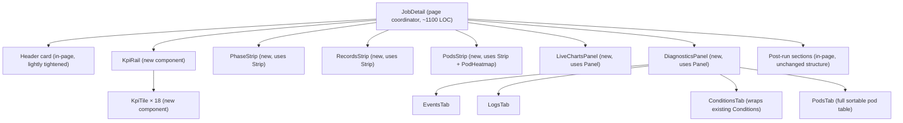
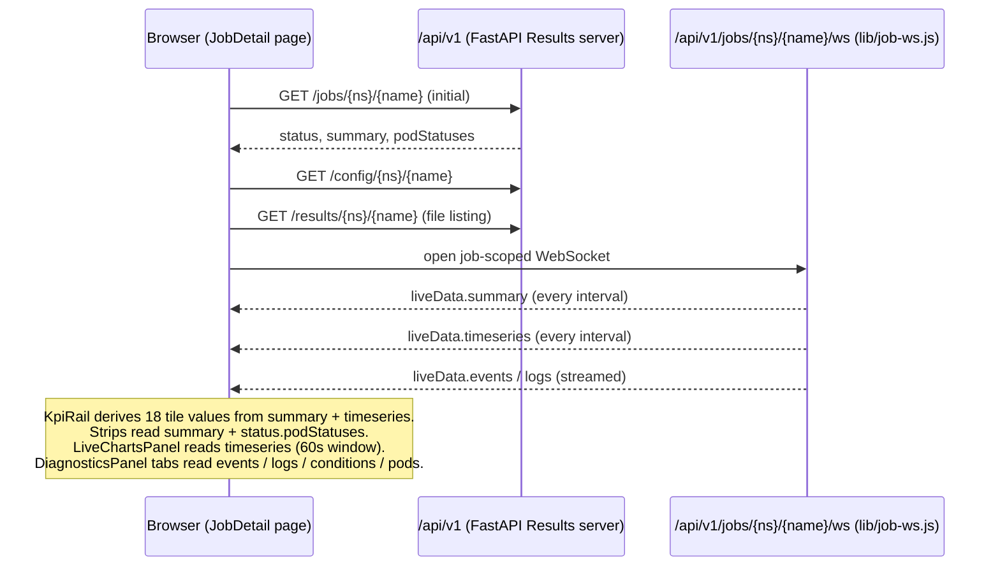

# `job-detail` page full rewrite — design

**Date:** 2026-05-02
**Owner:** Anthony Casagrande (@acasagrande)
**Status:** Draft (brainstormed)
**Scope:** `src/aiperf/operator/ui-v1/pages/job-detail.js` (2482 LOC) and seven supporting components.

## Why

The single-AIPerfJob workbench (`/jobs/:ns/:name`) is the highest-traffic page during a live ramp and the page users open first when forensicizing a completed run. Today it has three structural problems:

- **Fragmented status surfaces.** Phase, pods, events, logs, and conditions render as separate big sections stacked vertically. To answer "is the run healthy or wedged?" you scroll between four panels and triangulate. There is no single canonical "what's happening" surface.
- **Scroll-context loss.** The page is a single 2.5k-LOC vertical column. While running, KPI tiles sit at the top and pod/event detail sits ~1500px below. Checking pods loses the live-chart context, and vice versa.
- **Component drift.** Eight different "card" / "section" patterns have accumulated (`<div class="card section">` with varying padding, ad-hoc headings, inconsistent collapse affordances). The result is that fixing visual issues one component at a time has not converged on a coherent vocabulary.

Optimizing posture (per brainstorm): **active staring during a live ramp on a laptop** is the dominant case (rank: active > deep-debug ≫ glance). Width target: laptop, reactive up. Goal: see trends form, catch stalls in <30 s, drill to pods/events/logs without losing chart context.

The redesign keeps the same scroll model and panel architecture (the user explicitly does not want a dashboard / cockpit / scrubber / bento / tabbed shell). It densifies the KPI surface, normalizes panel chrome, scales pods to 1k+, and consolidates the four "what's happening" surfaces into one tabbed panel.

## Out of scope

- Other pages (`dashboard`, `jobs`, `sweeps`, `sweep-detail`, `compare`, `compare-epochs`, `leaderboard`, `history`, `archive`, `launch`) — unchanged.
- Routing IA (the namespace-scoped `/ns/...` redesign documented in `docs/kubernetes/dashboard-ui.md`) — separate spec.
- Backend / Results-API / WebSocket changes — none. Same endpoints, same `liveData` shape.
- Linked-crosshair across live charts, KPI-tile click-to-pin-as-large, baseline diff-vs-prior-run — parked for follow-up specs.
- TypeScript / build step — keeps the no-build, ESM-via-import-map, Preact + htm + Chart.js + signals architecture.

## Visual target

Approved during brainstorm (file: `.superpowers/brainstorm/200497-1777704999/content/streamlined.html`). Highlights:

- **Header card** — name, phase pill, namespace pill, model/backend/elapsed/ETA inline, RunPicker / Relaunch / Cancel buttons. Lightly tightened from today.
- **18-tile KPI rail** — 6 cols × 3 rows on ≥900 px, 3 cols × 6 rows on laptop. Every tile has label / value / unit / delta / 14 px sparkline / window indicator / optional warn-tone border.
- **Three thin canonical strips** — phase, records, pods. Single-row each (label · bar · meta-text). The pods strip embeds a compact 6×6 px heatmap that scales linearly past 1000 pods.
- **Two-column panels** — `LiveChartsPanel` (throughput + latency histogram, 60 s window) on the left at flex 1.6, `DiagnosticsPanel` on the right at flex 1. Stacks vertically below 900 px.
- **Post-run sections** — collapsed during live with disclosure arrows; expanded by default once `isCompleted`. Section list unchanged from today (full metrics breakdown, latency percentiles, ISL, concurrency·throughput, server metrics, spec, run metadata, per-record analysis, artifacts, SLA compliance).

## Architecture

### Component map



### Render-mode coordinator

`JobDetail(namespace, name, epoch?)` is a thin coordinator. It derives:

- `mode = isCompleted ? 'completed' : 'live'` from `status.phase` (set of completed phases stays as today: `Completed`, `Succeeded`, `Failed`, `Cancelled`).
- `isArchived` from "CR missing but `profile_export_aiperf.json` present" (today's existing detection).

The same component tree renders in both modes. Mode-dependent behavior is local to each component:

- `KpiRail`: `live` → tiles read from `liveData.timeseries` and animate; `completed` → tiles freeze at last known value, sparklines show full final 60 s window from `summary.timeseries` (or `—` if absent).
- `LiveChartsPanel`: `live` → 60 s rolling window via signals; `completed` → renders the full-run timeline from results files (the existing throughput / latency-histogram extraction code stays; window switches from rolling to whole-run).
- `DiagnosticsPanel`:
  - `live`: Events tab streams via existing `EventsPane` data hook; Logs tab streams via existing `LogsPane` data hook; Conditions tab renders the existing `Conditions` component; Pods tab shows current pod state.
  - `completed`: Events / Logs / Conditions remain visible (frozen, last seen state); Pods tab shows the terminal pod table from `status.podStatuses`.
  - `archived`: only Events + Conditions tabs render if their data is present in `profile_export_aiperf.json`; Logs and Pods tabs are hidden (irrelevant — pods are gone).
- Three strips: live → animated; completed → static final state.
- Post-run sections: live → wrapped in `<Panel collapsible defaultOpen={false}>` with a "results pending" hint when the section's data is partial; completed → `defaultOpen={true}`.

### New components — contracts

All new components live in `src/aiperf/operator/ui-v1/components/`. Each is designed to be testable in isolation against pure-data fixtures.

#### `Panel`

Canonical chrome for any titled section. **Replaces 8+ ad-hoc patterns** across the page.

```js
// components/panel.js
// Pure presentational; no state of its own except open/closed when collapsible.
// Open/closed state may be controlled via `open` + `onToggle`, or uncontrolled via `defaultOpen`.
export function Panel({
  title,            // string — green uppercase title (existing `--accent-green`)
  icon,             // optional — svg/symbol char rendered before title
  badge,            // optional string — small pill on the right of the title
  badgeTone,        // 'neutral' | 'warn' | 'bad' — colors the badge
  tone,             // 'neutral' | 'good' | 'warn' | 'bad' — colors the panel border
  collapsible,      // bool
  defaultOpen,      // bool, default true
  open, onToggle,   // optional controlled state
  children,
})
```

#### `KpiTile`

```js
// components/kpi-tile.js
export function KpiTile({
  label,         // 'tok/s'
  value,         // 8420 (number) or '8.42k' (preformatted string)
  unit,          // 'tok/s' (rendered small after value)
  delta,         // optional number; renders as ▲/▼/▬ + percent
  deltaWindow,   // optional string '30s'
  sparkSeries,   // optional Array<number> — 14px sparkline; reuses Sparkline component
  tone,          // 'neutral' | 'good' | 'warn' | 'bad' — border tint
  stale,         // optional bool — adds a "stale 12s" badge
  meta,          // optional string — small top-right corner label, e.g. 'live' / 'final'
})
```

Tone is computed by the consumer (see `KpiRail`); `KpiTile` only renders.

#### `KpiRail`

```js
// components/kpi-rail.js
// Subscribes to liveData.timeseries via @preact/signals. Derives 18 tile configs
// from a static TILE_CONFIG array. Missing series → tile shows '—' and no spark.
export function KpiRail({ summary, slos, timeseries, mode })
```

`TILE_CONFIG` is a module-level const, defined explicitly:

```js
// components/kpi-rail.js
const TILE_CONFIG = [
  // Throughput row
  { id: 'tok_s',         label: 'tok/s',       unit: 'tok/s',   summaryKey: 'token_throughput',     seriesKey: 'token_throughput',   sloKey: null,                 toneRule: 'higher_is_better' },
  { id: 'req_s',         label: 'req/s',       unit: 'req/s',   summaryKey: 'request_throughput',   seriesKey: 'request_throughput', sloKey: null,                 toneRule: 'higher_is_better' },
  { id: 'concurrency',   label: 'conc',        unit: '',        summaryKey: 'concurrency_current',  seriesKey: 'concurrency',        sloKey: null,                 toneRule: 'neutral' },
  { id: 'err_pct',       label: 'err %',       unit: '%',       summaryKey: 'error_rate',           seriesKey: 'error_rate',         sloKey: 'max_error_rate',     toneRule: 'lower_is_better' },
  { id: 'goodput',       label: 'good req/s',  unit: '/total',  summaryKey: 'goodput',              seriesKey: 'goodput',            sloKey: null,                 toneRule: 'higher_is_better' },
  { id: 'in_flight',     label: 'in-flight',   unit: '',        summaryKey: 'in_flight_requests',   seriesKey: 'in_flight',          sloKey: null,                 toneRule: 'neutral' },

  // Latency row
  { id: 'ttft_p50',      label: 'ttft p50',    unit: 'ms',      summaryKey: 'time_to_first_token.p50', seriesKey: 'ttft_p50',        sloKey: 'ttft_p50',           toneRule: 'lower_is_better' },
  { id: 'ttft_p99',      label: 'ttft p99',    unit: 'ms',      summaryKey: 'time_to_first_token.p99', seriesKey: 'ttft_p99',        sloKey: 'ttft_p99',           toneRule: 'lower_is_better' },
  { id: 'itl_p50',       label: 'itl p50',     unit: 'ms/tok',  summaryKey: 'inter_token_latency.p50', seriesKey: 'itl_p50',         sloKey: 'itl_p50',            toneRule: 'lower_is_better' },
  { id: 'itl_p99',       label: 'itl p99',     unit: 'ms/tok',  summaryKey: 'inter_token_latency.p99', seriesKey: 'itl_p99',         sloKey: 'itl_p99',            toneRule: 'lower_is_better' },
  { id: 'e2e_p50',       label: 'e2e p50',     unit: 'ms',      summaryKey: 'request_latency.p50',  seriesKey: 'latency_p50',        sloKey: 'request_latency_p50',toneRule: 'lower_is_better' },
  { id: 'e2e_p99',       label: 'e2e p99',     unit: 'ms',      summaryKey: 'request_latency.p99',  seriesKey: 'latency_p99',        sloKey: 'request_latency_p99',toneRule: 'lower_is_better' },

  // Workload + system row
  { id: 'isl_avg',       label: 'isl avg',     unit: 'tok',     summaryKey: 'input_sequence_length.avg', seriesKey: null,            sloKey: null,                 toneRule: 'neutral' },
  { id: 'osl_avg',       label: 'osl avg',     unit: 'tok',     summaryKey: 'output_sequence_length.avg', seriesKey: null,           sloKey: null,                 toneRule: 'neutral' },
  { id: 'pods',          label: 'pods',        unit: '',        summaryKey: 'pods_ready_total',     seriesKey: 'pods_ready',         sloKey: null,                 toneRule: 'pod_health' },
  { id: 'gpu_util',      label: 'gpu util',    unit: '%',       summaryKey: 'server_metrics.gpu_util_avg', seriesKey: 'gpu_util',    sloKey: null,                 toneRule: 'neutral' },
  { id: 'kv_cache',      label: 'kv cache',    unit: '%',       summaryKey: 'server_metrics.kv_cache_avg', seriesKey: 'kv_cache',    sloKey: null,                 toneRule: 'neutral' },
  { id: 'records',       label: 'records',     unit: '/total',  summaryKey: 'records_processed_total', seriesKey: 'records_processed', sloKey: null,               toneRule: 'records_progress' },
];
```

Where the operator's `summary` structure does not match a key (some shapes are nested in `liveSummary`, some come from `status.summary`), the `KpiRail` accessor handles fallback. The exact key paths are pinned to the current API and verified during implementation against `tests/fixtures/operator_ui/results/`.

#### `Strip`, `PhaseStrip`, `RecordsStrip`, `PodsStrip`

`Strip` is the chrome (label · bar · meta-text). The three strips are thin wrappers that compose `Strip` with a particular bar shape:

- `PhaseStrip` — segments are phases (`setup`, `warmup`, `measurement`, `cooldown`); current segment outlined in white. Replaces today's `PhaseBar`.
- `RecordsStrip` — single segment (0–100 %); meta-text shows `processed / total · rate · ETA`. Replaces `RecordProcessing`'s records-progress portion.
- `PodsStrip` — embeds `PodHeatmap` in the bar slot; meta-text shows `crashloop / pending / click to expand`. Click navigates to `?diag=pods`. Replaces `PodsBar`.

#### `PodHeatmap`

```js
// components/pod-heatmap.js
// Renders a flex-wrap grid of 6×6 px tiles, one per pod.
// Color encodes phase: Running → green, Pending → muted-green, Succeeded → blue,
// Failed/CrashLoop → red, Unknown → grey. Tooltip on hover with name/node/state.
// Designed to scale linearly to ≥1000 pods at ≤30 px row height per 200-pod row.
export function PodHeatmap({ pods, onPodClick? })
```

#### `DiagnosticsPanel`

```js
// components/diagnostics-panel.js
// Tabbed container. Tab state is URL-backed via ?diag=events|logs|conditions|pods.
// Each tab is a sub-component:
//   - <EventsTab ns name />          — wraps existing event data hook
//   - <LogsTab ns name pods />        — wraps existing log data hook
//   - <ConditionsTab conditions />    — renders existing Conditions component
//   - <PodsTab pods />                — full sortable pod table (was inside PodsBar)
// Tabs render badge counts (events count, log severity counts, conditions warn count,
// pods crashloop count). The active tab is preserved across mode transitions.
export function DiagnosticsPanel({ ns, name, conditions, pods, mode, archived })
```

#### `LiveChartsPanel`

```js
// components/live-charts-panel.js
// Wraps two ChartWrapper instances inside a Panel. Renders throughput line chart
// (60s rolling window) and latency histogram. In completed mode, switches the
// throughput chart to whole-run timeline and latency-histogram to the final
// histogram from results.
export function LiveChartsPanel({ liveData, results, mode })
```

### Reused unchanged

`ChartWrapper`, `Sparkline`, `Conditions`, `RunPicker`, `RelaunchButton`, `SimilarRunsLink`, `TokenEfficiencyCard`, `FileViewerModal`, `SpecViewerModal`. The page-local components (`MetricsTable`, `LatencyPercentileChart`, `ConcurrencyThroughputChart`, `ISLDistributionChart`, `JobConfigSection`, `RunMetadata`, `SLACompliance`, `PerRecordAnalysis`) stay defined inside `pages/job-detail.js` because they are tied to the page's results/config shape; they get wrapped in the new `Panel` chrome but their internals are untouched.

### Components deleted

The following components are deleted in the same commit as the rewrite (verified by grep — no other page imports them):

- `components/phase-bar.js` (63 LOC) — replaced by `PhaseStrip`
- `components/record-processing.js` (167 LOC) — split into `RecordsStrip` (records-progress) and absorbed into `PhaseStrip` (phase-progress)
- `components/pods-bar.js` (177 LOC) — replaced by `PodsStrip` + `PodHeatmap` + `PodsTab`
- `components/events-pane.js` (192 LOC) — absorbed into `DiagnosticsPanel.EventsTab` (data hook + presentation moves into the tab)
- `components/logs-pane.js` (337 LOC) — absorbed into `DiagnosticsPanel.LogsTab`
- `components/realtime-kpi-grid.js` (348 LOC) — replaced by `KpiRail` + `KpiTile`

`components/conditions.js` is retained because `pages/sweep-detail.js` also uses it; the new `ConditionsTab` reuses it.

## Data flow

No API changes. Same flow as today, summarized:



The KpiRail subscribes via `@preact/signals` to the existing `jobLiveData` signal. Tile updates are pushed; React reconciliation is batched. Sparkline series are derived once per signal tick and memoized per tile; no per-tile signal subscription.

## Error handling

No new error categories. Existing surfaces and behaviors are preserved:

| Failure | Surface (today) | Behavior in rewrite |
|---|---|---|
| Page-level fetch fails | `globalError` banner | Same — banner above page; page renders `LoadingPanel` until retry. |
| WS disconnect | (no current surface) | New: `KpiTile.stale` badge appears at 10 s; clears on reconnect. `LiveChartsPanel` shows a thin "live data paused" overlay. (This is a *small* improvement enabled by normalized chrome — it costs ~30 LOC.) |
| Archived state | Banner + suppressed cluster sections | Same banner. Logs and Pods tabs of `DiagnosticsPanel` are hidden. KpiRail freezes; sparklines drop to `—` if absent. |
| Cluster endpoint unavailable | "Cluster endpoint unavailable" banner | Same banner. Live mode falls back to summary-only KPIs (sparklines empty). |
| Results files 404 (e.g. `profile_export.jsonl` huge) | Existing per-section guards | Unchanged — guards live in the page-local post-run sections. |

## Testing

### Unit (`tests/unit/ui/`)

New Python-side tests for pure data shapes (the JS itself is exercised by e2e):

- `test_kpi_rail_tile_config.py` — verify the 18-tile config: every entry has `id`, `label`, valid `toneRule`, and the summary/series key paths are present in at least one fixture. Drive from `tests/fixtures/operator_ui/results/`.
- `test_pod_heatmap_layout.py` — given pod-list fixtures of size 10 / 100 / 1000, verify color mapping and DOM-node count.
- `test_diagnostics_tabs_routing.py` — `?diag=events|logs|conditions|pods` parsing, default-tab logic (Events for live, Conditions for archived).
- Existing tests (`test_operator_run_picker.py`, `test_realtime_metrics_dashboard.py`, `test_realtime_telemetry_dashboard.py`, `test_operator_compare_filters.py`) — keep passing without modification.

`test_realtime_metrics_dashboard.py` and `test_realtime_telemetry_dashboard.py` reference `RealtimeKpiGrid`-shaped data; they may need updates if they assert on the deleted component's HTML shape. Update them in the same PR.

### E2E (`tests/e2e/operator_ui/test_run_detail.py`)

Extend the existing run-detail e2e. New assertions:

- `test_live_mode_renders_full_layout` — header, 18 KPI tiles (assert by `data-tile-id`), 3 strips, charts panel, diagnostics with 4 tabs.
- `test_completed_mode_post_run_sections_expanded` — open a completed-job fixture, verify post-run sections are open by default, KpiRail has frozen sparklines.
- `test_archived_state_hides_live_tabs` — fixture with CR missing, results present; assert Logs and Pods tabs of `DiagnosticsPanel` are not rendered.
- `test_diagnostics_deep_link` — visit `/jobs/<ns>/<name>?diag=pods`, assert Pods tab is active on initial render.
- `test_pod_heatmap_1000_pods` — extend `tests/fixtures/operator_ui/k8s/` with a 1000-pod JobSet fixture; assert heatmap renders without overflow.

### Manual smoke

User runs a live ramp on the DGX cluster (per memory: this is the standard workflow for them) and confirms:

- KpiRail updates every poll cycle without flicker
- Stale badge appears within 10 s of WS disconnect
- Diagnostics tab state is preserved across mode transition (live → completed)
- Pod heatmap remains usable at ≥1000 pods

### Visual regression

The user explicitly does not have a Playwright visual regression rig set up. Visual checks are by inspection. Per memory (`feedback_dashboard_screenshots_in_docs.md`), the user maintains `docs/media/images/api-dashboard-v2.png` — this PR updates that screenshot to capture the new live-mode layout (overwriting in place).

## Implementation phases

Phased so each phase produces a green test suite. Suggested ordering for the writing-plans pass; not commit boundaries — phases may collapse into fewer commits depending on size.

1. **Foundation** — add `Panel`, `KpiTile`, `Strip`, `Sparkline` extensions if needed, color/spacing tokens in `style.css`. No page changes yet. Existing tests pass.
2. **KpiRail** — implement `KpiRail` + `TILE_CONFIG`, hook into existing `jobLiveData` signal. Render in a sandbox or replace `RealtimeKpiGrid` in-place behind a small `if (window.AIPERF_NEW_KPI)` guard so it can be developed without breaking the page. Once green, drop the guard.
3. **Strips** — implement `PhaseStrip`, `RecordsStrip`, `PodsStrip`, `PodHeatmap`. Replace `PhaseBar`, `RecordProcessing`, `PodsBar` rendering in `JobDetail`.
4. **Charts panel** — extract the existing inline live-charts code into `LiveChartsPanel`, wrap in `Panel`.
5. **Diagnostics panel** — extract `EventsPane` + `LogsPane` + `Conditions` + the pods table into `DiagnosticsPanel.{Events,Logs,Conditions,Pods}Tab`. URL-backed tab state.
6. **Page-local sections** — wrap `MetricsTable`, `LatencyPercentileChart`, etc. in `Panel`. Implement collapse-during-live / expand-on-complete logic.
7. **Cleanup** — delete the six replaced components (`PhaseBar`, `RecordProcessing`, `PodsBar`, `EventsPane`, `LogsPane`, `RealtimeKpiGrid`). Update tests that reference them.
8. **E2E + screenshot** — extend `test_run_detail.py`, regenerate `docs/media/images/api-dashboard-v2.png`.

## Migration & cutover

Cold cutover. Single commit (or commit chain on `ajc/k8s`) replaces the page. No feature flag, no dual mount, no parallel `ui-v2/`. ui-v1 elsewhere is untouched.

After merge, the next time `aiperf kube dashboard` is opened, users see the new page. The Results-API mount (`src/aiperf/operator/dashboard_mount.py` and the FastAPI `StaticFiles` for ui-v1) is unchanged — the rewrite is internal to the SPA.

## Documentation updates

Per the project's "Four-File Sync Rule" and Documentation Updates table:

- `docs/kubernetes/dashboard-ui.md` — update the "Run workbench" section. The doc currently describes the abstract per-namespace design (`/ns/...`) which is not what ui-v1 actually implements; the run-workbench section, however, is content-accurate and needs the new KPI/strip/diagnostics structure reflected.
- `docs/media/images/api-dashboard-v2.png` — overwrite with the new live-mode screenshot (per `feedback_dashboard_screenshots_in_docs.md`).
- `llms.txt` — no change (no new doc files added).
- No changes to `AGENTS.md` / `CLAUDE.md` / `.github/copilot-instructions.md` / `.cursor/rules/python.mdc` (no new code patterns or pre-commit conventions introduced).

## Open questions

None — locked during brainstorm. The spec is committed; implementation plan follows.
