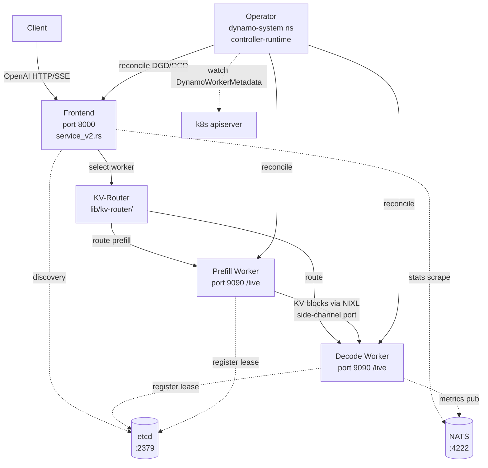

# Dynamo Chaos Suite — Design Document

**Status:** Draft  
**Date:** 2026-05-19  
**Author:** Anthony Casagrande (with parallel-agent research)  
**Scope:** Methodical chaos-engineering test suite targeting `ai-dynamo/dynamo` as the system-under-test, reusing AIPerf's `tests/kubernetes/chaos/` + `tests/kubernetes/gpu/dynamo/` infrastructure.

---

## 1. Goal

Build a chaos suite for Dynamo analogous to AIPerf's `tests/kubernetes/chaos/` (13 implemented C-scenarios C1, C3–C12, C15, C16 + B1–B3, K1–K3, H1–H4) but targeting a fundamentally different SUT: a Go-based operator reconciling `DynamoGraphDeployment` CRDs that orchestrate Frontend / Prefill-worker / Decode-worker pods, coordinating through etcd + NATS, with a KV-aware router and a KVBM/NIXL KV-transfer plane.

**API-version target:** This spec targets **v1beta1** of the DynamoGraphDeployment CRD (`deploy/operator/api/v1beta1/dynamographdeployment_types.go`). v1beta1 changed two shape facts that the prior draft of this spec got wrong:

- Components are a **list** under `spec.components[]` (each element has a `name` field), not a `spec.services` map. (v1alpha1 had the map form.)
- Per-component pod customization is `spec.components[].podTemplate.spec.*` (standard `corev1.PodSpec`); the `extraPodSpec` / `mainContainer` escape hatches from v1alpha1 are removed. To target the inference container, match on `containers[?(@.name=="main")]` (constant `MainContainerName = "main"` in `dynamocomponentdeployment_types.go:46`).

Every scenario, injector, and CRD reference below uses the v1beta1 shape.

**Deliverable:** ~40 scenarios (D-series) organized into 8 families, with a clear "Wave 0" of 10 high-leverage tests that ship first.

## 2. SUT topology (compressed)



**Key implementation files** (all `/tmp/dynamo`):

| Layer | File | Purpose |
|---|---|---|
| Operator | `deploy/operator/internal/controller/dynamographdeployment_controller.go:119` | Main reconcile |
| Operator | `deploy/operator/internal/controller/failover_cascade_controller.go:75` | Pod-failure cohort recreation (`FailoverCascadeReconciler.Reconcile`) |
| CRDs | `deploy/operator/api/v1beta1/{dynamographdeployment,dynamocomponentdeployment,…}_types.go` | DGD / DCD / DGDR / DGDSA |
| Frontend HTTP | `lib/llm/src/http/service/service_v2.rs:330,575` | Axum server + router |
| Frontend SSE | `lib/llm/src/http/service/disconnect.rs:212` | Stream monitor + disconnect |
| Frontend health | `lib/runtime/src/system_health.rs` | `/live`, `/health` |
| KV-router | `lib/kv-router/src/scheduling/selector.rs:108` | Worker logit / softmax |
| KV-router | `lib/kv-router/src/sequences/multi_worker.rs:307,346` | Replica sync, AddRequest/Free |
| KV-router | `lib/kv-router/src/scheduling/queue.rs:62,173` | Pending heap, admission gate |
| Discovery | `lib/runtime/src/discovery/kube/daemon.rs:42` | EndpointSlice + DynamoWorkerMetadata reflector |
| Discovery | `lib/runtime/src/transports/etcd/lease.rs:136` | Keep-alive (TTL/2), expiry cascade |
| Discovery | `lib/runtime/src/transports/nats.rs:46` | NATS client (no explicit reconnect) |
| KVBM | `lib/kvbm-{logical,physical,engine,consolidator,kernels,config}/` | KV cache + transfer |
| NIXL | `lib/memory/src/nixl/agent.rs:29` | Transport plugin (UCX/RDMA/POSIX) |
| Worker bootstrap | `components/src/dynamo/{vllm,trtllm,sglang}/main.py` | Engine init → register_model → serve_endpoint |
| MPI (TRT-LLM) | `deploy/operator/internal/dynamo/backend_trtllm.go:104` | SSH keys + mpirun launch |
| Grove/LWS | `deploy/operator/internal/dynamo/grove.go:36` | Multi-node PCSG / LWS |

## 3. Infrastructure plan — reuse vs. build

### 3.1 Direct reuse from AIPerf chaos suite

| Asset | Reuse strategy |
|---|---|
| `tests/kubernetes/helpers/{kubectl, log_streamer, cluster, helm, preflight, images}.py` | Use as-is. Operator-agnostic. |
| `tests/kubernetes/chaos/toxiproxy.py` + fixture YAML | Rename namespace `aiperf-chaos-toxiproxy` → `chaos-toxiproxy`. Add named ports for NATS (20020), etcd (20030), NIXL (20040–20049), frontend (20011). Port-pool invariant + per-call short-lived aiohttp session pattern carry over verbatim. |
| `tests/kubernetes/gpu/dynamo/{conftest.py, helpers.py}` (`DynamoDeployer`, `DynamoConfig`, `dynamo_operator`/`dynamo_server` fixtures) | Direct dependency. `generate_manifest()` is the hook for injecting `podTemplate.spec.shareProcessNamespace`, container env overrides (via `containers[?(@.name=="main")].env`), and invalid-CR variants. **Note:** `DynamoDeployer` currently emits v1alpha1 manifests; chaos suite tests should be authored against v1beta1, so `DynamoDeployer` either needs a v1beta1 mode or the chaos tests build their own manifests. |
| Pytest conventions (`@pytest.mark.k8s_slow`, `try/finally` cleanup, xfail-with-flip-condition) | Copy verbatim. |

### 3.2 Parameterize then reuse

The existing AIPerf `ChaosInjector` (`tests/kubernetes/chaos/chaos_injector.py:62`) currently takes only a `kubectl` arg; everything else is module-level constants (`OPERATOR_NAMESPACE = "aiperf-system"` at line 31, `OPERATOR_SELECTOR = "app.kubernetes.io/name=aiperf-operator"` at line 32, the literal `"aiperfjob"` resource kind inlined in several methods, the `AIPERF_CLAIM_ANNOTATION` constant at line 33). To share the generic helpers across SUTs, lift those module-level constants into ctor args:

```python
# tests/kubernetes/chaos_common/chaos_injector.py (new shared module)
class ChaosInjector:
    def __init__(
        self,
        kubectl: KubectlClient,
        *,
        cr_kind: str,            # was inlined literal "aiperfjob"
        cr_api_group: str,       # was implicit
        operator_namespace: str, # was module constant OPERATOR_NAMESPACE
        operator_selector: str,  # was module constant OPERATOR_SELECTOR
    ):
        ...
```

**Generic-as-is** (no changes needed): `kill_container_in_pod`, `kill_container_by_pid`, `wait_for_pod_status_reason`, `wait_for_container_restart`, `wait_for_pods_gone`, `apply_resource_quota`, `delete_resource_quota`.

**Parameterizable** (use new ctor args): `delete_cr_no_wait`, `delete_cr_twice`, `kill_operator_pod`, `wait_for_operator_ready`, `wait_for_cr_gone`.

**Dynamo-specific rewrites** (separate `DynamoChaosInjector(ChaosInjector)` subclass):
- `wait_for_state(name, states={"successful","failed",…})` → polls `.status.state` (not `.status.phase`).
- `wait_for_condition(name, condition_type="Ready", status="True")` → standard k8s conditions.
- `get_component_pods(deployment, role: Literal["frontend","decode","prefill","worker","planner","epp"])` → label selectors `nvidia.com/dynamo-component-type=…` and `nvidia.com/dynamo-sub-component-type=…` (constants `KubeLabelDynamoComponentType` / `KubeLabelDynamoSubComponentType` in `deploy/operator/internal/consts/consts.go:59-60`).
- `create_invalid_graph_deployment(spec_patch)` → builds a minimal `DynamoGraphDeployment` with the patch applied.

### 3.3 New injectors needed

| Injector | Fault domain | Implementation sketch | Cluster deps |
|---|---|---|---|
| **`EtcdInjector`** | etcd kill, partition, slow | Targets dynamo-platform helm release's bundled etcd; combines `kubectl scale sts` + Toxiproxy on `<release>-etcd:2379`. | None. |
| **`NatsInjector`** | NATS kill, partition | Targets the bundled NATS Service. Toxiproxy with `bandwidth: 0` / `slow_close` / `timeout: 0`. | None. |
| **`NixlTransportInjector`** | KV-transfer disruption | Toxiproxy in front of `VLLM_NIXL_SIDE_CHANNEL_PORT` (stamped per-engine as `5600 + engineID` in `deploy/operator/internal/dynamo/failover_vllm.go:35` — engine-0 → 5600, engine-1 → 5601, …). `latency`, `bandwidth`, `reset_peer`, full blackhole. Mutate `podTemplate.spec.containers[?(@.name=="main")].env` to point the side-channel host at the toxiproxy Service. Only meaningful in disagg mode. | GPU node + disagg deployment. |
| **`TPRankKillInjector`** | Multi-pod TP/PP group disruption | `kubectl delete pod <decode-worker-N> --force --grace-period=0` of a single rank in a TP-group; assert Grove/LWS recreates the whole cohort, not just the one pod. | Multi-GPU (TP>1) or Grove enabled. |
| **`WeightDownloadBlackholeInjector`** | HF Hub egress block | NetworkPolicy denying egress to `0.0.0.0/0` except cluster CIDR; or `podTemplate.spec.initContainers` that writes `127.0.0.1 huggingface.co` to `/etc/hosts` via emptyDir share. | NetworkPolicy-aware CNI (Cilium); **NOT kindnet** — needs Cilium overlay on kind or a real cluster. |
| **`GpuVramPressureInjector`** | VRAM contention | Sidecar `nvidia/cuda:12.2.0-base` running a tiny PyTorch alloc-and-sleep script. Vary size via env. | `runtimeClassName: nvidia` + shared `NVIDIA_VISIBLE_DEVICES`. Maps to `single_gpu_disagg` preset; for production multi-GPU needs MIG/MPS. |
| **`DeploymentMutator`** (generalize `MockServerInjector`) | Per-component env/scale/restart with LIFO restore | Lift the AIPerf class shape; instantiate three times (frontend, decode, prefill). Knobs: `DYN_KVBM_CPU_CACHE_GB`, `VLLM_NIXL_SIDE_CHANNEL_PORT`, `DYN_ROUTER_MODE`, `--gpu-memory-utilization`. | None. |
| **`DiscoveryRBACInjector`** | Watch-loop disruption | `kubectl patch role` denying `watch` on `dynamoworkermetadatas` / `endpointslices`; assert reflector backoff + stale-roster behavior. | None. |
| **`SSHSecretInjector`** (TRT-LLM only) | MPI bootstrap | Delete / corrupt the secret named by `MPIConfiguration.SSHSecretName` (validated as required in `deploy/operator/api/config/validation/validation.go:98`; commonly `mpi-run-ssh-secret` in test fixtures but the operator does not hardcode it) before deploy or mid-rollout. | TRT-LLM multi-node. |

## 4. Scenario catalogue — the D-series

Naming: `D{family}{number}` — D1xx control plane, D2xx data plane, D3xx KV transport, D4xx routing, D5xx workload runtime, D6xx multi-node, D7xx infra, D8xx state store.

Each scenario lists: **fault**, **injector**, **assertion**, **target Wave**. Severity legend: 🔴 critical, 🟠 high, 🟡 medium.

### D1xx — Operator / control plane

| ID | Scenario | Inject | Assert | Sev | Wave |
|---|---|---|---|---|---|
| D101 | Kill operator pod mid-DGD-apply | `kill_operator_pod(force=True)` while applying a fresh DGD | DGD reconciles to `state=successful` after operator restart; no orphan child resources | 🔴 | **0** |
| D102 | Rapid double-delete DGD is idempotent | `delete_cr_twice` | `.status.state=…` → CR-gone within 60 s; no stuck finalizer | 🟠 | 0 |
| D103 | Operator pod kill during failover-cascade | Kill operator while a pod is in `Failed`/`Terminating`; assert `FailoverCascadeReconciler` resumes | DGD `spec.components[?(@.name=="<x>")].replicas` returns to spec after restart (status replica counts in `status.components` recover) | 🟠 | 1 |
| D104 | Invalid DGD spec surfaces in status | Apply DGD with `spec.components[?(@.name=="Frontend")].replicas: -1` or missing required component name | `state=failed`, `conditions[?type=Ready].status=False`, reason names validation | 🟡 | 0 |
| D105 | Rapid create-delete-create-same-name | Apply, delete, re-apply within 5 s, same name | New DGD reaches `successful` despite the prior tombstone | 🟡 | 1 |
| D106 | Webhook validation pod down | Scale validator webhook deployment to 0 mid-traffic | Apply fails fast or is admitted-then-rejected; no half-created children | 🟡 | 2 |
| D107 | Operator RBAC revoked mid-reconcile | `kubectl patch clusterrole` to drop `deployments: patch` | Reconcile errors; CR state stays accurate (does not falsely flip to successful) | 🟡 | 2 |
| D108 | Apiserver pause 30 s during reconcile | Toxiproxy on apiserver with `timeout` toxic, `KUBERNETES_SERVICE_HOST` override | Operator survives, reconcile resumes, DGD reaches `successful` | 🟠 | 1 |

### D2xx — Data plane (Frontend / SSE)

| ID | Scenario | Inject | Assert | Sev | Wave |
|---|---|---|---|---|---|
| D201 | Force-kill Frontend pod under 64 concurrent SSE streams | `delete pod --force --grace-period=0` | Clients see TCP RST or HTTP 503; no zombie traffic on the next replica; `dynamo_frontend_disconnected_clients` increments | 🔴 | **0** |
| D202 | Scale Frontend 1→0→1 mid-traffic | `DeploymentMutator.scale(0)` then `scale(1)` | New requests succeed within 30 s of recovery; no permanent 503 | 🟠 | 1 |
| D203 | Backend stream inactivity timeout fires | Toxiproxy with 5 s upstream `latency` exceeding `DYN_HTTP_BACKEND_STREAM_TIMEOUT_SECS` | Stream RST observed; `ErrorType::ResponseTimeout` metric increments | 🟡 | 2 |
| D204 | Exceed `DYN_HTTP_BODY_LIMIT_MB` | Send 100 MB chat request when limit is 45 MB | HTTP 413 (not 500, not hang) | 🟡 | 2 |
| D205 | Unknown model name | POST with `model: "does-not-exist"` | HTTP 404 with `type=Not Found` shape; not 500 | 🟡 | 2 |
| D206 | All workers unavailable | Scale all decode replicas to 0 | HTTP 503 `Model temporarily unavailable`; no hang | 🟠 | 1 |
| D207 | Streaming error frame format | Kill upstream worker mid-stream | Client receives `{"error":{...,"code":500}}` SSE frame **then** `data: [DONE]` | 🟠 | 1 |
| D208 | Body limit zero-disclosure | Send oversized then valid; assert frontend not stuck | Frontend continues serving subsequent requests | 🟡 | 3 |

### D3xx — KV transport plane (KVBM / NIXL)

| ID | Scenario | Inject | Assert | Sev | Wave |
|---|---|---|---|---|---|
| D301 | NIXL `reset_peer` mid-KV-handoff (disagg) | Toxiproxy on `VLLM_NIXL_SIDE_CHANNEL_PORT` with `reset_peer` toxic during active prefill→decode | Frontend surfaces 500 + structured error; no decode-pod restart-loop; `dynamo_component_errors_total{error_type="response_stream"}` increments | 🔴 | **0** |
| D302 | NIXL backend plugin missing | Mutate worker env to use a stub NIXL backend (`is_stub()=true`) | Worker fails to register, surfaces in operator status; not a silent route-to-degraded-worker | 🟠 | 1 |
| D303 | KV transfer 60 s stall | Toxiproxy `bandwidth: 1KBps` on NIXL port | Expected warning log at 60 s, 90 s; no hard timeout (known gap to surface) — track as observation, not as pass/fail | 🟡 | 2 |
| D304 | KVBM consolidator ZMQ socket close | Patch consolidator env to break ZMQ; restart container | Prefill side surfaces lost-event log; decode reconnects within 30 s of consolidator restart | 🟠 | 1 |
| D305 | KVBM CPU cache pre-fill to capacity | Set `DYN_KVBM_CPU_CACHE_GB` to a tiny value, then push enough traffic to fill | G3 spill triggers; no `cudaMallocHost` OOM; latency spike but no crash | 🟡 | 2 |
| D306 | GPU OOM mid-transfer | VRAM-pressure sidecar above worker's `--gpu-memory-utilization` | Kernel launch fails, request fails cleanly, worker recovers (does not segfault) | 🟠 | 1 |

### D4xx — KV-router

| ID | Scenario | Inject | Assert | Sev | Wave |
|---|---|---|---|---|---|
| D401 | Kill decode worker mid-request (no retry path) | Kill the pod selected by the router during active generation | Client gets clean error (not infinite hang); track P99 of error latency | 🔴 | **0** |
| D402 | Split-brain on rapid topology churn | Rapid `kubectl delete pod` + recreate of a decode worker | No duplicated slot entries; router state matches actual roster within 30 s | 🟠 | 1 |
| D403 | Lost-block-deallocation memory leak | Force a free event for a removed worker (delete pod + send a request that completes elsewhere) | `dynamo_component_inflight_requests` drains; no router OOM after N cycles | 🟠 | 1 |
| D404 | Pending-queue unbounded growth (queueing enabled) | Set `threshold_frac` so all workers throttle; submit 10× normal load | Queue grows but router does not OOM within 2 min (currently unbounded — known gap) | 🟡 | 2 |
| D405 | Prefill-complete event-loss queue deadlock | Block worker→router watch channel briefly | Queue drains after channel recovers; no permanent deadlock | 🟡 | 2 |
| D406 | Pinned-worker head-of-line block | Submit a pinned request to an overloaded worker, then non-pinned requests | Document the HoL block (known TODO); test ratchets the timeout, not the fix | 🟡 | 3 |

### D5xx — Workload runtime (worker pods)

| ID | Scenario | Inject | Assert | Sev | Wave |
|---|---|---|---|---|---|
| D501 | Kill worker container; restart count advances | `kill_container_in_pod` with `kill 1` (or kill by PID via shared-PID ns) | `containerStatuses[].restartCount` advances; worker re-registers within 30 s | 🟠 | 0 |
| D502 | Kill worker between register_model and serve_endpoint | Time-based kill or PID-by-cmdline match | Pod restarts cleanly; no half-registered ghost in router | 🟠 | 1 |
| D503 | NCCL init failure (block one TP peer) | NetworkPolicy denying rank↔rank port during init | Engine init fails fast; CrashLoopBackOff with NCCL error in logs | 🟠 | 1 |
| D504 | Health-check payload hangs (engine deadlock) | Pause worker process via SIGSTOP (porting dynamo's own `tests/fault_tolerance/test_canary_rank_pause.py` to k8s) | Liveness probe fails after `failureThreshold × periodSeconds`; pod restart | 🟡 | 2 |
| D505 | Worker OOMKill via VRAM-pressure sidecar | `GpuVramPressureInjector` allocates above `--gpu-memory-utilization` headroom | Worker OOMs cleanly, restart, traffic recovers | 🟠 | 1 |
| D506 | Force-eager-mode latency on cold start | Override engine_args to `enforce_eager=True` | First-token latency increases but `/live` does not flap | 🟡 | 3 |

### D6xx — Multi-node / MPI

| ID | Scenario | Inject | Assert | Sev | Wave |
|---|---|---|---|---|---|
| D601 | Delete TP-rank-1 of 2 mid-traffic | `kubectl delete pod` on a non-leader rank | Whole group recreated by Grove/LWS; not stranded | 🔴 | 1 |
| D602 | Delete the headless service during init | `kubectl delete svc <model-hash>` during TP init | DNS unresolved → allreduce deadlock; assert operator surfaces failure within 5 min | 🟠 | 2 |
| D603 | Recreate headless service with wrong selector | Bad selector pointing to no pods | Pods Pending; eventually surface as DGD `state=failed` (not infinite Pending) | 🟡 | 2 |
| D604 | Delete the configured MPI SSH secret pre-startup | `kubectl delete secret <MPIConfiguration.SSHSecretName>` (test rig uses `mpi-run-ssh-secret`) before TRT-LLM multinode pod boots | Pod fails with clear "secret not found" not opaque CrashLoopBackOff | 🟠 | 2 |
| D605 | Corrupt SSH `authorized_keys` | Patch secret with bad pubkey | mpirun SSH timeout surfaces clean error, not infinite hang | 🟡 | 3 |
| D606 | Block port 2222 between MPI peers | NetworkPolicy denying TCP/2222 | mpirun timeout; DGD surfaces `state=failed` within 10 min | 🟡 | 3 |
| D607 | Disable Grove mid-multinode deploy | `helm upgrade --set global.grove.enabled=false` while DGD is reconciling | DGD does not silently corrupt; either succeeds on the old PCSGs or surfaces a clear error | 🟠 | 3 |

### D7xx — Infrastructure / cluster

| ID | Scenario | Inject | Assert | Sev | Wave |
|---|---|---|---|---|---|
| D701 | ImagePullBackOff surfaces in CR | Apply DGD with non-existent image | DGD reaches `state=failed` within 120 s of pull failure; reason names ImagePullBackOff | 🟡 | 0 |
| D702 | DNS resolution failure (egress to .invalid) | Endpoint config pointing at `.invalid` host | Worker surfaces DNS error; DGD `state=failed` | 🟡 | 2 |
| D703 | Namespace ResourceQuota exhausted | `apply_resource_quota` capping memory below worker request | DGD `state=failed`; quota deleted in `finally` | 🟡 | 2 |
| D704 | HF Hub egress blackhole during weight load | `WeightDownloadBlackholeInjector` (NetworkPolicy) | Worker surfaces clean weight-download error, not opaque CLBO | 🔴 | **0** |
| D705 | PVC scaled to 0Gi mid-bootstrap | Patch PVC | Engine init fails fast; pod restarts | 🟡 | 3 |
| D706 | DCGM XID injection (real GPU) | Port dynamo's `tests/fault_tolerance/hardware/gpu_fault_injector` agent | `DCGM_FI_DEV_XID_ERRORS` increments; worker restarts or NVSentinel evicts | 🟠 | 3 |

### D8xx — State store (etcd / NATS)

| ID | Scenario | Inject | Assert | Sev | Wave |
|---|---|---|---|---|---|
| D801 | etcd kill during decode-worker registration race | `kubectl delete pod -l app.kubernetes.io/name=etcd -n dynamo-system --force` while a fresh worker is registering | Worker either retries to registration success (within ~90 s lease-TTL window) or fails cleanly; no half-registered state | 🔴 | **0** |
| D802 | etcd 30 s pause via Toxiproxy | `timeout: 0` toxic on etcd Service for 30 s, then heal | Frontend serves stale roster, then recovers; lease-expiry latency bounded by 60 s + 30 s timeout = ~90 s | 🔴 | **0** |
| D803 | NATS pod kill mid-traffic | `kubectl delete pod -l app=nats --force` | KV-router load metrics go stale but routing falls back to round-robin; no crash | 🔴 | **0** |
| D804 | NATS slow-close toxic on stats subjects | Toxiproxy `slow_close` | Service-stats scrape times out cleanly; no permanent socket-leak | 🟠 | 2 |
| D805 | DynamoWorkerMetadata watch RBAC revoked | `kubectl patch role` denying watch on `dynamoworkermetadatas` | Reflector backoff; snapshot ages but does not drop existing entries | 🟠 | 2 |
| D806 | Worker lease keep-alive heartbeat blocked | Toxiproxy `bandwidth: 0` on etcd keepalive port for one worker | After 60 s lease TTL, worker's endpoints auto-deleted from discovery; frontend stops routing | 🟠 | 1 |
| D807 | NATS partition split-brain | Toxiproxy partition between two frontend replicas' NATS connections | Both replicas eventually converge to the same worker view; no permanent disagreement | 🟡 | 3 |

## 5. Wave 0 — the high-leverage ten

Ship these ten first. Each tests a control plane or data path that **is novel to Dynamo** (no AIPerf analog) **and** has a clear, file-level failure mode discovered by the parallel-agent research above.

| # | ID | Why ship first |
|---|---|---|
| 1 | **D803** NATS kill mid-traffic | NATS is dynamo's primary stats/metrics bus; no explicit reconnect backoff in `transports/nats.rs:46`. Highest expected bug yield. |
| 2 | **D802** etcd 30 s pause | Discovery resilience is the hallmark of any distributed inference stack; lease-TTL behavior at `transports/etcd/lease.rs:136` has hard timeouts that need real-traffic validation. |
| 3 | **D801** etcd kill during worker-registration race | Tests both the etcd-HA client and the operator's reconcile-on-missing-component path simultaneously. |
| 4 | **D301** NIXL `reset_peer` mid-KV-handoff | The KV-transfer plane is dynamo's biggest differentiator; the disagg prefill→decode handoff is the one path that AIPerf cannot test. `lib/kvbm-physical/src/transfer/notifications/nixl_status.rs:30` is where errors surface. |
| 5 | **D401** Kill decode worker mid-request | Documented "no retry logic" in `queue.rs:173-210` — likely to expose hangs. |
| 6 | **D201** Force-kill Frontend pod under 64 concurrent SSE streams | Stateless frontend but the SSE disconnect path at `disconnect.rs:212` has nontrivial cleanup semantics. |
| 7 | **D101** Kill operator mid-DGD-apply | Classic kopf-style chaos, ported to controller-runtime. Validates idempotency of dynamo's Go reconciler. |
| 8 | **D704** HF Hub egress blackhole during weight load | High UX impact, low injection cost; surfaces opaque CrashLoopBackOff regressions. |
| 9 | **D104** Invalid DGD spec surfaces in status | Cheap, deterministic, catches schema-vs-validator drift on every PR. |
| 10 | **D701** ImagePullBackOff surfaces in CR | Lowest-cost smoke test. Validates that the operator reaches `state=failed` not "Reconciling forever". |

## 6. File layout

```
tests/kubernetes/
  chaos_common/                  # NEW shared module (used by both AIPerf + Dynamo chaos)
    __init__.py
    chaos_injector.py            # generic parameterized ChaosInjector
    deployment_mutator.py        # generalized MockServerInjector
    toxiproxy.py                 # ported from chaos/toxiproxy.py
    fixtures/
      toxiproxy.yaml             # renamed ns, additional ports for nats/etcd/nixl/frontend

  chaos/                         # existing AIPerf-side; refactor to depend on chaos_common
    chaos_injector.py            # now AIPerfChaosInjector(ChaosInjector)
    conftest.py                  # unchanged wiring, new ctor args
    test_chaos_*.py              # unchanged
    findings-2026-04-23*.md

  chaos_dynamo/                  # NEW
    __init__.py
    conftest.py                  # dynamo-side fixtures: dynamo_chaos_injector,
                                 #   etcd_injector, nats_injector, nixl_injector,
                                 #   vram_pressure_injector, dynamo_deployer_chaos
    dynamo_chaos_injector.py     # DynamoChaosInjector(ChaosInjector)
    etcd_injector.py             # NEW
    nats_injector.py             # NEW
    nixl_injector.py             # NEW
    vram_pressure_injector.py    # NEW
    ssh_secret_injector.py       # NEW (TRT-LLM)
    weight_download_blackhole.py # NEW
    fixtures/
      vram_pressure_sidecar.yaml # CUDA stub container manifest
      bad_dgd_specs/             # invalid DGD variants for D104
    test_chaos_d1xx_operator.py
    test_chaos_d2xx_frontend.py
    test_chaos_d3xx_kv_transport.py
    test_chaos_d4xx_router.py
    test_chaos_d5xx_workers.py
    test_chaos_d6xx_multinode.py
    test_chaos_d7xx_infra.py
    test_chaos_d8xx_state_store.py
    README.md
    FEATURES.md                  # mirror of AIPerf's FEATURES.md
    findings-2026-05-19.md       # Wave-0 run log
```

## 7. Test-skeleton style (consistent with AIPerf)

```python
# tests/kubernetes/chaos_dynamo/test_chaos_d8xx_state_store.py
import pytest

pytestmark = [pytest.mark.k8s_slow, pytest.mark.asyncio]


@pytest.mark.timeout(300)
async def test_d803_nats_kill_mid_traffic_router_falls_back(
    dynamo_chaos_injector: DynamoChaosInjector,
    nats_injector: NatsInjector,
    dynamo_endpoint_url: str,
    aiperf_client_factory,  # reused from gpu/dynamo benchmark harness
):
    """D803: kill NATS pod under live traffic; assert KV-router degrades to
    round-robin and recovers within 90 s of NATS restart.

    Background: dynamo's `lib/runtime/src/transports/nats.rs:46` has no explicit
    reconnect backoff. KV-router load metrics flow over NATS; with NATS gone,
    the router must either fall back to round-robin or fail fast — silent
    serving with stale metrics is the failure mode this test exists to catch.
    """
    client = await aiperf_client_factory(dynamo_endpoint_url, concurrency=8)
    try:
        async with client.background_traffic():
            metrics_before = await dynamo_chaos_injector.scrape_frontend_metrics()
            await nats_injector.kill_pod(force=True)
            await asyncio.sleep(15)
            # Assert: traffic continues (no full outage)
            metrics_during = await dynamo_chaos_injector.scrape_frontend_metrics()
            assert metrics_during.completed_total > metrics_before.completed_total, (
                "Frontend stopped processing requests during NATS outage; "
                "expected degraded service, not full outage"
            )
            # Assert: error rate stays reasonable
            error_rate = (metrics_during.errors_total - metrics_before.errors_total) / (
                metrics_during.completed_total - metrics_before.completed_total + 1
            )
            assert error_rate < 0.20, f"Error rate {error_rate:.1%} >20% during NATS outage"

            await nats_injector.wait_for_pod_ready(timeout=60)
            await asyncio.sleep(30)  # Allow router to reconnect

            metrics_after = await dynamo_chaos_injector.scrape_frontend_metrics()
            recovery_error_rate = (
                (metrics_after.errors_total - metrics_during.errors_total)
                / (metrics_after.completed_total - metrics_during.completed_total + 1)
            )
            assert recovery_error_rate < 0.05, "Errors persist >5% after NATS restart"
    finally:
        await client.stop()
        await nats_injector.restore()
```

## 8. Open questions / risks

1. **Kind-vs-real-cluster**: D704 (NetworkPolicy egress blackhole) needs Cilium/Calico; kindnet doesn't honor NetworkPolicy. Either ship D704 only in CI against a real cluster, or document a `kindx/cilium` cluster bring-up alongside the existing `aiperf-pytest` kind cluster.
2. **GPU dependency tiering**: D3xx (NIXL/KVBM) and D5xx-D6xx (NCCL, MPI) need real GPU nodes. D1xx, D2xx, D4xx, D7xx, D8xx can run on Kind without GPUs by using vLLM CPU-only or by stubbing the worker engine entirely — design the fixture layering so non-GPU scenarios are runnable in plain CI.
3. **Existing dynamo coverage overlap**: dynamo's own `tests/fault_tolerance/{etcd_ha,migration,cancellation,hardware}` already runs in-process. Where overlap exists (D504 vs `test_canary_rank_pause.py`, D801/D802 vs `etcd_ha/`), the k8s-layer test asserts on the **operator + CR status surface**, not on the runtime internals — they are complements, not duplicates.
4. **`grove` vs `lws` vs plain `Deployment` backend**: dynamo's operator picks one based on `numberOfNodes` and helm chart values. Multinode tests (D6xx) must assert against the active backend, not assume Grove. Ship D6xx in Wave 2 once we've confirmed which backend dynamo deploys by default in our test cluster.
5. **Shared-PID-namespace**: AIPerf's `podTemplate.shareProcessNamespace` helm value maps to dynamo as `spec.components[].podTemplate.spec.shareProcessNamespace: true` (standard `corev1.PodSpec` field — supported by v1beta1 by definition since `podTemplate` is a passthrough). Needed for cross-container `kill` in D304, D502, D504. **Caveat:** `DynamoDeployer.generate_manifest()` currently emits v1alpha1; the chaos suite either rolls its own manifest builder or asks `DynamoDeployer` to gain a v1beta1 mode.

## 9. Acceptance criteria for Wave 0

- All 10 Wave-0 tests pass on a fresh `kind` cluster (with the `kindx/cilium` overlay for D704) within 45 minutes total.
- Each Wave-0 test has been seen to **fail** at least once during development on an intentionally-broken dynamo build, validating the assertion is real.
- `findings-2026-05-19.md` records every bug (real or surfaced-by-test) discovered during the Wave-0 chaos run, mirroring AIPerf's `findings-2026-04-23.md` style.
- The shared `chaos_common` module is consumed by both `chaos/` and `chaos_dynamo/` with no code duplication of `ChaosInjector` / `Toxiproxy` primitives.

## 10. Out of scope

- Long-soak / week-long chaos (this is unit-grade fault injection, not a Litmus / Chaos Mesh continuous campaign).
- Performance regression chaos (latency tail under fault) — captured as observational metrics in `findings-*.md` but not asserted.
- Production deployment patterns (Inference Gateway, ModelExpress, KEDA scaling) — Wave 3+ once the foundation is stable.
- Security / RBAC-escalation chaos — different threat model; explicit separate spec.
