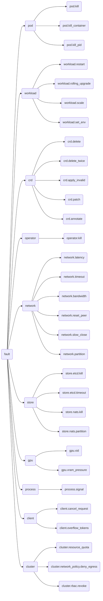

# Unified Chaos / Fault-Injection Interface — Design Document

**Status:** Draft
**Date:** 2026-05-19
**Author:** Anthony Casagrande
**Scope:** Merge two existing Python fault-injection systems — AIPerf's k8s-pod-level `tests/kubernetes/chaos/` suite and Dynamo's runtime+k8s `tests/fault_tolerance/` suite — under one async Python `FaultInjector` ABC + `InjectorRegistry`. Backward-compatible with the existing AIPerf scenarios (C1–C16, B1–B3, K1–K3, H1–H4) and the in-tree Dynamo fault-tolerance tests. Subsumes the new D-series scenario set proposed in [`2026-05-19-dynamo-chaos-suite-design.md`](2026-05-19-dynamo-chaos-suite-design.md) (referred to henceforth as the **D-series doc**).

---

## 1. Why merge?

There are three live fault-injection codebases targeting overlapping concerns:

- **System A — AIPerf chaos** (in this repo at [`tests/kubernetes/chaos/`](../../../../nvidia/projects/aiperf/ajc/new-config-kube/tests/kubernetes/chaos/)). Async Python, `kubectl exec`-driven, three sibling injectors (`ChaosInjector`, `ToxiproxyInjector`, `MockServerInjector`) glued by pytest fixtures, LIFO `_AppliedOp` restore in `MockServerInjector`, package-scoped Toxiproxy with a reserved port pool.
- **System B — Dynamo fault-tolerance** (`/tmp/dynamo/tests/fault_tolerance/`, plus shared helpers in `/tmp/dynamo/tests/utils/`). Synchronous pytest. The lifecycle primitives `ManagedProcess` (`tests/utils/managed_process.py:133`) and `ManagedDeployment` (`tests/utils/managed_deployment.py:505`) are **context managers only** — public surface is `is_running()`, `get_pid()`, `subprocesses()`, `read_logs()`, `log_path` plus the `__enter__`/`__exit__` lifecycle; termination is private (`_stop_started_processes`, `_force_stop_process`). On top of those, `tests/fault_tolerance/deploy/scenarios.py` defines a `Failure(ABC)` hierarchy keyed by scenario-name dict. Hardware faults live in `tests/fault_tolerance/hardware/fault_injection_service/`, deployed as **two workloads** — a central FastAPI `Deployment` + `Service` (`deploy/api-service.yaml`) and a per-node privileged `DaemonSet` (`deploy/gpu-fault-injector-kernel.yaml`) that uses `nsenter`+`kmsg` to inject XID errors. Socket monkey-patching for client-side cancellation lives in `cancellation/utils.py`; a real ETCD-cluster harness for HA tests lives in `etcd_ha/utils.py`.
- **System C — Proposed D-series** (the design at [`2026-05-19-dynamo-chaos-suite-design.md`](2026-05-19-dynamo-chaos-suite-design.md)). Net-new k8s-side chaos suite for Dynamo introducing nine new injectors (`EtcdInjector`, `NatsInjector`, `NixlTransportInjector`, `TPRankKillInjector`, `WeightDownloadBlackholeInjector`, `GpuVramPressureInjector`, `DeploymentMutator`, `DiscoveryRBACInjector`, `SSHSecretInjector`) and a 54-scenario catalog.

If we do nothing, the D-series ships a fourth concentric ring of injector-shaped classes with slightly different naming and lifecycle than what already exists. The point of this spec is that the **abstractions are the same**: every fault has a well-typed input, a side-effecting *inject* phase, and a restore phase that must run regardless of test outcome. Today every injector in both systems re-invents that contract.

A unified `FaultInjector` ABC plus a discovery/composition registry lets a test author say:

```python
async def test_d803_nats_kill(faults):
    async with faults.inject("store.nats.kill_pod", grace_period=0):
        await assert_traffic_continues(...)
    # automatic restore on context exit, LIFO across nested with-blocks
```

…whether the underlying mechanism is `kubectl exec kill`, a Toxiproxy REST call, a raw `os.kill(pid, SIGSTOP)` on a PID discovered inside a `ManagedProcess` subprocess (mirroring `test_canary_rank_pause.py:196`), an HTTP POST to the GPU XID injector DaemonSet, or a `kubectl patch` on a CRD spec.

The rest of this document defines that contract and shows how every existing capability maps into it.

## 2. Capability inventory — System A + B + C → unified domain

The table below is the source-of-truth mapping. Every public capability in either codebase has a row.

| Capability | Today (file:line / method) | Owner | Unified `fault_id` | Notes |
|---|---|---|---|---|
| Force-kill pod via `kubectl delete --force --grace-period=0` | A: `MockServerInjector.delete_pod` (`mock_server_injector.py:99`); B: `DeletePodFailure.execute` (`scenarios.py:236`) | both | `pod.kill` | merge: both call `kubectl delete`; unify on `kill(grace_period=0)` |
| Kill container PID 1 via `kubectl exec` | A: `ChaosInjector.kill_container_in_pod` (`chaos_injector.py:156`) | A | `pod.kill_container` | container-scoped; not whole-pod |
| Kill sibling container by PID via shared-PID-ns | A: `ChaosInjector.kill_container_by_pid` (`chaos_injector.py:422`) | A | `pod.kill_pid` | requires `shareProcessNamespace: true` |
| Send arbitrary signal to a named process | B: `TerminateProcessFailure.execute` (`scenarios.py:648`) calls `pod.exec` + `process.kill(signal)` | B | `process.signal` | unified API takes `signal: int | str` |
| SIGSTOP a worker process (canary pause) | B: `test_canary_rank_pause.py:196` issues raw `os.kill(rank_pid, signal.SIGSTOP)` on a PID discovered inside the `ManagedProcess` subprocess via `_find_engine_rank_pid` | B | `process.signal` with `signal="SIGSTOP"` |
| Force-close client TCP socket mid-request | B: `CancellableRequest.cancel` (`cancellation/utils.py:117`) — `socket.socket()` monkey-patch + `sock.close()` | B | `client.cancel_request` | socket-level; not pod-level |
| Restart Deployment via `kubectl rollout restart` | A: `MockServerInjector.restart` (`mock_server_injector.py:74`) | A | `workload.restart` | LIFO-restore strips `restartedAt` annotation |
| Trigger rolling upgrade on Dynamo deployment | B: `RollingUpgradeFailure.execute` (`scenarios.py:213`) calls `deployment.trigger_rolling_upgrade` | B | `workload.rolling_upgrade` |
| Scale Deployment to N replicas | A: `MockServerInjector.scale` (`mock_server_injector.py:123`) | A | `workload.scale` | records prior count for restore |
| Set env var on Deployment | A: `MockServerInjector.patch_env` (`mock_server_injector.py:164`) | A | `workload.set_env` | LIFO removes the var on restore |
| Toxiproxy `add_proxy` / `add_toxic` | A: `ToxiproxyInjector` (`toxiproxy.py:227,251`) | A | `network.latency`, `network.timeout`, `network.bandwidth`, `network.reset_peer`, `network.slow_close`, `network.partition` (one per toxic type) | underlying mechanism stays; surface is fault-domain dotted name |
| Apiserver pause / TLS-passthrough proxy | A: `operator_ready_apiserver_toxiproxy_routed` fixture (`conftest.py:175`) | A | `network.apiserver.timeout` | composite: deploy operator with envs + add toxic |
| Operator→controller HTTP blackhole | A: `operator_ready_toxiproxy_routed` (`conftest.py:134`) | A | `network.controller_http.timeout` |
| etcd pod kill | B+C: `EtcdCluster.terminate_replica(idx)` (`etcd_ha/utils.py:346`) — internally calls `replica.stop()` on a `ManagedProcess`-derived `EtcdReplicaServer`; C plans `EtcdInjector.kill_pod` | both | `store.etcd.kill` | unify on the planned `EtcdInjector` shape |
| etcd network pause via Toxiproxy | C plans (`EtcdInjector` + Toxiproxy on `:2379`) | C | `store.etcd.timeout`, `store.etcd.bandwidth` |
| NATS pod kill | C plans `NatsInjector.kill_pod` | C | `store.nats.kill` |
| NATS partition | C plans `NatsInjector` toxics | C | `store.nats.partition`, `store.nats.slow_close` |
| Delete CR (no wait) | A: `ChaosInjector.delete_cr_no_wait` (`chaos_injector.py:71`); D-series doc parameterizes for any kind | A→generic | `crd.delete` | generalized via `cr_kind` ctor arg |
| Rapid double-delete | A: `ChaosInjector.delete_cr_twice` (`chaos_injector.py:90`) | A | `crd.delete_twice` |
| Apply invalid CR | A: `ChaosInjector.create_invalid_cr` (`chaos_injector.py:511`) | A | `crd.apply_invalid` | spec template injected by subclass |
| Patch CRD spec (mid-run mutation) | C plans `DeploymentMutator` patch | C | `crd.patch` |
| Stamp operator-internal annotation | A: `ChaosInjector.stamp_completion_claim` (`chaos_injector.py:132`) | A | `crd.annotate` | hardcoded annotation today; generic helper instead |
| Kill operator pod | A: `ChaosInjector.kill_operator_pod` (`chaos_injector.py:117`) | A→generic | `operator.kill` | parameterize selector/ns |
| Apply ResourceQuota | A: `ChaosInjector.apply_resource_quota` (`chaos_injector.py:640`) | A | `cluster.resource_quota` |
| Delete ResourceQuota | A: `ChaosInjector.delete_resource_quota` (`chaos_injector.py:663`) | A | LIFO restore for above |
| NetworkPolicy egress blackhole | C plans `WeightDownloadBlackholeInjector` | C | `cluster.network_policy.deny_egress` |
| RBAC role patch / revoke | C plans `DiscoveryRBACInjector` | C | `cluster.rbac.revoke` |
| GPU XID error injection | B: FastAPI route `@app.post("/inject-xid")` (`hardware/fault_injection_service/agents/gpu_fault_injector/agent.py:170`) delegating to `GPUFaultInjector.kernel_xid_injector.inject_xid` (`agent.py:218`) | B | `gpu.xid` | HTTP POST to per-node DaemonSet (or central API-service Deployment) |
| VRAM pressure sidecar | C plans `GpuVramPressureInjector` | C | `gpu.vram_pressure` |
| Token-overflow client-side input | B: `TokenOverflowFailure` (`scenarios.py:698`) | B | `client.overflow_tokens` |
| Wait helpers (CR gone, pods gone, phase) | A: `ChaosInjector.wait_for_*` (`chaos_injector.py:180,210,261`) | A | `observers.wait_for_*` | not faults — separate concern, kept on injectors as helpers |

Capabilities marked "owner: A→generic" or "C" are net-new under this unification; everything else is a rename + adapter into the unified surface.

## 3. The unified interface

### 3.1 `FaultInjector` ABC

```python
# tests/kubernetes/chaos_common/base.py
from __future__ import annotations
from abc import ABC, abstractmethod
from contextlib import AbstractAsyncContextManager
from dataclasses import dataclass, field
from typing import Any, ClassVar, Protocol


@dataclass(frozen=True)
class FaultSpec:
    """Identity + parameters for one fault application.

    `fault_id` is the dotted name from the fault-domain tree (Section 3.4).
    `params` are passed verbatim to the resolver. `target` is opaque to the
    registry; each injector subclass parses its own shape (a pod name, a
    Toxiproxy proxy name, a deployment ref, etc.).
    """
    fault_id: str
    params: dict[str, Any] = field(default_factory=dict)
    target: dict[str, Any] = field(default_factory=dict)


class AppliedFault(AbstractAsyncContextManager["AppliedFault"]):
    """Handle to a single fault that has been (or will be) injected.

    Async context manager: `__aenter__` is a no-op (the inject already happened
    in `FaultInjector.inject`); `__aexit__` calls `restore()` regardless of
    exception state. The registry's `compose()` builder relies on
    `AsyncExitStack` for LIFO ordering across multiple faults.

    Subclasses must populate `metadata` with enough state to restore the
    mutation — mirrors AIPerf's `_AppliedOp` pattern (`mock_server_injector.py:42`)
    but lifted to the ABC.
    """
    spec: FaultSpec
    metadata: dict[str, Any]  # populated by inject(); read by restore()
    _restored: bool

    async def __aenter__(self) -> AppliedFault:
        return self

    async def __aexit__(self, exc_type, exc, tb) -> None:
        if not self._restored:
            await self.restore()

    @abstractmethod
    async def restore(self) -> None:
        """Reverse the mutation. Idempotent. Tolerates 'already gone'."""
        ...


class FaultInjector(ABC):
    """Resolve a `FaultSpec` and produce an `AppliedFault` handle.

    Subclasses declare which `fault_id` namespace prefixes they own via the
    class-level `HANDLES` tuple. The registry uses this for dispatch.
    """

    HANDLES: ClassVar[tuple[str, ...]] = ()

    @abstractmethod
    async def inject(self, spec: FaultSpec) -> AppliedFault:
        """Perform the mutation and return the restore handle.

        Raises:
            FaultPreconditionError: when the target is in an unexpected state
                (CR missing, pod not ready, Toxiproxy not reachable).
            FaultMechanismError: when the underlying mechanism fails
                (kubectl returned non-zero, REST POST returned 5xx).
        """
        ...

    @classmethod
    def handles(cls, fault_id: str) -> bool:
        return any(fault_id == prefix or fault_id.startswith(prefix + ".")
                   for prefix in cls.HANDLES)
```

The two error classes are explicit so test code can `except FaultMechanismError` vs `except FaultPreconditionError` independently — see Section 5 on observability.

### 3.2 `InjectorRegistry`

```python
# tests/kubernetes/chaos_common/registry.py
from __future__ import annotations
from contextlib import AsyncExitStack, asynccontextmanager
from typing import Any, Callable, ClassVar


class InjectorRegistry:
    """Holds the set of `FaultInjector` instances available to a test.

    Discovery: explicit `register()` calls inside pytest fixtures. We rejected
    decorator-based auto-discovery (rationale in Section 7): too much magic for
    a test harness, fights pytest's own collection cycle.
    """

    def __init__(self) -> None:
        self._injectors: list[FaultInjector] = []

    def register(self, injector: FaultInjector) -> None:
        self._injectors.append(injector)

    def resolve(self, fault_id: str) -> FaultInjector:
        for inj in self._injectors:
            if inj.handles(fault_id):
                return inj
        raise LookupError(
            f"no FaultInjector registered for {fault_id!r}; registered: "
            f"{[i.__class__.__name__ + str(i.HANDLES) for i in self._injectors]}"
        )

    @asynccontextmanager
    async def inject(self, fault_id: str, **params: Any):
        """Apply one fault for the lifetime of the `async with` block."""
        target = params.pop("target", {})
        spec = FaultSpec(fault_id=fault_id, params=params, target=target)
        injector = self.resolve(fault_id)
        applied = await injector.inject(spec)
        try:
            async with applied:
                yield applied
        finally:
            pass  # restore() already invoked via __aexit__

    @asynccontextmanager
    async def compose(self, *fault_specs: tuple[str, dict[str, Any]]):
        """Apply N faults atomically; restore LIFO on exit."""
        async with AsyncExitStack() as stack:
            handles = []
            for fault_id, params in fault_specs:
                applied = await stack.enter_async_context(self.inject(fault_id, **params))
                handles.append(applied)
            yield handles
```

The pytest fixture wiring is straightforward:

```python
# tests/kubernetes/chaos_common/conftest.py
@pytest_asyncio.fixture
async def faults(kubectl, toxiproxy_admin, dynamo_deployer):
    reg = InjectorRegistry()
    reg.register(PodInjector(kubectl))
    reg.register(WorkloadInjector(kubectl))
    reg.register(CRDInjector(kubectl, cr_kind="aiperfjob", cr_api_group="aiperf.nvidia.com"))
    reg.register(NetworkInjector(toxiproxy_admin))
    reg.register(StoreInjector(kubectl, toxiproxy_admin))
    reg.register(GPUInjector(kubectl, daemonset_url=...))
    reg.register(ProcessInjector(kubectl))
    reg.register(ClientInjector())
    reg.register(ClusterInjector(kubectl))
    yield reg
    # registry has no state to tear down; per-injector cleanup is
    # already handled by the AsyncExitStack inside each `inject()` block.
```

### 3.3 Concrete injector skeletons

The interface is enforced by ABCs; here are the eight concrete classes that cover the entire capability matrix from Section 2.

```python
class PodInjector(FaultInjector):
    HANDLES = ("pod",)
    # pod.kill, pod.kill_container, pod.kill_pid

class WorkloadInjector(FaultInjector):
    HANDLES = ("workload",)
    # workload.restart, workload.rolling_upgrade, workload.scale, workload.set_env

class CRDInjector(FaultInjector):
    HANDLES = ("crd", "operator")
    # crd.delete, crd.delete_twice, crd.apply_invalid, crd.patch, crd.annotate, operator.kill

class NetworkInjector(FaultInjector):
    HANDLES = ("network",)
    # network.{latency,timeout,bandwidth,reset_peer,slow_close,partition}.{generic,apiserver,controller_http,mock_server}

class StoreInjector(FaultInjector):
    HANDLES = ("store",)
    # store.etcd.{kill,timeout,bandwidth,partition}, store.nats.{kill,partition,slow_close}

class GPUInjector(FaultInjector):
    HANDLES = ("gpu",)
    # gpu.xid (HTTP POST to DaemonSet), gpu.vram_pressure (sidecar)

class ProcessInjector(FaultInjector):
    HANDLES = ("process",)
    # process.signal (SIGKILL, SIGSTOP, SIGTERM, ...) — uses kubectl exec OR ManagedProcess

class ClientInjector(FaultInjector):
    HANDLES = ("client",)
    # client.cancel_request (socket close), client.overflow_tokens

class ClusterInjector(FaultInjector):
    HANDLES = ("cluster",)
    # cluster.resource_quota, cluster.network_policy.deny_egress, cluster.rbac.revoke
```

Each concrete class internally composes the legacy helpers — `PodInjector` calls into the existing `kubectl.run("delete", "pod", ...)`; `NetworkInjector` proxies to the existing `ToxiproxyInjector._post_json`; `ProcessInjector` *either* calls `kubectl exec` (k8s case, all D5xx scenarios) *or* (for the in-process Dynamo cases mirroring `cancellation/` and `migration/`) discovers a PID inside a `ManagedProcess`-managed subprocess and issues `os.kill(pid, signal)` directly — `ManagedProcess` itself exposes no public `send_signal` / `terminate`.

### 3.4 Fault-domain tree



Naming rules:

1. **Dotted, lowercase, no underscores between domain segments.** Underscores *inside* a leaf are OK (`kill_container`, `reset_peer`) because they describe a single verb. Periods are domain boundaries.
2. **Pod-scope vs. workload-scope is explicit.** `pod.kill` removes one pod; `workload.restart` rolls a Deployment. Same kubectl machinery, different semantic blast radius.
3. **Target subdomains are flat under their domain** when the underlying mechanism is uniform (`network.latency` works for any TCP endpoint via Toxiproxy). When the mechanism diverges by target (apiserver TLS-passthrough vs. plain TCP), the divergence is encoded in the `target` dict of `FaultSpec`, not in a deeper `fault_id`.

## 4. Resolving naming collisions (A vs B)

| Collision | Today | Pick | Migration |
|---|---|---|---|
| `kill_container_in_pod` (A) vs raw `os.kill(pid, signal)` on a PID discovered in a `ManagedProcess`-managed subprocess (B) | A is k8s-scoped, B is subprocess-scoped | Keep both, but `pod.kill_container` is the k8s case and `process.signal` (with `signal="SIGTERM"` or `signal="SIGKILL"`) is the subprocess case. The dispatcher decides by `target.kind` (`"pod"` vs `"managed_process"`). | `MockServerInjector.delete_pod` → `pod.kill`. `ProcessInjector` becomes the thin wrapper that does PID discovery + `os.kill` for tests that want unified discovery. |
| `restart` (A: Deployment rollout) vs implicit "respawn the `ManagedProcess` context manager" (B) | both | A becomes `workload.restart`. B has no first-class respawn method; dynamo today exits the context manager and enters a fresh one. Our `process.restart` formalizes that pattern as a single op for tests that want one fault-id. |
| `scale` (A) vs `_set_replicas` (B internal helper) | A | `workload.scale` for both. B's helper is private; nothing to migrate. |
| `cancel_request` | only B | `client.cancel_request` |
| `pause` | proposed everywhere, never landed | `process.signal(signal="SIGSTOP")`. No new verb. |

## 5. Cleanup contract

The LIFO `_AppliedOp` model in `mock_server_injector.py:42` is the right shape; it generalizes by lifting the responsibility into `AppliedFault.metadata` (Section 3.1). Two specifics worth nailing down:

**Test-crash before `finally`.** If the test process is killed (SIGKILL on the runner), `AsyncExitStack.__aexit__` does not run; no `restore()` fires. We accept this — the same is true today — and add a **session-scoped sweeper fixture** that, at session teardown, walks every fault-touched namespace and force-deletes:

- Test namespaces under the harness prefix (`aiperf-test-*`, `dynamo-test-*`).
- The toxiproxy namespace (`aiperf-chaos-toxiproxy` → `chaos-toxiproxy` per D-series doc).
- Any operator-level annotations stamped via `crd.annotate` (cleared by deleting the CR, which is already part of namespace teardown).

The sweeper does *not* try to undo cluster-scoped mutations (RBAC, ResourceQuota, NetworkPolicy). Those are explicitly tagged at injection time and recorded in a session-scoped `pytest-cache` JSON; if the session crashes hard, a `pytest --chaos-sweep` recovery command reads the JSON and reverses them. This is borrowed verbatim from AIPerf's existing pattern of dropping cleanup state in cache files when the operator pod itself died mid-test.

**Restore that fails.** Every `restore()` swallows its own exceptions and logs a warning (see `MockServerInjector.restore`, `mock_server_injector.py:202`) — failing restores must not mask the original test exception. The session sweeper is the backstop.

## 6. Backward compatibility

**Decision: keep the old API in place; the new unified API wraps it.** Concretely:

- `ChaosInjector`, `ToxiproxyInjector`, `MockServerInjector` in `tests/kubernetes/chaos/` stay unchanged. They keep their existing public methods, existing fixture wiring, existing tests.
- The new module `tests/kubernetes/chaos_common/` introduces the ABC + registry + eight concrete injectors. Each concrete injector internally instantiates (or holds a reference to) the legacy class and delegates.
- New scenarios — all D-series, plus any new AIPerf scenarios authored after the merge — use the unified API exclusively.
- Existing tests are **not rewritten**. The legacy fixtures (`chaos_injector`, `toxiproxy_injector`, `mock_server_injector`) keep working. We add a single new `faults` fixture (Section 3.2) that any test can request.

Rejected alternatives:

- *Rewrite the old tests*: 16+8+4 existing scenarios, each ~50 LOC, mostly stable. Rewriting risks regressing tests we depend on for the operator we're shipping.
- *Deprecate the old API immediately*: same risk, plus we're mid-flight on the AIPerf k8s post-port branch (`ajc/k8s-post-port`); a deprecation warning every test run is noise.
- *Adapter layer that re-exports old names from `chaos_common`*: tempting but creates an import-cycle hazard between `chaos/` and `chaos_common/`. Simpler to have `chaos_common/` *depend on* `chaos/` for the legacy implementations during the transition, then later (post-D-series Wave 0 ship) flip the dependency.

The migration order is therefore:

1. Land `chaos_common/` with ABCs + registry + the eight concrete injectors, each delegating to legacy classes. **No existing test changes.**
2. Author all D-series scenarios on the new API directly.
3. Once Wave 0 of the D-series is green, *only then* consider lifting AIPerf scenarios to the new API one file at a time. Likely never urgent.

## 7. Cross-repo strategy (Dynamo)

`/tmp/dynamo/tests/fault_tolerance/` is upstream and we cannot merge our code there. Three options:

1. **Vendor + adapt their helpers.** Copy `cancellation/utils.py`, `migration/utils.py`, `etcd_ha/utils.py`, `hardware/fault_injection_service/` into AIPerf and re-license/re-attribute. Pro: full control. Con: version skew with upstream — when their `ManagedProcess` API drifts, our copies rot.
2. **Import their package as a test-dep.** Add `dynamo[fault-tolerance]` to `[project.optional-dependencies]` and import `tests.fault_tolerance.cancellation.utils` directly. Pro: stays current. Con: requires upstream to ship `tests/` as a package (they don't, today), and we'd be importing from a path that is explicitly under their `tests/` tree.
3. **Re-implement wrappers; call dynamo's modules as black-box subprocesses.** Our `ProcessInjector` shells out to a thin Python entrypoint inside the dynamo image that invokes their helpers. Pro: zero source coupling. Con: an extra IPC hop.

**Pick: (3) for the runtime-process helpers (`ProcessInjector`, `ClientInjector`), (1) for the GPU-fault DaemonSet (`GPUInjector`).** Rationale:

- The `ManagedProcess` family lives in `tests/utils/` (not `tests/fault_tolerance/`) and is a shared test utility that other tests rely on. Public surface is small (`is_running`, `get_pid`, `subprocesses`, `read_logs`, plus the context-manager lifecycle); termination is private. The handful of cases where we do want SIGSTOP-on-an-engine-process (D504, mirroring `test_canary_rank_pause.py:196`) can be implemented via `kubectl exec ... -- kill -STOP <pid>` directly. Vendoring `ManagedProcess` would also drag `ManagedDeployment` and the rest of `tests/utils/` along with it.
- The GPU XID fault-injection service is **two workloads**, not one: `deploy/gpu-fault-injector-kernel.yaml` (privileged per-node DaemonSet running the kernel-XID agent — the actual injection runs in `agent.py:218`) plus `deploy/api-service.yaml` (central FastAPI `Deployment` + `Service` that fronts the DaemonSet replicas). The agent talks to the kernel via `nsenter`+`kmsg` — stable kernel API, not dynamo API. We vendor **both** YAMLs into `chaos_common/fixtures/gpu_fault_injector/` (re-namespaced) and the Python client is a thin `aiohttp.post()` wrapper in `GPUInjector` that either targets the DaemonSet directly (per-node) or fronts via the API-service Deployment.

For the etcd-HA test pattern (cluster-of-three-etcd-replicas in subprocess), we do *not* port it: the corresponding k8s-side fault (`store.etcd.kill`) operates on the real bundled etcd that ships with the helm chart, which is closer to production and avoids reproducing dynamo's etcd-cluster harness.

## 8. Scenario catalog under the unified API

Five representative AIPerf scenarios + five Dynamo / D-series ones, rewritten against `faults`.

### A1. AIPerf C1 — delete CR mid-ramp

```python
async def test_c1_delete_aiperfjob_mid_ramp(faults, aiperf_job_fixture):
    job = await aiperf_job_fixture.apply()
    await faults.resolve("crd.delete").wait_for_phase(
        ns=job.namespace, name=job.name, phases=("Running",), current_phase="profiling"
    )
    async with faults.inject(
        "crd.delete",
        target={"kind": "aiperfjob", "ns": job.namespace, "name": job.name},
        wait=False,
    ):
        await faults.resolve("crd.delete").wait_for_cr_gone(job.namespace, job.name, timeout=60)
```

### A2. AIPerf C4 — kill operator mid-benchmark

```python
async def test_c4_kill_operator(faults, aiperf_job_fixture):
    job = await aiperf_job_fixture.apply_and_wait("profiling")
    async with faults.inject("operator.kill", target={"selector": "app.kubernetes.io/name=aiperf-operator", "ns": "aiperf-system"}):
        await faults.resolve("operator.kill").wait_for_operator_ready(timeout=30)
    await aiperf_job_fixture.wait_for_completion(timeout=180)
```

### A3. AIPerf B3 — mock-server latency injection

```python
async def test_b3_mock_server_latency(faults, mock_server_routed_through_toxiproxy):
    async with faults.inject(
        "network.latency",
        target={"proxy": "mock-server", "listen": "0.0.0.0:20010", "upstream": "aiperf-mock-server.default.svc:8000"},
        attributes={"latency": 500, "jitter": 100},
    ):
        # ... drive benchmark, assert P99 reflects added latency ...
```

### A4. AIPerf K1 — ImagePullBackOff surfaces Pending

```python
async def test_k1_image_pull_backoff(faults, aiperf_job_fixture):
    await aiperf_job_fixture.apply(image="does-not-exist:nope")
    pod = await faults.resolve("pod.kill").wait_for_pod_status_reason(
        namespace=aiperf_job_fixture.namespace,
        label_selector=f"jobset.sigs.k8s.io/jobset-name=aiperf-{aiperf_job_fixture.name}",
        reason="ImagePullBackOff",
        timeout=120,
    )
    assert pod
```

### A5. AIPerf H2 — helm upgrade with in-flight job

```python
async def test_h2_upgrade_inflight(faults, helm, aiperf_job_fixture):
    job = await aiperf_job_fixture.apply_and_wait("profiling")
    async with faults.inject("workload.rolling_upgrade", target={"deployment": "aiperf-operator", "ns": "aiperf-system"}):
        await helm.upgrade(values={"image.tag": "new"})
    await aiperf_job_fixture.wait_for_completion()
```

### D1. D803 — NATS pod kill mid-traffic

```python
async def test_d803_nats_kill_mid_traffic(faults, dynamo_endpoint_url, client_factory):
    client = await client_factory(dynamo_endpoint_url, concurrency=8)
    async with client.background_traffic():
        before = await client.scrape_metrics()
        async with faults.inject("store.nats.kill", target={"ns": "dynamo-system", "selector": "app=nats"}, grace_period=0):
            await asyncio.sleep(15)
            during = await client.scrape_metrics()
            assert during.completed_total > before.completed_total
        await asyncio.sleep(30)
        after = await client.scrape_metrics()
        assert (after.errors_total - during.errors_total) / max(after.completed_total - during.completed_total, 1) < 0.05
```

### D2. D301 — NIXL reset_peer mid-handoff

The NIXL Toxiproxy mapping (proxy `nixl` on `0.0.0.0:20040` → `decode-worker:5601`) is created once by the `nixl_proxy_routed` fixture during deployment setup so the worker is already routed through Toxiproxy when traffic starts. The fault itself only adds + removes the `reset_peer` toxic.

```python
async def test_d301_nixl_reset_peer(faults, dynamo_disagg_deployment, nixl_proxy_routed, client_factory):
    client = await client_factory(dynamo_disagg_deployment.frontend_url, concurrency=4)
    async with client.background_traffic(), faults.inject(
        "network.reset_peer", target={"proxy": "nixl"},
    ):
        await asyncio.sleep(20)
        # assert frontend surfaces 500 + structured error, decode does not crash-loop
```

### D3. D504 — engine SIGSTOP (port of dynamo's `test_canary_rank_pause.py`)

```python
async def test_d504_engine_sigstop_triggers_liveness_failure(faults, dynamo_decode_pod):
    pid = await dynamo_decode_pod.find_pid("vllm.entrypoints")
    async with faults.inject(
        "process.signal",
        target={"kind": "pod", "ns": dynamo_decode_pod.ns, "pod": dynamo_decode_pod.name, "container": "main", "pid": pid},
        signal="SIGSTOP",
    ):
        await assert_liveness_probe_fails_within(periods=3, timeout=30)
```

### D4. Cancellation (port of dynamo's `CancellableRequest`)

```python
async def test_client_cancellation(faults, dynamo_frontend_url):
    req = await faults.resolve("client.cancel_request").start(dynamo_frontend_url, prompt="…", stream=True)
    await asyncio.sleep(0.5)
    async with faults.inject("client.cancel_request", target={"handle": req.id}):
        ...  # assertion on frontend cancellation-counter metric
```

### D5. ETCD HA — kill leader

`EtcdCluster` (`etcd_ha/utils.py:133`) exposes `terminate_replica(idx)` + per-replica `is_leader()`; there is no `get_leader()` / `wait_for_new_leader()` method, so the test composes them manually:

```python
async def test_etcd_leader_kill(faults, etcd_cluster):
    leader_idx, leader = next(
        (idx, r) for idx, r in enumerate(etcd_cluster._replicas) if r.is_leader()
    )
    async with faults.inject(
        "store.etcd.kill",
        target={"cluster": etcd_cluster, "replica_idx": leader_idx},
        grace_period=0,
    ):
        # Poll for a different replica to take over leadership.
        deadline = asyncio.get_event_loop().time() + 30
        while asyncio.get_event_loop().time() < deadline:
            new_idx = next(
                (idx for idx, r in enumerate(etcd_cluster._replicas)
                 if idx != leader_idx and r.is_leader()),
                None,
            )
            if new_idx is not None:
                break
            await asyncio.sleep(0.5)
        assert new_idx is not None, "no new leader within 30s"
```

(The `store.etcd.kill` resolver calls `etcd_cluster.terminate_replica(replica_idx)` internally; the test stays at the EtcdCluster API surface.)

## 9. File layout

```
tests/kubernetes/chaos_common/             # NEW shared module
  __init__.py
  base.py                                  # FaultInjector ABC, AppliedFault, FaultSpec, errors
  registry.py                              # InjectorRegistry + compose()
  conftest.py                              # `faults` fixture, session sweeper
  injectors/
    __init__.py
    pod.py                                 # PodInjector — wraps legacy ChaosInjector.kill_*
    workload.py                            # WorkloadInjector — wraps MockServerInjector + RollingUpgradeFailure
    crd.py                                 # CRDInjector — generalized from ChaosInjector
    network.py                             # NetworkInjector — wraps ToxiproxyInjector
    store.py                               # StoreInjector — etcd + NATS, mixes pod + network
    gpu.py                                 # GPUInjector — DaemonSet client (vendored from dynamo)
    process.py                             # ProcessInjector — kubectl exec OR ManagedProcess
    client.py                              # ClientInjector — socket-close, token-overflow
    cluster.py                             # ClusterInjector — ResourceQuota, NetworkPolicy, RBAC
  fixtures/
    toxiproxy.yaml                         # ported from chaos/fixtures/, expanded ports
    gpu_fault_injector_daemonset.yaml      # vendored from dynamo, re-namespaced
  README.md
  FEATURES.md                              # mirror of chaos/FEATURES.md

tests/kubernetes/chaos/                    # EXISTING — unchanged
  ... (all existing files stay)

tests/kubernetes/chaos_dynamo/             # NEW (per D-series doc)
  ... (uses chaos_common/ exclusively, no own injectors except dynamo-specific helpers)
```

## 10. Rejected alternatives

**(a) Keep two parallel suites with no merger.** Lowest engineering cost today but guarantees three sets of subtly different injector APIs the first time someone writes a scenario that touches both AIPerf and Dynamo (e.g. an end-to-end soak that benchmarks Dynamo via AIPerf and faults both). Rejected.

**(b) Fully replace dynamo's suite with our k8s-side suite.** Dynamo's `tests/fault_tolerance/` is upstream-maintained and already covers things our k8s-side suite *cannot* — `ManagedProcess` lifecycle, in-process socket monkey-patching for cancellation, multi-replica ETCD cluster boot. Replacing it would either lose coverage or require us to maintain a fork of dynamo's runtime harness in our repo. Rejected.

**(c) Use Chaos Mesh or LitmusChaos instead of building this.** Tempting because both are mature, declarative, k8s-native. The problem: both are *campaign* tools (apply chaos for N minutes, observe Prometheus). Neither integrates cleanly with pytest's `try/finally` per-test cleanup model, and neither understands AIPerfJob/DGD CR-status transitions, which is the *primary* assertion surface for our operator chaos. Chaos Mesh's `PodChaos`/`NetworkChaos` CRDs could back our `PodInjector`/`NetworkInjector` *internally* in a future iteration — that would replace Toxiproxy and the `kubectl exec kill` machinery — but the test-author-facing surface (the unified ABC) stays. Rejected as a replacement; tracked as a future internal mechanism swap.

**(d) Decorator-based injector discovery (`@register_injector("network")`).** Magic; conflicts with pytest's collection cycle; makes tracebacks during fixture errors point inside the decorator. Explicit `registry.register(...)` in a conftest is half a screen of code and zero magic. Rejected.

## 11. Open questions

1. **How do we expose `wait_for_*` observers under the unified API?** They are not faults but every chaos test needs them. Current spec proposal: they stay as methods on the concrete injectors (`faults.resolve("crd.delete").wait_for_cr_gone(...)`). Alternative: pull them out into a separate `Observer` family. Slight risk of API sprawl either way; needs a vote before implementation.
2. **`AppliedFault.metadata` shape — typed or `dict[str, Any]`?** A `TypedDict` per concrete injector would be more discoverable but bloats the ABC surface. A `dict[str, Any]` mirrors the existing `_AppliedOp.payload` shape and keeps subclasses free to evolve. Leaning toward `dict[str, Any]` with per-injector dataclasses inside; needs a usage sample to validate.
3. **Cross-repo strategy for `ManagedProcess` — durable?** Section 7 picks option (3) (re-implement) because the cases we need are narrow. If the D-series ever needs `ManagedProcess`'s log-capture + port-allocation semantics, we revisit and likely flip to option (1) (vendor + adapt). Need to confirm with the first D5xx scenario that actually needs it.
