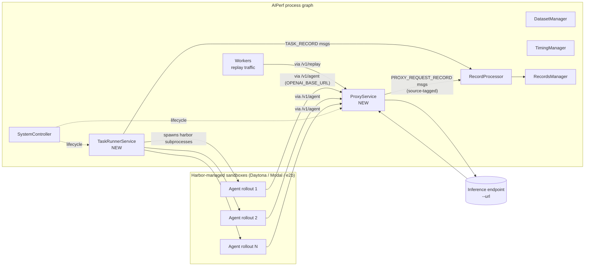
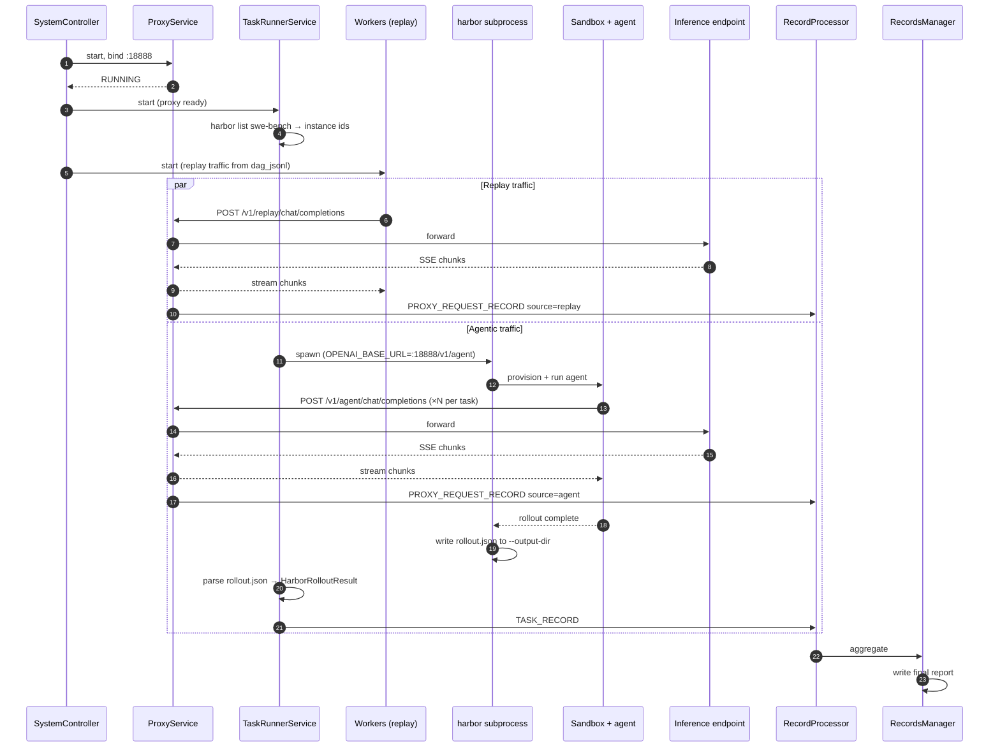

<!--
SPDX-FileCopyrightText: Copyright (c) 2026 NVIDIA CORPORATION & AFFILIATES. All rights reserved.
SPDX-License-Identifier: Apache-2.0
-->

# AIPerf + Harbor: Agentic Benchmarking Design

**Status:** Draft (brainstormed 2026-05-29, awaiting user review)
**Owner:** dbermudez@nvidia.com
**Spec location:** `docs/superpowers/specs/2026-05-29-aiperf-harbor-agentic-design.md`

## 1. Problem

AIPerf measures inference-server performance under request-shaped load (TTFT, ITL, throughput). Its `--accuracy-benchmark` system grades single-shot or few-shot tasks (MMLU, AIME) alongside per-request perf. Neither model fits **agentic** benchmarks like SWE-bench and Terminal-bench, where a single "unit of work" is a multi-minute, multi-turn agent rollout running in a sandbox, issuing dozens of model calls and executing tools, ending in a binary resolved/not-resolved outcome.

The [Harbor framework](https://pypi.org/project/harbor/) is the official harness for Terminal-Bench-2.0 and integrates SWE-Bench. It runs real agents (Claude Code, OpenHands, Codex CLI) in sandboxed environments via providers like Daytona, Modal, and e2b, and grades them. Harbor solves the agent-execution-and-grading problem; AIPerf solves the inference-perf-measurement problem. We want both signals from one benchmark run, correlated, ideally alongside other concurrent traffic to simulate multi-tenant production conditions.

## 2. Goals and non-goals

### Goals

- Measure per-request inference perf (TTFT, ITL, throughput) for traffic generated by harbor agents during a SWE-bench or Terminal-bench run.
- Report per-task outcomes (resolved rate, rollout wall-clock, tokens-per-task) from the same run, as a new metrics aggregate.
- Support concurrent **agent traffic + replayed trace traffic** through the same inference endpoint, with metrics bucketed by source so users can see how agent-shaped load interacts with baseline chat traffic.
- Keep harbor coupling loose enough that harbor 0.x releases don't break AIPerf — subprocess invocation, vendored output schema, no Python-API import.
- Reuse AIPerf's existing services, message bus, records pipeline, and artifact conventions where possible.
- Leave the new proxy reusable for non-harbor agentic clients (OpenHands, Codex CLI, anything honoring `OPENAI_BASE_URL`).

### Non-goals (v1)

- Per-step request-ID correlation between proxy records and harbor's per-step output (revisit when there's a concrete drill-down need).
- Crash recovery / resume-from-checkpoint for partially-completed harbor runs.
- AIPerf-managed sandbox provisioning (harbor owns Daytona/Modal/e2b lifecycle entirely).
- Real sandbox provider tests in AIPerf CI (out of scope; harbor tests its own providers).
- Other agent harnesses (`openhands`, `codex` as task-runner values) — the enum leaves room, but only `harbor` is implemented in v1.

## 3. Design decisions (brainstorm outcomes)

| Decision | Choice | Rejected alternatives |
|---|---|---|
| Where does AIPerf measure agent model calls? | **Network-level capture via reverse proxy.** | Task-level only (loses per-request resolution); instrument harbor's HTTP client (requires harbor cooperation per release). |
| What traffic flows through the proxy? | **Agent traffic + replayed traces, both source-tagged.** | Agent only (loses multi-tenant story); agent + synthetic worker load (synthetic is a worse proxy for real chat traffic than recorded traces). |
| How is harbor invoked? | **Subprocess + vendored Pydantic schema for harbor's rollout JSON.** | CLI subprocess with stdout scraping (brittle); Python API import (couples to harbor 0.x churn). |
| How is concurrency expressed? | **Two independent knobs: `--task-concurrency N` (rollouts) and `--concurrency M` (replay requests).** | Shared in-flight budget (agent stalls perturb the latency being measured); task-concurrency only (drops multi-tenant goal). |
| How is the architecture sliced? | **Two new services as peers: `ProxyService` + `TaskRunnerService`.** | One service embedding the proxy (proxy can't be reused); proxy + harbor-as-new-endpoint-type (requires reworking worker credit lifetimes for multi-minute units of work). |

## 4. Architecture

Two new `BaseComponentService` peers join the existing AIPerf process graph, registered in `src/aiperf/plugin/plugins.yaml` under the `service:` category.



Key invariants:

- **The proxy is the only entity on the live request path.** AIPerf-controlled replay workers and harbor-driven agents both hit it; it forwards to `--url` and emits per-request records with a `source` discriminator inferred from URL path.
- **`TaskRunnerService` is a subprocess supervisor only.** It spawns `harbor run …` subprocesses with `OPENAI_BASE_URL` pointed at the proxy's `/v1/agent/` path. It does not touch sandboxes; harbor owns sandbox lifecycle.
- **Two new message types** flow into the existing records pipeline: `PROXY_REQUEST_RECORD` (per HTTP call, source-tagged) and `TASK_RECORD` (per rollout).
- **Existing services unchanged** except `RecordProcessor`, which gains handlers for the two new message types.

## 5. Components

### 5.1 `ProxyService` — `src/aiperf/proxy/service.py`

`BaseComponentService` hosting a FastAPI app on `--proxy-port` (default `18888`). Three passthrough routes to `--url`:

- `POST /v1/agent/{path:path}` → `source="agent"`
- `POST /v1/replay/{path:path}` → `source="replay"`
- `POST /v1/worker/{path:path}` → `source="worker"`

Each route streams the upstream response back faithfully — SSE chunks forwarded as they arrive, no buffering — which is critical to preserve TTFT/ITL measurement. Each request is timed at: send, first byte (TTFT), each chunk (ITL), final. The proxy parses request and response payloads to extract input/output token counts. Records `PROXY_REQUEST_RECORD` messages with: `source`, upstream path (e.g. `chat/completions`), timings, status, token counts, generated `request_id`. Headers from client → proxy → upstream are forwarded transparently except `Host`. Auth headers (`Authorization`, `api-key`) pass through unchanged.

**HTTP client for upstream:** `httpx` (already in AIPerf deps).

**Depends on:** `BaseComponentService`, existing message bus, FastAPI (already in deps).

### 5.2 `TaskRunnerService` — `src/aiperf/task_runner/service.py`

`BaseComponentService` that supervises `harbor run` subprocesses. On `@on_start`:

1. Read CLI flags: `--task-concurrency N`, `--harbor-benchmark <name>`, `--harbor-output-dir <path>` (defaults under `<artifact_dir>/harbor`), `--harbor-extra-args <str>`.
2. Resolve the instance list by invoking `harbor list <benchmark>` once.
3. Construct `asyncio.Semaphore(N)` and an instance queue.
4. Launch a single `@background_task` dispatcher coroutine that, for each instance in the queue, awaits a free semaphore slot and then schedules a per-instance worker coroutine via `asyncio.create_task`. This produces up to N concurrent rollouts at any moment; the dispatcher itself does not block on subprocess completion.
5. Each per-instance worker: spawn `harbor run <benchmark> --instance <id> --model <model> --base-url http://localhost:<proxy-port>/v1/agent --output-dir <path>/<id> [harbor-extra-args]` → await subprocess exit → parse rollout JSON → emit `TASK_RECORD` → release the semaphore slot.

**Depends on:** `ProxyService` lifecycle (must be `RUNNING` before `TaskRunnerService` starts spawning), `harbor` CLI on `PATH`, the vendored Pydantic schema (5.3).

### 5.3 Vendored harbor schema — `src/aiperf/task_runner/harbor_schema.py`

Pydantic models mirroring harbor's per-rollout output JSON. Initial shape (verified against an actual harbor 0.9.0 rollout before implementation):

```python
class HarborRolloutResult(AIPerfBaseModel):
    model_config = ConfigDict(extra="forbid")

    instance_id: str = Field(description="Benchmark instance identifier (e.g. swe-bench task ID)")
    benchmark: str = Field(description="Benchmark name, e.g. 'swe-bench' or 'terminal-bench'")
    resolved: bool = Field(description="Whether the agent successfully completed the task")
    wall_clock_seconds: float = Field(description="Total wall-clock duration of the rollout")
    total_input_tokens: int = Field(description="Sum of input tokens across all model calls")
    total_output_tokens: int = Field(description="Sum of output tokens across all model calls")
    step_count: int = Field(description="Number of agent steps in the rollout")
    error: str | None = Field(default=None, description="Error message if the rollout failed mid-run")
    harbor_version: str = Field(description="Harbor version that produced this rollout")
```

Vendored, not imported from harbor. `extra="forbid"` means any unknown field harbor adds in a future version fails `ValidationError` loudly and surfaces as `error_category="schema_mismatch"` in the metrics — the schema-drift signal is intentional. Per-version fixtures live under `tests/fixtures/harbor/v<MAJOR>_<MINOR>_<PATCH>/`.

### 5.4 Records pipeline extension — `src/aiperf/records/record_processor_service.py`

Add two `@on_message` handlers:

- `@on_message(MessageType.PROXY_REQUEST_RECORD)` — flows through the existing per-request metric path (TTFT, ITL, throughput, error rate) with an added `source` dimension so aggregates can be sliced.
- `@on_message(MessageType.TASK_RECORD)` — feeds a new aggregator computing: pass rate (`% resolved`), p50/p95 rollout wall-clock, mean tokens per task, count of failures by `error_category`.

Both surface in the final report's JSON and console table.

### 5.5 New message types

In `src/aiperf/common/enums/enums.py`:

```python
class MessageType(StrEnum):
    ...
    PROXY_REQUEST_RECORD = "proxy_request_record"
    TASK_RECORD = "task_record"
```

Plus corresponding `Message` subclasses in `src/aiperf/messages/proxy_request_record.py` and `src/aiperf/messages/task_record.py` with `Field(description=…)` on every field per AIPerf coding standards.

### 5.6 New CLI flags — `src/aiperf/config/flags/`

| Flag | Default | Description |
|---|---|---|
| `--task-runner <name>` | unset | Activates the task-runner subsystem. `harbor` is the only allowed value in v1; enum allows future expansion (`openhands`, `codex`). |
| `--harbor-benchmark <name>` | — | Required when `--task-runner harbor`. E.g. `swe-bench`, `terminal-bench`. |
| `--task-concurrency <N>` | `1` | Concurrent harbor rollouts. |
| `--harbor-output-dir <path>` | `<artifact_dir>/harbor` | Where harbor writes rollouts; AIPerf watches this directory. |
| `--harbor-extra-args <str>` | empty | Escape hatch for harbor flags AIPerf doesn't model. |
| `--proxy-port <port>` | `18888` | Port for `ProxyService` to bind. |
| `--task-runner-fail-fast <ratio>` | `0.5` | Stop dispatching new tasks if infrastructure-failure ratio exceeds this. |
| `--task-runner-shutdown-grace <seconds>` | `60` | Grace period for in-flight rollouts to finish on shutdown. |

`--task-runner harbor` is the master switch; without it, `ProxyService` and `TaskRunnerService` are not started.

### 5.7 Plugin registry — `src/aiperf/plugin/plugins.yaml`

Two new entries under `service:`:

```yaml
service:
  proxy:
    class: aiperf.proxy.service:ProxyService
    description: |
      Reverse proxy that sits between LLM clients (harbor agents, replay workers)
      and the configured inference endpoint, emitting per-request perf records
      tagged by source.
    metadata:
      required: false
      auto_start: false

  task_runner:
    class: aiperf.task_runner.service:TaskRunnerService
    description: |
      Supervises long-running agent task rollouts via the harbor subprocess.
      Spawns up to --task-concurrency harbor processes in parallel, parses
      each rollout's JSON output on subprocess exit, and emits per-task records.
    metadata:
      required: false
      auto_start: false
```

### 5.8 Footprint summary

| New | Modified |
|---|---|
| `src/aiperf/proxy/service.py` | `src/aiperf/plugin/plugins.yaml` (+2 service entries) |
| `src/aiperf/task_runner/service.py` | `src/aiperf/common/enums/enums.py` (+2 `MessageType`) |
| `src/aiperf/task_runner/harbor_schema.py` | `src/aiperf/records/record_processor_service.py` (+2 handlers) |
| `src/aiperf/messages/proxy_request_record.py` | `src/aiperf/config/flags/cli_config.py` (+8 flags) |
| `src/aiperf/messages/task_record.py` | `docs/cli-options.md` (auto-regenerated) |
| `tests/fixtures/harbor/v0_9_0/{resolved,failed,errored,schema_drift}.json` | `docs/environment-variables.md` (auto-regenerated if env vars added) |
| `tests/fixtures/harbor/README.md` | |
| `tests/harness/mock_harbor.py` | |
| `tests/unit/proxy/test_*.py` (3 files) | |
| `tests/unit/task_runner/test_*.py` (2 files) | |
| `tests/component_integration/test_proxy_in_process.py` | |
| `tests/component_integration/test_task_runner_with_mock_harbor.py` | |
| `tests/integration/test_agentic_*.py` (3 files) | |
| `docs/benchmark-modes/agentic-harbor.md` | `docs/index.yml` (+1 entry for the new doc) |

## 6. Data flow

### 6.1 End-to-end invocation

```bash
aiperf profile meta-llama/Llama-3.1-8B-Instruct \
  --url http://inference-server:8000 \
  --endpoint-type chat \
  --task-runner harbor \
  --harbor-benchmark swe-bench \
  --task-concurrency 4 \
  --input-file traces/chat_background.dag.jsonl \
  --concurrency 8 \
  --num-requests 200
```



### 6.2 Final report shape

Existing per-request table gains a source breakdown:

```
              TTFT p50   TTFT p95   ITL p50    Throughput
all           42 ms      210 ms     18 ms      1,240 req/min
  agent       58 ms      340 ms     22 ms        980 req/min
  replay      28 ms       95 ms     14 ms        260 req/min
```

New sibling table for task metrics:

```
Harbor swe-bench (32 instances, --task-concurrency 4)
  Resolved:               18 / 32  (56.3%)
  Failed:                 11 / 32  (34.4%)
  Errored:                 3 / 32  ( 9.4%)
  Rollout wall-clock      p50  4m12s   p95  11m04s
  Tokens per task         mean 18.4k   p95  42.1k
```

Both go into the final `profile_export.json` under new top-level keys `proxy_request_metrics` (mirroring existing per-request shape but with a `source` dimension) and `harbor_task_metrics`. Raw per-task results land in `<artifact_dir>/harbor/<instance_id>/rollout.json` for drill-down.

### 6.3 Lifecycle ordering

`SystemController` enforces this startup order so the proxy is `RUNNING` before any client emits traffic:

1. `ProxyService` → `RUNNING` (port bound, upstream health-checked).
2. `TaskRunnerService` → `INITIALIZED` (instance list resolved via `harbor list`).
3. `Workers`, `DatasetManager`, `TimingManager` → `RUNNING`.
4. `TaskRunnerService` → `RUNNING` (begins spawning subprocesses).

Shutdown reverses: `TaskRunnerService` drains in-flight rollouts (per `--task-runner-shutdown-grace`), then `Workers` stop, then `ProxyService` drains in-flight HTTP, then all stop.

### 6.4 Stream correlation (v1 non-goal)

The proxy stamps `X-AIPerf-Request-Id` on every record. If a future harbor version exposes per-step request IDs in its rollout JSON, the `TaskRunnerService` can include those in `TASK_RECORD` to enable per-step drill-down. For v1, the streams stay independent; users can drill down via the saved `<artifact_dir>/harbor/<instance_id>/rollout.json` files.

## 7. Error handling

Principle: **a task failure is data, an infrastructure failure aborts the run.**

### 7.1 Proxy crash → benchmark aborts

The proxy is on the critical path for all traffic; no measurement is valid after it dies. `SystemController` treats `ProxyService` transitioning to `FAILED` like any required service: emit a fatal lifecycle event, signal all peers to stop, exit non-zero. Uses existing required-service failure machinery; no new policy.

### 7.2 Upstream endpoint error → recorded, not fatal

5xx, timeouts, connection resets from the inference endpoint are forwarded to the client as-is and recorded into `PROXY_REQUEST_RECORD` with `status` and `error_class` populated. Failure rate per source surfaces in existing metrics. Stream interruptions (TCP reset mid-SSE) record what was captured up to the cut and mark the record `partial=True`. Aggregates exclude partial records from latency percentiles but count them toward error rate.

### 7.3 Harbor subprocess exits non-zero → task fails, run continues

Non-zero exit, missing rollout JSON, or `ValidationError` parsing the JSON all become a `TASK_RECORD` with `resolved=False, error_category=<class>, stderr_tail=<last 4KB>`. The semaphore slot frees; the next instance dispatches. Harbor stderr tail goes to the AIPerf log at WARNING. Three categories:

- `harbor_crash` — process died, no rollout written.
- `schema_mismatch` — rollout written but doesn't parse against the vendored schema.
- `task_failure` — rollout parsed, `resolved=False` for legitimate task reasons.

Only the first two indicate infrastructure problems; the third is signal.

### 7.4 Sandbox provisioning failure → harbor's problem, surfaces as task error

Daytona/Modal/e2b quota, network, image-pull failures happen inside harbor's subprocess. They surface to AIPerf as `harbor_crash` or a rollout JSON with an error field (verified against real harbor behavior during implementation). If the failure ratio exceeds `--task-runner-fail-fast` (default `0.5`), `TaskRunnerService` stops dispatching new tasks and the run completes early with a clear "too many infrastructure failures" reason in the report. Prevents burning a 1000-instance budget when Daytona is down.

### 7.5 Schema drift between harbor versions → loud failure at parse time

`ConfigDict(extra="forbid")` on `HarborRolloutResult` means any new harbor field fails `ValidationError` on first encounter — not silently — and classifies as `schema_mismatch`. The error message includes the harbor version (parsed from the rollout JSON, or from `harbor --version` at `TaskRunner` startup) so the fix is obvious: bump the vendored model, add a fixture for the new version, re-run.

### 7.6 Backpressure: proxy ↔ task runner

`--task-concurrency` is the only knob limiting agent fan-out. The proxy has no internal queue limit. If the inference endpoint slows, agents naturally slow (they're waiting on responses) — the correct closed-loop behavior. The proxy does NOT artificially throttle; measuring the endpoint's actual response under realistic load is the whole point.

### 7.7 Shutdown: drain vs. kill

`SIGINT`/`SIGTERM`:

1. `TaskRunnerService` stops dispatching new instances.
2. In-flight harbor subprocesses get `--task-runner-shutdown-grace` (default 60s) to finish naturally, then `SIGTERM`, then 5s, then `SIGKILL`.
3. Killed subprocesses emit `TASK_RECORD` with `error_category="shutdown_killed"`.
4. Workers drain via existing machinery.
5. Proxy waits for all in-flight HTTP (10s ceiling), then closes.

Report explicitly notes `shutdown_killed` tasks so users don't conflate them with real failures.

### 7.8 Crash recovery (explicit v1 non-goal)

No resume-from-checkpoint. A killed run loses in-flight tasks. The `<artifact_dir>/harbor/<instance_id>/rollout.json` layout is stable enough that a future `aiperf re-aggregate` tool could produce partial-run reports if users want it.

## 8. Testing strategy

Three tiers matching AIPerf convention. Real Daytona/Modal/e2b sandboxes are explicitly out of scope.

### 8.1 Unit tests — `tests/unit/`

- `unit/proxy/test_proxy_service.py` — boot `ProxyService` against `pytest-httpserver`. Cases: happy-path forward (JSON and SSE), header passthrough, request-ID stamping, source-tag inference from path, upstream 5xx forwarded, upstream timeout, client disconnect mid-stream marks record `partial=True`. SSE chunk-timing test asserts recorded TTFT/ITL match injected delays within tolerance — the most load-bearing assertion in the feature.
- `unit/proxy/test_proxy_records.py` — parametrize across `source = agent | replay | worker`; assert `PROXY_REQUEST_RECORD` payload shape; token-count parsing for chat/completions and completions response bodies.
- `unit/task_runner/test_harbor_schema.py` — fixtures under `tests/fixtures/harbor/v0_9_0/`. Parametrized cases per fixture. `ValidationError` on extra fields proves the drift detection actually fires.
- `unit/task_runner/test_task_runner_service.py` — `TaskRunnerService` with subprocess monkeypatched. Cases: spawn count respects `--task-concurrency`, semaphore honored under burst, non-zero exit → `harbor_crash`, missing rollout JSON → `harbor_crash`, malformed JSON → `schema_mismatch`, parsed `resolved=False` → `task_failure`, `--task-runner-fail-fast` triggers early stop at threshold.
- `unit/messages/test_new_message_types.py` — `PROXY_REQUEST_RECORD` and `TASK_RECORD` deserialize symmetrically; `MessageType` enum entries present.

### 8.2 Component-integration — `tests/component_integration/`

- `test_proxy_in_process.py` — start `ProxyService` + `RecordProcessor` + `RecordsManager` via the real message bus (single process). Drive HTTP at the proxy with `httpx`; assert aggregated metrics match expected values within tolerance.
- `test_task_runner_with_mock_harbor.py` — `tests/harness/mock_harbor.py` is a script placed on `PATH` for the test that takes `harbor run` args, sleeps configurably, writes a deterministic rollout JSON, exits. Verifies `TaskRunnerService` → mock_harbor → rollout parse → `TASK_RECORD` end-to-end.

### 8.3 Integration — `tests/integration/`

- `test_agentic_against_mock_server.py` — full multi-process stack (`aiperf profile … --task-runner harbor`) against the in-repo mock inference server, with `mock_harbor` providing rollouts. Asserts final `profile_export.json` contains both `proxy_request_metrics` (sliced by source) and `harbor_task_metrics`, artifact directory has `harbor/<instance_id>/rollout.json` files, exit 0.
- `test_agentic_plus_replay_against_mock_server.py` — same plus `--input-file <dag_jsonl>` driving replay workers concurrently. Asserts per-source breakdown shows nonzero record counts for both `agent` and `replay`; global aggregates equal the sum.
- `test_proxy_failure_aborts_run.py` — kill the proxy mid-run; assert `SystemController` exits non-zero with a fatal-lifecycle message in the log.

### 8.4 Property tests — `tests/unit/property/`

One mechanical invariant: `count(all) == sum(count(source=s) for s in sources)` in `proxy_request_metrics`. Catches any record that escapes source tagging.

### 8.5 Test data — `tests/fixtures/harbor/`

```
tests/fixtures/harbor/
  v0_9_0/
    resolved.json
    failed_task.json     # resolved=False, valid schema
    schema_drift.json    # has extra_field; must fail validation
  README.md              # how to capture new fixtures from a real harbor run
```

### 8.6 Out of scope for CI

- Real Daytona/Modal/e2b sandboxes — harbor tests those.
- Real `harbor` binary behavior — covered indirectly via `mock_harbor`. One optional smoke test gated by `HARBOR_SMOKE=1` could run a single real harbor rollout against the mock inference server, but stays out of the default test matrix.
- Per-step request-ID correlation — explicit v1 non-goal.

### 8.7 Coverage targets

Match existing AIPerf service standards: 90%+ on the two new service files; 100% on `harbor_schema.py` (small and load-bearing).

## 9. Documentation updates

Per the AIPerf "documentation is required, not optional" rule:

- **New:** `docs/benchmark-modes/agentic-harbor.md` — user-facing guide for `--task-runner harbor`, with worked SWE-bench and Terminal-bench examples. Add to `docs/index.yml`.
- **Updated:** `docs/architecture.md` — add `ProxyService` and `TaskRunnerService` to the components section and the data-flow diagram.
- **Updated:** `docs/dev/patterns.md` — add a "Long-running task runner" pattern entry pointing at `TaskRunnerService` as the reference implementation.
- **Auto-regenerated:** `docs/cli-options.md` via `make generate-cli-docs`.
- **Updated:** `AGENTS.md` + `CLAUDE.md` + `.github/copilot-instructions.md` + `.cursor/rules/python.mdc` — add the new service category to the "Tips" or "Adding a New Service" section (four-file sync rule applies).

## 10. Open questions for implementation

These came up during brainstorming and need verification when work starts; none block design approval:

1. **Real harbor rollout schema.** Section 5.3 lists the fields we believe harbor emits; verify against an actual `harbor run` output before writing the Pydantic model. If the real schema is significantly larger, scope the model to only the fields AIPerf needs.
2. **`harbor list <benchmark>` command shape.** Verify the command and its output format for instance-list resolution; if it doesn't exist, fall back to letting the user pre-supply an instance file via `--harbor-instances <path>`.
3. **Token-count parsing for streaming responses.** Confirm where the final token counts appear in OpenAI-compatible SSE streams (usage block in final chunk, or only available on non-streaming). If streaming doesn't carry usage, the proxy may need to optionally call `/usage` separately, or fall back to tokenizer-based estimation.
4. **`OPENAI_BASE_URL` honoring.** Confirm harbor's litellm config propagates `OPENAI_BASE_URL` (or equivalent) into the sandbox environment, not just the host. If sandboxes don't inherit the env var, `--base-url` on the CLI is the fallback.

## 11. Future work (out of scope)

- Per-step request-ID correlation between proxy and task records.
- Additional task runners: `--task-runner openhands`, `--task-runner codex` (the enum and CLI shape are extensible).
- `aiperf re-aggregate <artifact_dir>` for producing reports from partially-completed runs.
- Real-harbor smoke test in a separate CI job.
- Reusing `ProxyService` for non-task-runner scenarios (e.g., a `--proxy-only` mode that just measures arbitrary client traffic for debugging).
