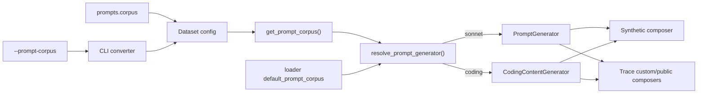

<!--
SPDX-FileCopyrightText: Copyright (c) 2026 NVIDIA CORPORATION & AFFILIATES. All rights reserved.
SPDX-License-Identifier: Apache-2.0
-->

# Prompt corpus clean seam

## Purpose

Unify `--prompt-corpus` / `prompts.corpus` into one clean seam for `sonnet`
and `coding` only. Synthetic generation always used Shakespeare, file/public
authored corpus on a separate field, and each composer selected the generator
independently. The goal is one authored field, one resolver, and real effect
everywhere prompt content is synthesized.

## Decisions (locked)

| Decision | Choice |
|---|---|
| Corpus values | `sonnet` / `coding` only (`random` out of scope) |
| Authored shape | Always `prompts.corpus` |
| Defaults when omitted | Keep loader `default_prompt_corpus` from `plugins.yaml` |
| Selector location | Shared factory module (not only a base-composer method) |

## Authored surface

### Field rename

- `PromptConfig` corpus field is `corpus` under `prompts`
- File and Public datasets author a slim `prompts` object whose only required
  seam field for this work is `corpus`

Recommended shape for file/public:

```yaml
datasets:
  - type: file
    format: weka_trace
    path: ./traces/
    prompts:
      corpus: coding
```

Synthetic already has a full `prompts` block; it gains `corpus` (renamed):

```yaml
datasets:
  - type: synthetic
    prompts:
      isl: 128
      corpus: coding
```

### CLI

- Keep flag name `--prompt-corpus`
- Converter always projects into `prompts.corpus` for synthetic, file, and
  public
- For file/public, after `_apply_dataset_type` strips the synthetic prompts
  subtable, re-attach a slim `prompts: { corpus: ... }` (replace today's
  `_apply_corpus_and_cache_bust` top-level write for corpus; cache-bust may
  stay as today unless it already nests cleanly)

### Reader

`BenchmarkConfig.get_prompt_corpus()` resolves only
`dataset.prompts.corpus` (one path for all dataset types).

## Runtime selector

### New module

`src/aiperf/dataset/generator/corpus.py`:

```python
def resolve_prompt_generator(
    *,
    corpus: PromptCorpus | str | None,
    default_corpus: PromptCorpus | str | None,
    tokenizer: Tokenizer,
    prompts: PromptConfig | None = None,
    prefix_prompts: PrefixPromptConfig | None = None,
) -> PromptGenerator | CodingContentGenerator:
    ...
```

Resolution order:

1. explicit `corpus`
2. else `default_corpus`
3. else `PromptCorpus.SONNET`

Mapping:

- `coding` → `CodingContentGenerator(config=prompts or PromptConfig(), tokenizer=...)`
- otherwise → `PromptGenerator(prompts=..., prefix_prompts=..., tokenizer=...)`

Composers and loaders do not parse corpus strings independently.

### Consumers

| Path | Behavior |
|---|---|
| Synthetic (`BaseDatasetComposer` / `SyntheticDatasetComposer`) | Build `self.prompt_generator` via factory using authored `prompts.corpus` (fixes today's no-op) |
| Custom trace loaders (`is_trace`) | Factory with `loader_metadata.default_prompt_corpus`; delete `_select_trace_prompt_generator` body in favor of the shared call |
| Public trace datasets | Same as custom |
| Verbatim loaders (`single_turn`, `multi_turn`, `baseten_trace`, …) | Do not call the factory; `prompts.corpus` may be present but unused |

### Defaults

- Synthetic with no authored corpus → sonnet
- Trace loaders → `plugins.yaml` `default_prompt_corpus` (weka family remains
  `coding`; most others remain `sonnet`)
- Explicit authored / CLI value always wins

### Cache key

mmap / dataset cache keys continue to include the resolved corpus so sonnet
and coding never share a stale decoded mmap.

## Data flow



## Errors

- Invalid corpus enum value → existing Pydantic / CLI choice validation
- Trace dataset without tokenizer → keep current clear error

## Tests

- Factory: explicit wins; default applies; both None → sonnet; coding vs sonnet types
- Converter: `--prompt-corpus coding` → `prompts.corpus` for synthetic, file, public
- Synthetic composer: coding corpus yields `CodingContentGenerator`
- Trace composer: weka default coding; explicit sonnet overrides (update
  `test_coding_corpus_injection.py`)

## Docs

- Regenerate CLI docs (`make generate-cli-docs`)
- Add a short user-facing note under `docs/reference/prompt-corpus.md`
  (honored only where content is synthesized; values; defaults)
- Register the reference doc in `docs/index.yml`

## Out of scope

- `random` corpus
- Exact decode/re-encode ISL repair loops beyond existing generators
- Changing any loader's registered `default_prompt_corpus` values
- Broader `prompts` nesting for unrelated file/public fields (cache-bust may
  remain as today)

## Source anchors (this branch)

- `src/aiperf/config/flags/cli_config.py` (`--prompt-corpus`)
- `src/aiperf/config/flags/_converter_dataset.py` (routing)
- `src/aiperf/config/dataset/content.py` (`PromptConfig`)
- `src/aiperf/config/dataset/config.py` (`FileDataset` / `PublicDataset`)
- `src/aiperf/config/loader/helpers.py` (`get_prompt_corpus`)
- `src/aiperf/dataset/composer/{base,synthetic,custom,public}.py`
- `src/aiperf/dataset/generator/{prompt,coding_content}.py`
- `src/aiperf/plugin/plugins.yaml` (`default_prompt_corpus`)
- `tests/unit/dataset/composer/test_coding_corpus_injection.py`
- `tests/unit/config/test_trace_flag_routing.py`
