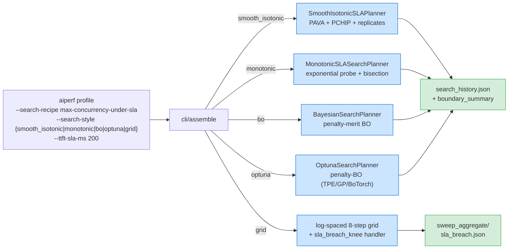

<!--
# SPDX-FileCopyrightText: Copyright (c) 2026 NVIDIA CORPORATION & AFFILIATES. All rights reserved.
# SPDX-License-Identifier: Apache-2.0
-->
# Find the maximum passing concurrency

The classic LLM-serving capacity question: **what is the highest concurrency at which the SUT still meets its SLA?** Issue [ai-dynamo/aiperf#883](https://github.com/ai-dynamo/aiperf/issues/883) asks for an adaptive search that names both the maximum passing concurrency and the first failing concurrency in O(log N) trials. The answer is the `max-concurrency-under-sla` search recipe; the goodput-formulation alternative is `max-goodput-under-slo`. Both are plugin-registered presets that compose with the existing adaptive-search engine documented in [Bayesian-Optimization Outer Loop](bayesian-optimization.md) and [Search Recipes](search-recipes.md).

The research basis is an industry survey plus academic citations (SCOOT, DistServe, Letham 2017, Gardner 2014).

## Quick start

```bash
# Default: smooth-isotonic SLA search (PAVA-denoised + PCHIP root-find;
# strictly more accurate than `monotonic` under noise)
aiperf profile --model my-model --url http://infer.example.com --streaming \
  --search-recipe max-concurrency-under-sla --ttft-sla-ms 200

# Monotonic style: 1D exponential probe + bisection (~10 iterations on
# [1, 1000] at 5% precision). Cheaper but margin-magnitude-blind.
aiperf profile --model my-model --url http://infer.example.com --streaming \
  --search-recipe max-concurrency-under-sla --search-style monotonic --ttft-sla-ms 200

# BO style: optimize WITHIN the feasibility region (best when you also want
# to maximize throughput, not only locate the boundary)
aiperf profile --model my-model --url http://infer.example.com --streaming \
  --search-recipe max-concurrency-under-sla --search-style bo --ttft-sla-ms 200

# Grid style: 8 log-spaced points + sla_breach.json artifact for plotting
aiperf profile --model my-model --url http://infer.example.com --streaming \
  --search-recipe max-concurrency-under-sla --search-style grid --ttft-sla-ms 200

# Goodput formulation (DistServe canonical: per-request TTFT/TPOT/E2E SLOs +
# attainment-fraction; objective is the goodput metric itself)
aiperf profile --model my-model --url http://infer.example.com --streaming \
  --search-recipe max-goodput-under-slo \
  --ttft-sla-ms 500 --tpot-sla-ms 15 --e2e-sla-ms 2000 \
  --slo-attainment-fraction 0.95
```

The recipe expands in the CLI assembly pipeline into the same `AdaptiveSearchSweep` (set on `AIPerfConfig.sweep`) machinery a hand-written `--search-space` invocation would produce.

## SLA flags

The four issue-named SLA flags are sugar over the generic `--search-sla` syntax. All five may be combined; recipe-named flags compose first, then `--search-sla` entries in CLI order.

| Flag | Metric tag | Stat | Op | Notes |
|---|---|---|---|---|
| `--ttft-sla-ms` | `time_to_first_token` | `p95` | `lt` | Streaming required |
| `--tpot-sla-ms` (a.k.a. `--itl-sla-ms`) | `inter_token_latency` | `p95` | `lt` | Streaming required; TPOT == ITL in AIPerf metric tags |
| `--e2e-sla-ms` | `request_latency` | `p99` | `lt` | |
| `--error-rate-sla` | `request_error_rate` | `p99` | `lt` | Fraction in `[0, 1]` |
| `--search-sla "TAG:STAT:OP:THRESHOLD"` | any | any of `{avg, p50, p90, p95, p99}` | any of `{lt, le, gt, ge}` | Repeatable; format is strict colon-delimited 4-tuple |

```bash
# Compose: TTFT p95 < 200ms AND error rate p99 < 1%, on the explicit
# --search-space path (no recipe).
aiperf profile --model my-model --streaming \
  --search-space "phases.profiling.concurrency:1,1000:int" \
  --search-sla "time_to_first_token:p95:lt:200" \
  --search-sla "request_error_rate:p99:lt:0.01" \
  --search-metric output_token_throughput --search-direction maximize \
  --search-max-iterations 30
```

Malformed `--search-sla` values raise `TypeError` naming the offending flag. Unknown stat or op keys are validated against the `SLAFilter` `Literal` types — typos error loud at parse time.

## Search styles for `max-concurrency-under-sla`

`--search-style` selects which planner the recipe expands to. The defaults match the issue's exact ask.

| Style | Algorithm | Iterations (typical) | Best for |
|---|---|---|---|
| `smooth_isotonic` (default) | PAVA-denoised isotonic regression + PCHIP root-find on per-SLO margin curves | ~13–25 on `[1, 1000]` at 5% precision (more with replicates) | Most-accurate boundary location under noise; reports `boundary_type` (smooth or cliff), `binding_constraint`, optional bootstrap CI |
| `monotonic` | Exponential probe + bisection on `[lo, hi]` | ~10 on `[1, 1000]` at 5% precision | Cheapest path; margin-magnitude-blind so a single noisy probe at the boundary can pull the verdict |
| `bo` | Penalty-BO with `output_token_throughput` as objective | ~30 (see [BO doc](bayesian-optimization.md)) | Optimizing throughput WITHIN the feasibility region, not just naming the boundary |
| `optuna` | Same penalty-BO formulation via the `OptunaSearchPlanner` (TPE / GP / BoTorch samplers) | ~30 | Same as `bo`, but on the Optuna backend; BoTorch samplers require the optional `botorch` extra |
| `grid` | 8 log-spaced points + `sla_breach_knee` post-process | 8 fixed | Plotting / visualization with a reproducible artifact |



The monotonic planner mirrors Triton perf_analyzer's `--binary-search`: each point's verdict is provisional until 2 trials agree (configurable via `AdaptiveSearchSweep.monotonic_stability_trials`; automatic when `--num-profile-runs >= 2`).

### `smooth_isotonic` (default)

The smooth-isotonic planner is a drop-in replacement for `monotonic` that fixes its core accuracy gap: bisection uses **sign-only** feedback at every probe, so a single noisy probe at the boundary can flip the verdict and corrupt the next root estimate. `smooth_isotonic` instead fits a smooth, monotone curve to all probe margins and root-finds the boundary on the curve.

The algorithm runs in five phases:

1. **Bracket** — exponential probe (`x = x_min, 2·x_min, 4·x_min, …`) until the first SLO breach, identical to `monotonic`. Output: `[x_lo, x_hi]`.
2. **Smooth-isotonic fit** — three internal probes inside `[x_lo, x_hi]`, then for each per-SLO margin series: PAVA (`scipy.optimize.isotonic_regression`) denoises by pooling adjacent violators into a monotone step function, then PCHIP (`scipy.interpolate.PchipInterpolator`) interpolates the **denoised** points to give a smooth, monotone, root-findable curve. Solve `m̂(x*) = 0` per SLO and aggregate via σ-normalized max-of-margins to pick the candidate boundary. PAVA-then-PCHIP composition fixes both PCHIP's noise-fragility (vLLM's deleted `serve_sla.py` pattern) and isotonic regression's piecewise-constant ambiguous-root problem.
3. **Replicates (opt-in)** — when `sla_replicates: N > 0` in YAML (or the auto-budget formula triggers `N ≥ 3`), re-run the candidate `x*` `N` times under Common Random Numbers (same `BenchmarkConfig` + same `random_seed`) to estimate per-replicate margin variance. Bootstrap CI on the binding margin → if CI brackets zero, expand to `x* ± δ` and refit; otherwise terminate. Capped at 20 replicates to bound runaway under noisy degenerate constraints.
4. **Cliff guard** — PAVA-residual changepoint detection. If the most-recent probe's residual `|m_observed - m̂|` exceeds `3·σ_local` AND the bracket gap exceeds `precision · x_hi`, the planner declares `boundary_type: "cliff"` and reports `(boundary_low, boundary_high)` instead of pretending the curve is smooth across a discontinuity. Otherwise `boundary_type: "smooth"`. Catches the prefill-prioritizing-server pattern documented in Sarathi-Serve.
5. **Termination** — bootstrap CI on `x*` narrower than `precision · x*`, OR consecutive iterations move `x*` by less than that, OR `--search-max-iterations` exhausted.

Power-user knobs (all optional; the defaults are sized for typical LLM-serving workloads). These are **YAML-only** fields on the `AdaptiveSearchSweep` schema (`src/aiperf/config/sweep/config.py`); they are not exposed as CLI flags. Set them under a `sweep:` block in your AIPerf YAML config:

- `sla_replicates: N` — Phase-3 replicate count override. Default `0` (auto). Set to a fixed integer to override the auto budget.
- `sla_precision: tight|normal|coarse` — Per-probe sample budget. Maps to `n_requests_per_probe ∈ {10000, 1000, 300}`. Default `normal` → p99 CI ≈ ±10%.
- `sla_warmup_seconds: N` — Per-probe warmup discard before computing margins. Default `None` → 30s flat floor (`AIPERF_SEARCH_PLANNER_DEFAULT_WARMUP_SECONDS`). The first probe at each swept value is floored at 60s (`FIRST_PROBE_WARMUP_FLOOR`); replicate probes at 15s (`REPLICATE_WARMUP_FLOOR`).

The `boundary_summary` block in `search_history.json` carries three new optional fields when `smooth_isotonic` ran: `boundary_type` (`"smooth"` or `"cliff"`), `binding_constraint` (the SLO key with the worst σ-normalized margin at termination), and `boundary_ci` (`{lo, hi}` bootstrap CI on the binding margin) when Phase-3 replicates ran. See [Search History API Reference](../api/search-history.md#boundary_summary).

No new dependencies — the planner uses only `scipy.optimize.isotonic_regression` and `scipy.interpolate.PchipInterpolator`, both already part of the `scipy>=1.13.0` hard dep.

## Output artifacts

### `search_history.json` — `boundary_summary` block

The BO and monotonic paths write `search_history.json` incrementally per iteration (same file documented in [BO Output schema](bayesian-optimization.md#output-schema)). The 1D-feasibility extension is the `boundary_summary` block:

```json
{
  "config": {
    "objective_metric": "output_token_throughput",
    "objective_direction": "maximize",
    "search_space": [{"path": "phases.profiling.concurrency", "lo": 1, "hi": 1000, "kind": "int"}],
    "sla_filters": [
      {"metric_tag": "time_to_first_token", "stat": "p95", "op": "lt", "threshold": 200.0}
    ]
  },
  "iterations": [
    {"iteration_idx": 0, "variation_values": {"phases.profiling.concurrency": 256}, "feasible": true},
    {"iteration_idx": 1, "variation_values": {"phases.profiling.concurrency": 512}, "feasible": false}
  ],
  "best": {"iteration_idx": 0, "variation_values": {"phases.profiling.concurrency": 256}, "feasible": true},
  "boundary_summary": {
    "swept_dim_path": "phases.profiling.concurrency",
    "feasible_max": {"value": 256, "iteration_idx": 0, "objective_value": 4172.3},
    "infeasible_min": {
      "value": 320, "iteration_idx": 4,
      "first_breach": {
        "metric_tag": "time_to_first_token", "stat": "p95",
        "op": "lt", "threshold": 200.0, "observed": 213.4
      }
    }
  },
  "convergence_reason": "monotonic_precision_reached"
}
```

`boundary_summary` is `null` when the search space has more than one dimension — the field is intentionally narrow and its semantics are only well-defined in 1D. For `monotonic_sla` and `smooth_isotonic`, the planner writes the summary directly from its internal state; for the BO style, the field is derived post-hoc from the iteration history (highest feasible swept value, lowest infeasible). The `smooth_isotonic` planner additionally writes `boundary_type`, `binding_constraint`, and (when Phase-3 replicates ran) `boundary_ci` — see [Search History API Reference](../api/search-history.md#boundary_summary). All shapes share the same base so consumers don't branch on style.

### `sla_breach.json` — grid style only

The `grid` style emits a dedicated artifact under `sweep_aggregate/sla_breach.json`. Its keys substitute the leaf parameter name (here `concurrency`) for clarity:

```json
{
  "swept_param": "phases.profiling.concurrency",
  "max_passing_concurrency": 256,
  "first_failing_concurrency": 384,
  "first_failing_breach": {
    "metric_tag": "time_to_first_token", "stat": "p95",
    "op": "lt", "threshold": 200.0, "observed": 213.4
  },
  "all_points": [
    {"concurrency": 1,   "feasible": true,  "breaches": []},
    {"concurrency": 256, "feasible": true,  "breaches": []},
    {"concurrency": 384, "feasible": false, "breaches": [{"metric_tag": "time_to_first_token", "...": "..."}]}
  ],
  "monotonicity_check": true,
  "filters": [{"metric_tag": "time_to_first_token", "stat": "p95", "op": "lt", "threshold": 200.0}]
}
```

Edge cases: `max_passing_concurrency: null` when every point fails; `first_failing_concurrency: null` when every point passes. `monotonicity_check: false` when feasibility alternates along the swept axis — informational, never an error (it usually means the SUT is unstable, not that the search broke).

### Goodput recipe

`max-goodput-under-slo` writes the same `search_history.json` shape, but the BO objective is the [`goodput`](../tutorials/goodput.md) metric tag and the per-request SLO threshold-set (TTFT/TPOT/E2E + attainment fraction) is wired into the goodput-metric configuration channel rather than as `SLAFilter` rows. Per the DistServe formulation ([Zhong et al. OSDI '24](https://www.usenix.org/system/files/osdi24-zhong-yinmin.pdf)), a request counts as "good" only when **all three** thresholds are simultaneously met, and the attainment fraction (default `0.95`) is the minimum acceptable share of good requests.

## Comparison to other tools

| Tool | Saturation-search | SLA-stop semantics | Where AIPerf lands |
|---|---|---|---|
| [Triton perf_analyzer](https://docs.nvidia.com/deeplearning/triton-inference-server/user-guide/docs/perf_analyzer/docs/cli.html) `--binary-search` | 1D bisection over concurrency / request rate, stability-window verdict | None native | `monotonic` style is the direct equivalent + adds explicit SLA filters |
| [k6](https://k6.io/docs/test-types/breakpoint-testing/) `abortOnFail` thresholds | `ramping-arrival-rate` executor | Threshold breach stops the test, breaking-point VU count recorded | Closest UX precedent; AIPerf's `boundary_summary.infeasible_min` plays the same role |
| [Triton Model Analyzer](https://github.com/triton-inference-server/model_analyzer/blob/main/docs/config_search.md) `quick` / `optuna` | Hill-climbing or BO over engine-config space | Constraints applied as post-hoc filter | AIPerf's `bo` style is the equivalent; `monotonic` has no Model-Analyzer counterpart |
| [GenAI-Perf `analyze`](https://github.com/triton-inference-server/perf_analyzer/blob/main/genai-perf/docs/analyze.md) | `--sweep-range` / `--sweep-list` only | Python-API post-hoc filter | AIPerf's `grid` style with `sla_breach.json` exceeds this |
| [vLLM `bench serve`](https://github.com/vllm-project/vllm/pull/9338) `--goodput TTFT:500 TPOT:15 E2E:2000` | Single point per invocation | Reports goodput at that point | `max-goodput-under-slo` is the auto-search equivalent |

## Caveats

**Monotonicity assumption.** Bisection assumes feasibility is monotonic along the swept axis (high concurrency fails, low passes). Real systems can violate this under cold-cache conditions or memory pressure. Watch for `monotonicity_check: false` in `sla_breach.json` and the `non_monotonic_warning` flag on the iteration history — when set, treat `boundary_summary.feasible_max` as the largest *observed* passing value, not a proof of optimality.

**"First failing" semantics.** Well-defined for `monotonic` and `grid` paths. For `bo`, the BO trajectory is non-monotonic by design; `boundary_summary.infeasible_min.value` reports the *lowest seen* failing concurrency, which is a lower bound on the true first-failing point — not a tight one.

**Stability under noise.** A single trial's verdict can flip with run-to-run variance. Pass `--num-profile-runs >= 2` so each point's verdict averages over trials; the monotonic planner's stability window kicks in automatically. The cost is linear in the number of trials, but the boundary location is more robust.

**Streaming requirement.** The TTFT and TPOT/ITL filters are streaming-only metrics. The recipe rejects `--no-streaming` at expand time when any SLA references a streaming-only metric. E2E latency and error-rate filters work without streaming.

**Mutual exclusion.** As with all recipes, `--search-recipe` is mutually exclusive with explicit `--search-*` flags and with magic-list sweeps; see [Search Recipes — mutual-exclusion rules](search-recipes.md#mutual-exclusion-rules) for the full matrix. Cluster-side execution (`AIPerfSweep` CRDs) inherits the same planners via the plugin registry — see [Adaptive search on Kubernetes](../kubernetes/sweeps.md#adaptive-search-bayesian-optimization).

## See also

- [Search Recipes](search-recipes.md) — recipe catalog and authoring guide.
- [Bayesian-Optimization Outer Loop](bayesian-optimization.md) — engine details, `search_history.json` schema, `--search-*` flag reference.
- [Adaptive Search Tutorial](../tutorials/adaptive-search.md) — narrative walkthrough.
- [Goodput tutorial](../tutorials/goodput.md) — per-request SLO definitions used by `max-goodput-under-slo`.
