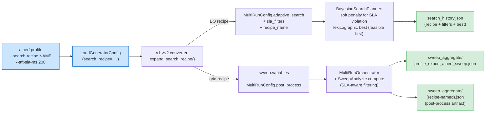
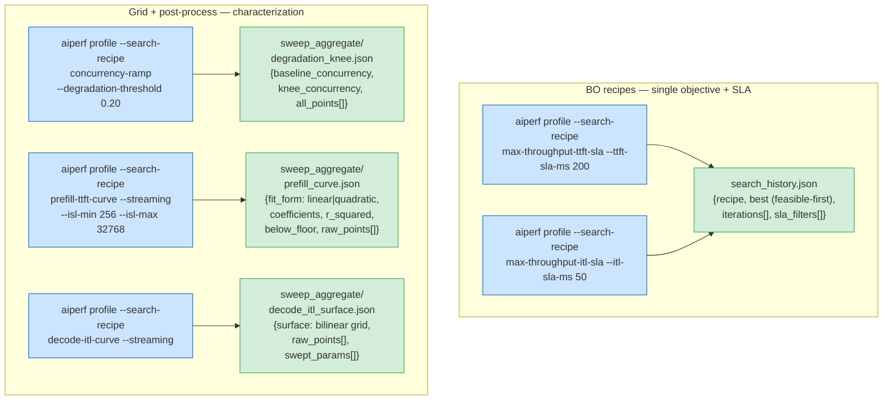
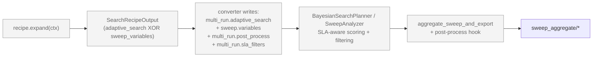

<!--
# SPDX-FileCopyrightText: Copyright (c) 2026 NVIDIA CORPORATION & AFFILIATES. All rights reserved.
# SPDX-License-Identifier: Apache-2.0
-->
# Search Recipes

Search Recipes are named, plugin-registered presets that bundle a search space, an optimization objective (or grid), termination conditions, optional SLA constraints, and an optional post-process step into a single CLI selector. They lift the user-facing surface from "write `--search-space` / `--search-metric` / `--search-direction` / `--search-max-iterations` and pick the right combination" to `--search-recipe <name>`.

```bash
aiperf profile --models my-model --url http://infer.example.com --streaming \
  --search-recipe max-throughput-ttft-sla --ttft-sla-ms 200
```

Recipes expand at the v1->v2 converter boundary into the same machinery the explicit `--search-*` / sweep flags drive — the runtime path is unchanged. See [Bayesian-Optimization Outer Loop](bayesian-optimization.md) for the underlying engine and `search_history.json` schema.

## When to use a recipe

| You want to | Recipe | Lower-level alternative |
|---|---|---|
| Maximize throughput under a TTFT SLA | `max-throughput-ttft-sla` | `--search-space ... --search-direction maximize` + post-filter |
| Maximize throughput under an ITL SLA | `max-throughput-itl-sla` | `--search-space ... --search-direction maximize` + post-filter |
| Find the concurrency knee where p99 latency degrades | `concurrency-ramp` | `--concurrency 1,10,50,100,500,1000` + post-process |
| Characterize TTFT(ISL) for capacity planning | `prefill-ttft-curve` | grid sweep + custom curve fit |
| Characterize ITL(concurrency, OSL) | `decode-itl-curve` | 2D grid sweep + custom surface fit |

Power users can keep the explicit `--search-*` flags; recipes are mutually exclusive with them at the converter (clear error on collision).

## How it feels — a walkthrough

This section shows the user experience end-to-end. Every recipe collapses several BO/grid flags into one named selector, and emits artifacts the user can read directly.

### Before / after

```bash
# Before: write the BO config from scratch
aiperf profile --model X --url Y --streaming \
  --search-space "phases.profiling.concurrency:1,1000:int" \
  --search-metric output_token_throughput \
  --search-direction maximize \
  --search-max-iterations 30
# Hope you picked the right metric. Hope max-iterations is sensible.
# No SLA constraint — the winner might violate p95 TTFT silently.

# After: name the workflow, supply the SLA
aiperf profile --model X --url Y --streaming \
  --search-recipe max-throughput-ttft-sla --ttft-sla-ms 200
```

### Flow at a glance



### Five recipes, five interaction shapes



### Concrete BO interaction (`max-throughput-ttft-sla`)

```text
$ aiperf profile --model deepseek-r1 --url http://localhost:8000 \
    --endpoint-type chat --streaming \
    --search-recipe max-throughput-ttft-sla --ttft-sla-ms 200

[expand] recipe=max-throughput-ttft-sla
         search_space=[phases.profiling.concurrency: 1..1000 int]
         objective=output_token_throughput.avg → MAXIMIZE
         max_iterations=30, n_initial_points=5
         sla_filters=[time_to_first_token.p95 < 200.0]

[BO  iter 0] concurrency=  47  → throughput=2143  TTFT.p95= 87  feasible
[BO  iter 1] concurrency= 891  → throughput=2890  TTFT.p95=412  ✗ infeasible (penalty=22.6)
[BO  iter 2] concurrency= 312  → throughput=3120  TTFT.p95=178  feasible
[BO  iter 3] concurrency= 524  → throughput=3340  TTFT.p95=215  ✗ infeasible (penalty=2.5)
[BO  iter 4] concurrency= 401  → throughput=3290  TTFT.p95=193  feasible  ★ best so far
...
[BO  iter 12] no improvement for 7 iterations — stopping (improvement_patience)

→ artifacts/<run>/search_history.json
   {"recipe": "max-throughput-ttft-sla",
    "best": {"iteration_idx": 4, "objective_value": 3290,
             "variation_values": {"phases.profiling.concurrency": 401},
             "feasible": true, "feasible_count": 8},
    "config": {"sla_filters": [{"metric_tag": "time_to_first_token",
                                "stat": "p95", "op": "lt", "threshold": 200.0}],
               ...}}
```

The user reads `best.variation_values` and gets a concrete answer: **deploy at concurrency=401 to maximize throughput while keeping p95 TTFT under 200 ms.** Without the recipe they'd have written ~5 BO flags by hand and post-hoc filtered for the SLA themselves.

The above terminal log is illustrative — the actual progress format depends on the dashboard / progress UI mode.

### Concrete grid + curve interaction (`prefill-ttft-curve`)

```text
$ aiperf profile --model deepseek-r1 --url http://localhost:8000 \
    --endpoint-type chat --streaming \
    --search-recipe prefill-ttft-curve --isl-min 256 --isl-max 32768

[expand] sweep_variables={
   datasets.main.prompts.isl: [256, 512, 1024, 2048, 4096, 8192, 16384, 32768],
   phases.profiling.concurrency: [1]
 }
[expand] post_process: ttft_curve_fit → prefill_curve.json

[run  1/8] ISL=  256 conc=1 → TTFT.avg=  18.2 ms
[run  2/8] ISL=  512 conc=1 → TTFT.avg=  31.7 ms
...
[run  8/8] ISL=32768 conc=1 → TTFT.avg=2104.0 ms

[post-process] ttft_curve_fit → linear fit r²=0.998
→ artifacts/<run>/sweep_aggregate/prefill_curve.json
   {"fit_form": "linear",
    "coefficients": [0.0641, 1.83],
    "r_squared": 0.998,
    "below_floor": false,
    "raw_points": [{"isl": 256, "ttft_ms": 18.2}, ..., {"isl": 32768, "ttft_ms": 2104.0}]}
```

The user gets a usable equation: **`TTFT(ms) = 0.0641 × ISL + 1.83`** — feed it into a capacity planner directly. Quadratic fallback fires automatically if linear `r² < 0.85`; `below_floor` flags low-confidence fits.

### Failure paths fail loud

```text
$ aiperf profile --search-recipe max-throughput-ttft-sla
TypeError: recipe 'max-throughput-ttft-sla' requires --ttft-sla-ms
           (TTFT SLA threshold in milliseconds); pass it on the CLI alongside
           --search-recipe.

$ aiperf profile --search-recipe max-throughput-ttft-sla --ttft-sla-ms 200 \
    --search-space "phases.profiling.concurrency:1,500:int"
TypeError: --search-recipe 'max-throughput-ttft-sla' is mutually exclusive
           with explicit --search-* flags ['search_space']. Either drop the
           explicit flags and let the recipe expand them, or drop --search-recipe
           and configure --search-* by hand.

$ aiperf profile --search-recipe prefill-ttft-curve --no-streaming \
    --isl-min 256 --isl-max 32768
ValueError: recipe 'prefill-ttft-curve' requires --streaming (TTFT is a
            streaming-only metric); enable streaming on the endpoint or pick
            a different recipe.
```

### What stays invisible



That whole pipeline — Protocol dispatch, mutual-exclusion checking, model_dump round-trips, soft-penalty math, lexicographic best, post-process plugin lookup — is invisible to the user. They typed two flags. They got an answer.

## Catalog

| Recipe | Algorithm | What it answers | Inputs | Output |
|---|---|---|---|---|
| `max-throughput-ttft-sla` | BO | "Highest tokens/s where p95 TTFT < X ms" | `--ttft-sla-ms` | `best_configurations` filtered to feasible |
| `max-throughput-itl-sla` | BO | "Highest tokens/s where p95 ITL < X ms" | `--itl-sla-ms` | `best_configurations` filtered to feasible |
| `concurrency-ramp` | Grid + post-process | "Where does p99 latency degrade by >N%?" | `--degradation-threshold` | `sweep_aggregate/degradation_knee.json` |
| `prefill-ttft-curve` | Grid + post-process | "TTFT(ISL) curve" | `--isl-min`, `--isl-max` | `sweep_aggregate/prefill_curve.json` |
| `decode-itl-curve` | Grid + post-process | "ITL(concurrency, OSL) surface" | optional bounds | `sweep_aggregate/decode_itl_surface.json` |

All recipes whose metric is streaming-only (TTFT, ITL) require `--streaming`; the recipe rejects non-streaming endpoints at expand time with a message naming the recipe and the missing flag.

## Per-recipe usage

### `max-throughput-ttft-sla`

Bayesian-optimized over `phases.profiling.concurrency` in [1, 1000]. Lifts the SLA `p95(time_to_first_token) < ttft-sla-ms` into a soft penalty in the GP score and a strict feasibility filter on `best_configurations`. See [Bayesian-Optimization Outer Loop](bayesian-optimization.md#sla-filters) for the scoring details.

```bash
aiperf profile --models my-model --url http://infer.example.com --streaming \
  --search-recipe max-throughput-ttft-sla --ttft-sla-ms 200
```

### `max-throughput-itl-sla`

Identical shape to the TTFT twin, but on `p95(inter_token_latency) < itl-sla-ms`.

```bash
aiperf profile --models my-model --url http://infer.example.com --streaming \
  --search-recipe max-throughput-itl-sla --itl-sla-ms 50
```

### `concurrency-ramp`

8-step log-spaced grid over concurrency in [1, 1000]; post-process detects the first concurrency where `p99(request_latency)` exceeds `baseline * (1 + --degradation-threshold)`. Streaming is **not** required (`request_latency` is end-to-end).

```bash
aiperf profile --models my-model --url http://infer.example.com \
  --search-recipe concurrency-ramp --degradation-threshold 0.20
```

Output: `sweep_aggregate/degradation_knee.json` with `baseline_concurrency`, `knee_concurrency` (or `null` if no knee found), threshold, and the full point series.

### `prefill-ttft-curve`

8-step log-spaced grid over ISL in [`--isl-min`, `--isl-max`] (defaults 256, 32768) at concurrency=1; post-process fits `TTFT = a*ISL + b` and falls back to a quadratic fit when r² < 0.85.

```bash
aiperf profile --models my-model --url http://infer.example.com --streaming \
  --search-recipe prefill-ttft-curve --isl-min 256 --isl-max 32768
```

Output: `sweep_aggregate/prefill_curve.json` with `fit_form` (`linear` | `quadratic`), `coefficients`, `r_squared`, `r_squared_floor`, and the raw `(isl, ttft_ms)` points.

### `decode-itl-curve`

Two-axis grid: 6 log-spaced concurrency points in [1, 200] x 4 log-spaced OSL points in [64, 1024]. Post-process emits an axis-aligned grid surface; cells where no triple was measured stay `null` (the handler refuses to invent values for missing cells).

```bash
aiperf profile --models my-model --url http://infer.example.com --streaming \
  --search-recipe decode-itl-curve
```

Output: `sweep_aggregate/decode_itl_surface.json` with `surface.concurrency_axis`, `surface.osl_axis`, `surface.itl_grid` (2D, indexed `[concurrency_idx][osl_idx]`), and the raw `(concurrency, osl, itl_ms)` triples.

## Mutual-exclusion rules

- `--search-recipe` is rejected alongside any explicit `--search-*` flag (`--search-space`, `--search-metric`, `--search-direction`, `--search-max-iterations`, `--search-stat`, `--search-initial-points`, `--search-random-seed`). Drop one or the other.
- Grid recipes are rejected alongside magic-list flags (`--concurrency 10,20,30`, etc.). The recipe owns the swept variables.
- BO recipes are rejected alongside `--convergence-metric` (trial-level adaptive early-stop). The two operate at different levels.

Errors name both the recipe and the conflicting flag list.

## Writing your own recipe

A recipe is a stateless class implementing the `SearchRecipe` Protocol in `aiperf.search_recipes._base`:

```python
# my_pkg/recipes.py
from typing import ClassVar
from aiperf.common.enums import OptimizationDirection
from aiperf.config.adaptive_search import AdaptiveSearchConfig, SearchSpaceDimension
from aiperf.search_recipes._base import (
    PostProcessSpec,
    SearchRecipe,
    SearchRecipeContext,
    SearchRecipeOutput,
    SLAFilter,
)


class MyThroughputRecipe(SearchRecipe):
    """One-line summary; expand the docstring for users.

    Example:
        aiperf profile --search-recipe my-throughput --ttft-sla-ms 100
    """

    name: ClassVar[str] = "my-throughput"
    description: ClassVar[str] = "Maximize throughput under a tight TTFT SLA."

    def expand(self, ctx: SearchRecipeContext) -> SearchRecipeOutput:
        threshold = ctx.sla_targets.get("ttft_sla_ms")
        if threshold is None:
            raise ValueError(
                f"recipe {self.name!r} requires --ttft-sla-ms; pass it on the CLI."
            )
        return SearchRecipeOutput(
            adaptive_search=AdaptiveSearchConfig(
                algorithm="bayes",
                search_space=[
                    SearchSpaceDimension(
                        path="phases.profiling.concurrency",
                        lo=1, hi=500, kind="int",
                    ),
                ],
                objective_metric="output_token_throughput",
                objective_stat="avg",
                objective_direction=OptimizationDirection.MAXIMIZE,
                max_iterations=20,
                n_initial_points=5,
            ),
            sla_filters=[
                SLAFilter(
                    metric_tag="time_to_first_token",
                    stat="p95",
                    op="lt",
                    threshold=float(threshold),
                ),
            ],
        )
```

Then register the recipe in your `plugins.yaml`:

```yaml
search_recipe:
  my-throughput:
    class: my_pkg.recipes:MyThroughputRecipe
    description: |
      Maximize output_token_throughput under a tight TTFT SLA.
    metadata:
      algorithm: bayes
      sweep_path: phases.profiling.concurrency
```

The plugin loader picks it up at startup; `aiperf plugins --validate` exercises the registry. See [Plugin System](../plugins/plugin-system.md) for the broader registry shape.

### Returning a grid recipe instead of BO

Set `sweep_variables` (a `path -> list-of-values` map) instead of `adaptive_search`; the converter writes the dict into `sweep.variables` so `expand_sweep` materializes one variation per cartesian-product cell. Optionally attach a `PostProcessSpec` to emit a derived artifact under `sweep_aggregate/`:

```python
return SearchRecipeOutput(
    sweep_variables={
        "phases.profiling.concurrency": [1, 10, 100],
        "datasets.main.prompts.osl": [64, 256, 1024],
    },
    post_process=PostProcessSpec(
        handler="itl_surface_fit",
        params={
            "metric_tag": "inter_token_latency",
            "stat": "avg",
            "concurrency_param": "phases.profiling.concurrency",
            "osl_param": "datasets.main.prompts.osl",
        },
        output_filename="my_surface.json",
    ),
)
```

### Writing a post-process handler

Handlers implement `PostProcessHandler` in `aiperf.search_recipes.post_process` and register under the `search_recipe_post_process` plugin category. They run after `SweepAnalyzer.compute()` and emit a JSON artifact under `sweep_aggregate/<output_filename>`:

```python
from typing import Any, ClassVar


class MyKneeFinder:
    name: ClassVar[str] = "my_knee_finder"
    description: ClassVar[str] = "Locate the knee in a swept-parameter curve."

    def process(
        self, sweep_aggregate: dict[str, Any], params: dict[str, Any]
    ) -> dict[str, Any]:
        # Walk sweep_aggregate["per_combination_metrics"] and return a dict;
        # aggregate_sweep_and_export serializes it to JSON.
        ...
```

```yaml
search_recipe_post_process:
  my_knee_finder:
    class: my_pkg.handlers:MyKneeFinder
    description: Locate the knee in a swept-parameter curve.
```

Failures in a handler are logged and recorded in `sweep_aggregate/post_process_errors.json` but do not fail the sweep — standard artifacts are already written.

## See also

- [Bayesian-Optimization Outer Loop](bayesian-optimization.md) — engine details, search-space grammar, SLA scoring, `search_history.json`.
- [Adaptive Search Tutorial](../tutorials/adaptive-search.md) — narrative walkthrough.
- [Plugin System](../plugins/plugin-system.md) — registry shape, validation, override priorities.
