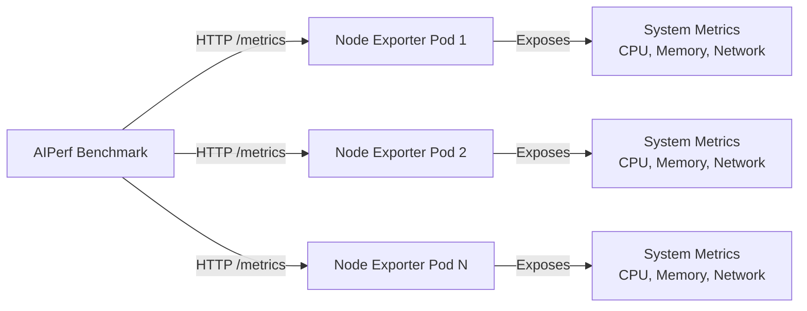

# Kubernetes System Telemetry (CPU/Memory/Network)

This guide shows how to collect system-level metrics (CPU utilization, memory usage, network I/O, disk I/O, etc.) from Kubernetes pods during AIPerf benchmarks using Prometheus Node Exporter.

## Overview

AIPerf's Server Metrics Manager can collect metrics from any Prometheus-compatible endpoint, including Prometheus Node Exporter which exposes system-level metrics. This allows you to correlate inference performance with system resource utilization during benchmarks.

**What you can collect:**
- CPU utilization per core and overall
- Memory usage (RSS, cache, swap)
- Network I/O (bytes sent/received, packets, errors)
- Disk I/O (read/write throughput, IOPS)
- Filesystem usage
- System load averages
- Process statistics

## Prerequisites

- Kubernetes cluster with running pods
- AIPerf installed and configured
- Access to deploy DaemonSets or pods in your cluster

## Architecture



Node Exporter runs on each node (or as a sidecar in inference server pods) and exposes system metrics at `/metrics`. AIPerf collects these metrics alongside GPU and inference server metrics.

## Deployment Options

### Option 1: DaemonSet (Cluster-Wide Monitoring)

Deploy Node Exporter as a DaemonSet to monitor all nodes in your cluster.

**1. Create Node Exporter DaemonSet:**

```yaml
# node-exporter-daemonset.yaml
apiVersion: apps/v1
kind: DaemonSet
metadata:
  name: node-exporter
  namespace: monitoring
  labels:
    app: node-exporter
spec:
  selector:
    matchLabels:
      app: node-exporter
  template:
    metadata:
      labels:
        app: node-exporter
    spec:
      hostNetwork: true
      hostPID: true
      containers:
      - name: node-exporter
        image: prom/node-exporter:v1.8.2
        args:
        - --path.procfs=/host/proc
        - --path.sysfs=/host/sys
        - --path.rootfs=/host/root
        - --collector.filesystem.mount-points-exclude=^/(sys|proc|dev|host|etc)($$|/)
        ports:
        - containerPort: 9100
          name: metrics
          protocol: TCP
        resources:
          requests:
            memory: 30Mi
            cpu: 100m
          limits:
            memory: 50Mi
            cpu: 200m
        volumeMounts:
        - name: proc
          mountPath: /host/proc
          readOnly: true
        - name: sys
          mountPath: /host/sys
          readOnly: true
        - name: root
          mountPath: /host/root
          readOnly: true
          mountPropagation: HostToContainer
      volumes:
      - name: proc
        hostPath:
          path: /proc
      - name: sys
        hostPath:
          path: /sys
      - name: root
        hostPath:
          path: /
---
apiVersion: v1
kind: Service
metadata:
  name: node-exporter
  namespace: monitoring
  labels:
    app: node-exporter
spec:
  type: ClusterIP
  clusterIP: None
  selector:
    app: node-exporter
  ports:
  - name: metrics
    port: 9100
    targetPort: 9100
    protocol: TCP
```

**2. Deploy to cluster:**

```bash
kubectl create namespace monitoring
kubectl apply -f node-exporter-daemonset.yaml
```

**3. Verify deployment:**

```bash
# Check pods are running
kubectl get pods -n monitoring -l app=node-exporter

# Get node IPs
kubectl get pods -n monitoring -l app=node-exporter -o wide

# Test metrics endpoint (replace POD_IP)
kubectl exec -n monitoring -it <node-exporter-pod> -- wget -O- http://localhost:9100/metrics | head -20
```

**4. Run AIPerf with Node Exporter:**

```bash
# Get all node exporter endpoints
NODE_EXPORTERS=$(kubectl get pods -n monitoring -l app=node-exporter -o jsonpath='{range .items[*]}{.status.podIP}:9100 {end}')

# Run benchmark with system metrics
aiperf profile \
    --model Qwen/Qwen3-0.6B \
    --endpoint-type chat \
    --endpoint /v1/chat/completions \
    --streaming \
    --url http://my-inference-server:8000 \
    --concurrency 4 \
    --request-count 100 \
    --server-metrics $NODE_EXPORTERS
```

### Option 2: Sidecar Container (Per-Pod Monitoring)

Deploy Node Exporter as a sidecar container alongside your inference server to monitor specific pods.

**Example pod configuration:**

```yaml
# inference-server-pod.yaml
apiVersion: v1
kind: Pod
metadata:
  name: vllm-inference-server
  labels:
    app: vllm-server
spec:
  containers:
  - name: vllm
    image: vllm/vllm-openai:latest
    args:
    - --model
    - Qwen/Qwen3-0.6B
    - --host
    - 0.0.0.0
    - --port
    - "8000"
    ports:
    - containerPort: 8000
      name: inference
    resources:
      limits:
        nvidia.com/gpu: 1
  
  # Node Exporter sidecar
  - name: node-exporter
    image: prom/node-exporter:v1.8.2
    args:
    - --path.procfs=/host/proc
    - --path.sysfs=/host/sys
    - --web.listen-address=:9100
    ports:
    - containerPort: 9100
      name: metrics
    volumeMounts:
    - name: proc
      mountPath: /host/proc
      readOnly: true
    - name: sys
      mountPath: /host/sys
      readOnly: true
  
  volumes:
  - name: proc
    hostPath:
      path: /proc
  - name: sys
    hostPath:
      path: /sys
```

**Run AIPerf with sidecar:**

```bash
# Get pod IP
POD_IP=$(kubectl get pod vllm-inference-server -o jsonpath='{.status.podIP}')

# Run benchmark
aiperf profile \
    --model Qwen/Qwen3-0.6B \
    --endpoint-type chat \
    --endpoint /v1/chat/completions \
    --streaming \
    --url http://${POD_IP}:8000 \
    --concurrency 4 \
    --request-count 100 \
    --server-metrics http://${POD_IP}:9100
```

### Option 3: Port Forwarding (Development/Testing)

For local development, use port forwarding to access Node Exporter from outside the cluster.

```bash
# Forward port from a node exporter pod
kubectl port-forward -n monitoring <node-exporter-pod> 9100:9100 &

# Run AIPerf pointing to localhost
aiperf profile \
    --model Qwen/Qwen3-0.6B \
    --endpoint-type chat \
    --endpoint /v1/chat/completions \
    --streaming \
    --url http://my-inference-server:8000 \
    --concurrency 4 \
    --request-count 100 \
    --server-metrics http://localhost:9100
```

## Key Node Exporter Metrics

AIPerf automatically collects all metrics exposed by Node Exporter. Here are the most relevant metrics for inference benchmarking:

### CPU Metrics

| Metric | Type | Description |
|--------|------|-------------|
| `node_cpu_seconds_total` | counter | CPU time spent in each mode (user, system, idle, iowait) |
| `node_load1`, `node_load5`, `node_load15` | gauge | System load averages |
| `node_procs_running` | gauge | Number of processes in runnable state |
| `node_procs_blocked` | gauge | Number of processes blocked waiting for I/O |

**CPU utilization calculation:**
```python
# AIPerf automatically calculates rate for counters
cpu_usage_rate = metrics['node_cpu_seconds_total']['series'][0]['stats']['rate']
# For multi-core systems, sum across all CPU modes except idle
```

### Memory Metrics

| Metric | Type | Description |
|--------|------|-------------|
| `node_memory_MemTotal_bytes` | gauge | Total system memory |
| `node_memory_MemFree_bytes` | gauge | Free memory |
| `node_memory_MemAvailable_bytes` | gauge | Available memory (includes cache that can be freed) |
| `node_memory_Buffers_bytes` | gauge | Memory used for buffers |
| `node_memory_Cached_bytes` | gauge | Memory used for cache |
| `node_memory_SwapTotal_bytes` | gauge | Total swap space |
| `node_memory_SwapFree_bytes` | gauge | Free swap space |

**Memory usage calculation:**
```python
# Used memory = Total - Available
used_memory = total_bytes - available_bytes
utilization_pct = (used_memory / total_bytes) * 100
```

### Network Metrics

| Metric | Type | Description |
|--------|------|-------------|
| `node_network_receive_bytes_total` | counter | Network bytes received per interface |
| `node_network_transmit_bytes_total` | counter | Network bytes transmitted per interface |
| `node_network_receive_packets_total` | counter | Network packets received per interface |
| `node_network_transmit_packets_total` | counter | Network packets transmitted per interface |
| `node_network_receive_errs_total` | counter | Network receive errors |
| `node_network_transmit_errs_total` | counter | Network transmit errors |

**Network throughput:**
```python
# AIPerf calculates rate automatically
rx_bytes_per_sec = metrics['node_network_receive_bytes_total']['series'][0]['stats']['rate']
tx_bytes_per_sec = metrics['node_network_transmit_bytes_total']['series'][0]['stats']['rate']
```

### Disk I/O Metrics

| Metric | Type | Description |
|--------|------|-------------|
| `node_disk_read_bytes_total` | counter | Bytes read from disk |
| `node_disk_written_bytes_total` | counter | Bytes written to disk |
| `node_disk_reads_completed_total` | counter | Read operations completed |
| `node_disk_writes_completed_total` | counter | Write operations completed |
| `node_disk_io_time_seconds_total` | counter | Time spent doing I/O |

### Filesystem Metrics

| Metric | Type | Description |
|--------|------|-------------|
| `node_filesystem_size_bytes` | gauge | Filesystem size |
| `node_filesystem_free_bytes` | gauge | Filesystem free space |
| `node_filesystem_avail_bytes` | gauge | Filesystem space available to non-root |

## Output Files

All Node Exporter metrics are included in the standard server metrics exports:

### JSON Export

```json
{
  "metrics": {
    "node_cpu_seconds_total": {
      "type": "counter",
      "description": "Seconds the CPUs spent in each mode.",
      "unit": "seconds",
      "series": [{
        "endpoint_url": "http://10.244.1.5:9100/metrics",
        "labels": { "cpu": "0", "mode": "user" },
        "stats": {
          "total": 45.23,
          "rate": 0.85,
          "rate_avg": 0.82,
          "rate_std": 0.12
        }
      }]
    },
    "node_memory_MemAvailable_bytes": {
      "type": "gauge",
      "description": "Memory available in bytes.",
      "unit": "bytes",
      "series": [{
        "endpoint_url": "http://10.244.1.5:9100/metrics",
        "labels": {},
        "stats": {
          "avg": 32212254720.0,
          "min": 28991029248.0,
          "max": 33554432000.0,
          "std": 1234567890.0,
          "p50": 32212254720.0,
          "p99": 33554432000.0
        }
      }]
    }
  }
}
```

### CSV Export

Node Exporter metrics are included in the CSV export with labels expanded into columns:

```csv
endpoint_url,metric_name,metric_type,cpu,mode,total,rate,rate_avg,rate_min,rate_max,rate_std
http://10.244.1.5:9100/metrics,node_cpu_seconds_total,counter,0,user,45.23,0.85,0.82,0.45,1.23,0.12
http://10.244.1.5:9100/metrics,node_cpu_seconds_total,counter,0,system,12.34,0.23,0.21,0.10,0.45,0.05

endpoint_url,metric_name,metric_type,avg,min,max,std,p1,p50,p99
http://10.244.1.5:9100/metrics,node_memory_MemAvailable_bytes,gauge,32212254720,28991029248,33554432000,1234567890,28991029248,32212254720,33554432000
```

## Multi-Node Benchmarking

For distributed inference setups across multiple Kubernetes nodes, collect metrics from all nodes:

```bash
# Get all node IPs where inference server pods are running
NODE_IPS=$(kubectl get pods -l app=inference-server -o jsonpath='{range .items[*]}{.status.hostIP} {end}')

# Construct node exporter URLs (assuming DaemonSet deployment)
EXPORTERS=$(echo $NODE_IPS | tr ' ' '\n' | sort -u | sed 's/$/:9100/' | tr '\n' ' ')

# Run benchmark with multi-node system metrics
aiperf profile \
    --model Qwen/Qwen3-0.6B \
    --endpoint-type chat \
    --endpoint /v1/chat/completions \
    --streaming \
    --url http://load-balancer:8000 \
    --concurrency 100 \
    --request-count 1000 \
    --server-metrics $EXPORTERS \
    --gpu-telemetry
```

Each node's metrics will be tagged with its `endpoint_url` in the exports for easy identification.

## Combining with GPU Telemetry

Collect system, GPU, and inference server metrics simultaneously for complete observability:

```bash
aiperf profile \
    --model Qwen/Qwen3-0.6B \
    --endpoint-type chat \
    --endpoint /v1/chat/completions \
    --streaming \
    --url http://inference-server:8000 \
    --concurrency 4 \
    --request-count 100 \
    --gpu-telemetry \
    --server-metrics http://node-exporter:9100
```

This will produce:
- `gpu_telemetry_export.json` - GPU metrics (power, utilization, memory)
- `server_metrics_export.json` - Inference server + system metrics (CPU, memory, network)
- `profile_export_aiperf.json` - Benchmark results (latency, throughput)

## Querying System Metrics

### Using jq (JSON)

```bash
# Average CPU usage rate
jq '.metrics["node_cpu_seconds_total"].series[] | select(.labels.mode=="user") | .stats.rate' server_metrics_export.json

# Memory utilization percentage
jq '.metrics | {
  total: .node_memory_MemTotal_bytes.series[0].stats.avg,
  available: .node_memory_MemAvailable_bytes.series[0].stats.avg
} | ((.total - .available) / .total * 100)' server_metrics_export.json

# Network throughput
jq '.metrics["node_network_receive_bytes_total"].series[] | select(.labels.device=="eth0") | .stats.rate' server_metrics_export.json
```

### Using pandas (CSV)

```python
import pandas as pd
from io import StringIO

# Load CSV sections
with open("server_metrics_export.csv") as f:
    sections = f.read().strip().split('\n\n')
    gauges = pd.read_csv(StringIO(sections[0]))
    counters = pd.read_csv(StringIO(sections[1]))

# CPU usage by mode
cpu_stats = counters[counters['metric_name'] == 'node_cpu_seconds_total']
print(cpu_stats[['mode', 'rate', 'rate_avg', 'rate_std']])

# Memory metrics
memory_stats = gauges[gauges['metric_name'].str.contains('node_memory')]
print(memory_stats[['metric_name', 'avg', 'min', 'max']])

# Network throughput
network_rx = counters[
    (counters['metric_name'] == 'node_network_receive_bytes_total') &
    (counters['device'] == 'eth0')
]
print(f"Network RX throughput: {network_rx['rate'].values[0]:.2f} bytes/sec")
```

### Using DuckDB (Parquet)

```bash
# Export with Parquet format
aiperf profile --model MODEL ... --server-metrics http://node-exporter:9100 --server-metrics-formats json csv parquet

# Query with DuckDB
duckdb -c "
SELECT 
  metric_name,
  AVG(value) as avg_value,
  MAX(value) as max_value
FROM 'server_metrics_export.parquet'
WHERE metric_name LIKE 'node_memory_%'
GROUP BY metric_name
ORDER BY metric_name
"
```

## Troubleshooting

| Problem | Check | Solution |
|---------|-------|----------|
| Node Exporter not reachable | `curl http://<node-ip>:9100/metrics` | Check pod is running, firewall rules, NetworkPolicies |
| Missing metrics | Check Node Exporter logs | Ensure host mounts are configured (`/proc`, `/sys`, `/`) |
| High overhead | Resource usage | Node Exporter is lightweight (<50MB RAM, <100m CPU); reduce scrape frequency with `AIPERF_SERVER_METRICS_COLLECTION_INTERVAL` |
| Metrics show all zeros | Check Node Exporter args | Ensure `--path.procfs=/host/proc` and other paths are correct |
| DaemonSet not scheduling | Node affinity/taints | Add tolerations or node selectors to DaemonSet spec |

## Best Practices

1. **Use DaemonSet for production**: Ensures all nodes are monitored without manual configuration
2. **Use sidecar for development**: Easier to debug and iterate on pod configurations
3. **Combine with GPU telemetry**: Get complete picture of resource utilization
4. **Filter interfaces**: Use `device` labels to filter network metrics to relevant interfaces (e.g., `eth0`)
5. **Monitor disk I/O**: High disk I/O can indicate model loading, checkpointing, or logging overhead
6. **Track load averages**: `node_load1/5/15` indicate system pressure over time
7. **Watch swap usage**: Non-zero swap indicates memory pressure
8. **Export Parquet for analysis**: Time-series data enables correlation analysis between system metrics and inference performance

## Related Documentation

- [Server Metrics Collection](../server-metrics/server-metrics.md) - Server metrics architecture and output formats
- [GPU Telemetry with AIPerf](gpu-telemetry.md) - GPU metrics collection with DCGM and pynvml
- [Server Metrics Reference](../server-metrics/server-metrics-reference.md) - Complete metric definitions
- [Parquet Schema Reference](../server-metrics/server-metrics-parquet-schema.md) - Time-series data schema

## Example: Complete Observability Stack

Deploy complete observability for Kubernetes inference workloads:

```bash
# 1. Deploy Node Exporter DaemonSet
kubectl apply -f node-exporter-daemonset.yaml

# 2. Deploy DCGM Exporter for GPU telemetry (if not built into inference server)
kubectl apply -f dcgm-exporter-daemonset.yaml

# 3. Deploy inference server with metrics enabled
kubectl apply -f vllm-deployment.yaml

# 4. Get all endpoints
NODE_EXPORTERS=$(kubectl get pods -n monitoring -l app=node-exporter -o jsonpath='{range .items[*]}{.status.podIP}:9100 {end}')
DCGM_EXPORTERS=$(kubectl get pods -n monitoring -l app=dcgm-exporter -o jsonpath='{range .items[*]}{.status.podIP}:9400 {end}')
INFERENCE_URLS=$(kubectl get svc vllm-service -o jsonpath='{.spec.clusterIP}:{.spec.ports[0].port}')

# 5. Run comprehensive benchmark
aiperf profile \
    --model Qwen/Qwen3-0.6B \
    --endpoint-type chat \
    --endpoint /v1/chat/completions \
    --streaming \
    --url http://${INFERENCE_URLS} \
    --concurrency 100 \
    --request-count 1000 \
    --gpu-telemetry ${DCGM_EXPORTERS} \
    --server-metrics ${NODE_EXPORTERS} \
    --server-metrics-formats json csv parquet
```

This setup provides:
- Inference performance metrics (TTFT, ITL, throughput)
- GPU utilization (power, memory, temperature)
- System metrics (CPU, memory, network, disk)
- Complete time-series data for correlation analysis
