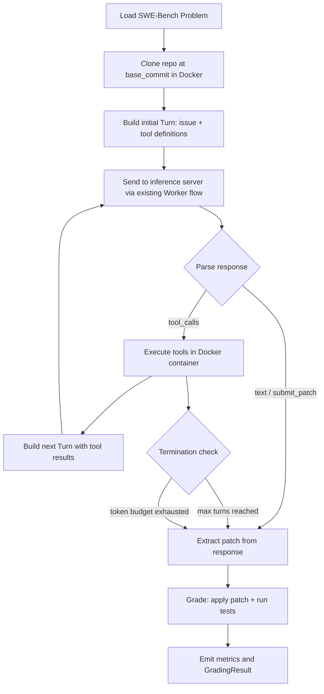
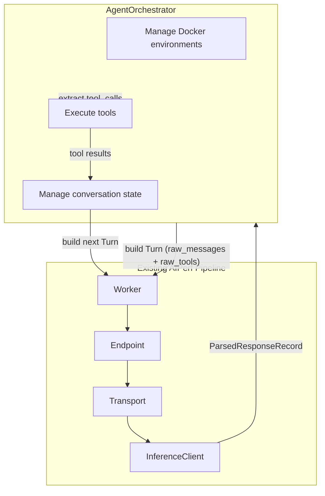

<!--
# SPDX-FileCopyrightText: Copyright (c) 2025-2026 NVIDIA CORPORATION & AFFILIATES. All rights reserved.
# SPDX-License-Identifier: Apache-2.0
-->

# SWE-Bench Integration Analysis

This document analyzes what it would take to integrate [SWE-Bench](https://www.swebench.com/) into AIPerf's accuracy benchmarking scaffolding. SWE-Bench evaluates LLMs on real-world software engineering tasks sourced from GitHub issues and pull requests.

## Table of Contents

- [Background: What is SWE-Bench?](#background-what-is-swe-bench)
- [Current Scaffolding Summary](#current-scaffolding-summary)
- [Layer 1: What Fits the Current Scaffolding (Easy)](#layer-1-what-fits-the-current-scaffolding-easy)
- [Layer 2: Where the Model Starts to Creak (Moderate)](#layer-2-where-the-model-starts-to-creak-moderate)
- [Layer 3: Where New Infrastructure Is Needed (Hard)](#layer-3-where-new-infrastructure-is-needed-hard)
- [Integration Spectrum](#integration-spectrum)
- [Recommended Approach](#recommended-approach)
- [Why SWE-Bench Matters for AIPerf](#why-swe-bench-matters-for-aiperf)
- [Agentic Loop: Development Deep Dive](#agentic-loop-development-deep-dive)

---

## Background: What is SWE-Bench?

SWE-Bench is a benchmark for evaluating LLMs on real-world software engineering tasks. Each problem consists of:

- A **GitHub issue description** from a popular open-source Python repository
- A **base commit** to check out (the state of the repo before the fix)
- A **gold patch** (the human-written fix from the corresponding pull request)
- A **test patch** with tests that validate the fix
- **`FAIL_TO_PASS`** test list (tests that should pass after the fix)
- **`PASS_TO_PASS`** test list (tests that must not regress)

The model's job: given the issue + codebase, produce a patch that makes the failing tests pass without breaking existing tests.

### Dataset Variants

| Variant | Problems | Notes |
|---------|----------|-------|
| SWE-bench Full | 2,294 | Complete dataset, many very hard problems |
| SWE-bench Lite | 300 | Curated subset, self-contained problems |
| SWE-bench Verified | 500 | Human-verified, most commonly reported |

### Key Difference from Existing Benchmarks

The 9 existing accuracy benchmark stubs (MMLU, AIME, HellaSwag, etc.) all follow a **prompt-in, text-out, grade** pattern: one prompt, one LLM response, one grading check. SWE-Bench is an **agentic** benchmark: the model receives a codebase + issue, must explore files, reason about the problem, and produce a code patch. Grading means applying that patch and running the repository's test suite. This mismatch touches almost every layer of the scaffolding.

---

## Current Scaffolding Summary

The accuracy benchmarking scaffolding (documented in [`accuracy_stubs.md`](accuracy_stubs.md)) provides:

- **`BenchmarkProblem`** model: `prompt`, `ground_truth`, `task`, `metadata`, `few_shot_examples`
- **`AccuracyBenchmarkProtocol`**: single method `load_problems()` returning `list[BenchmarkProblem]`
- **`AccuracyGraderProtocol`**: `grade()` and `extract_answer()` for scoring text responses
- **Plugin system**: `plugins.yaml` registration, auto-generated enums, CLI flags
- **Self-disabling pattern**: processors/exporters skip themselves when accuracy is off
- **9 benchmark stubs**, **4 grader stubs**, **2 processors**, **2 exporters** -- all raising `NotImplementedError`

---

## Layer 1: What Fits the Current Scaffolding (Easy)

### New Benchmark Class

A `SWEBenchBenchmark` class in `benchmarks/swe_bench.py` would implement `load_problems()` like the other 9 stubs. It would load from the [SWE-bench HuggingFace dataset](https://huggingface.co/datasets/princeton-nlp/SWE-bench) (or Lite/Verified variants) and return `list[BenchmarkProblem]`.

```python
class SWEBenchBenchmark(AIPerfLoggerMixin):
    def __init__(self, user_config: UserConfig, **kwargs) -> None:
        self._user_config = user_config

    async def load_problems(
        self, tasks: list[str] | None, n_shots: int, enable_cot: bool
    ) -> list[BenchmarkProblem]:
        # Load from HuggingFace datasets or local cache
        # Filter by variant (lite, verified, full) via tasks parameter
        # Return BenchmarkProblem per instance
        ...
```

### Plugin Registration

Straightforward additions to the existing registry:

**`plugins.yaml`** -- new entry under `accuracy_benchmark`:

```yaml
accuracy_benchmark:
  swe_bench:
    class: aiperf.accuracy.benchmarks.swe_bench:SWEBenchBenchmark
    description: SWE-Bench software engineering benchmark
    metadata:
      default_grader: swe_bench_execution
      default_n_shots: 0
```

**Auto-generated enum**: `AccuracyBenchmarkType.SWE_BENCH` would be generated automatically.

### CLI

Works out of the box with no changes:

```bash
aiperf profile --accuracy-benchmark swe_bench --accuracy-tasks lite
```

The `--accuracy-tasks` flag maps naturally to dataset variants (`lite`, `verified`, `full`) or specific repositories (e.g., `astropy/astropy`, `django/django`).

---

## Layer 2: Where the Model Starts to Creak (Moderate)

### `BenchmarkProblem` Model Needs Extension

The current `BenchmarkProblem` model assumes a single prompt and a single ground truth string:

```python
class BenchmarkProblem(AIPerfBaseModel):
    prompt: str                        # Issue description for SWE-Bench
    ground_truth: str                  # Gold patch? Test expectations?
    task: str                          # repo/instance_id
    metadata: dict = {}               # Would carry: repo, base_commit, test_patch, etc.
    few_shot_examples: list[dict] = []
```

For SWE-Bench, the `metadata` dict would need to carry:

| Key | Type | Description |
|-----|------|-------------|
| `repo` | `str` | Repository identifier, e.g. `"astropy/astropy"` |
| `base_commit` | `str` | Commit SHA to check out |
| `test_patch` | `str` | Test file changes that validate the fix |
| `hints_text` | `str` | Optional hints about the fix |
| `environment_setup_commit` | `str` | Commit for reproducible environment setup |
| `fail_to_pass` | `list[str]` | Tests that must pass after the fix |
| `pass_to_pass` | `list[str]` | Tests that must not regress |
| `instance_id` | `str` | Unique problem identifier, e.g. `"astropy__astropy-12907"` |
| `patch` | `str` | Gold patch (for reference/debugging) |
| `variant` | `str` | `"lite"`, `"verified"`, or `"full"` |

This *technically* works via the `metadata: dict` escape hatch, but it strains the model's intent. Two cleaner alternatives:

1. **Add optional fields** to `BenchmarkProblem` (e.g., `repo_context: dict | None = None`)
2. **Create a subclass** `SWEBenchProblem(BenchmarkProblem)` with typed fields (breaks the uniform `list[BenchmarkProblem]` contract)

**Recommendation**: Use `metadata` for the initial integration. If SWE-Bench-style agentic benchmarks become a category, refactor `BenchmarkProblem` with optional structured fields.

---

## Layer 3: Where New Infrastructure Is Needed (Hard)

Three areas require genuinely new capabilities:

### A. Agentic Execution Loop

**Current flow:**

```
prompt --> single LLM call --> grade response text
```

**SWE-Bench flow:**

```
issue description
    --> agent explores codebase (multiple LLM calls)
    --> agent reads/searches files (tool use)
    --> agent edits files (tool use)
    --> agent runs tests (tool use)
    --> agent iterates on failures
    --> final patch produced
    --> grade by applying patch and running test suite
```

AIPerf currently sends one prompt and gets one response. SWE-Bench needs an **agent harness** -- a multi-turn loop where the model can read files, search code, edit files, and run commands against a cloned repository.

#### Three possible approaches:

**Option 1: External Agent Integration (recommended)**
Shell out to an existing SWE-agent framework and collect the patch:
- [SWE-agent](https://github.com/princeton-nlp/SWE-agent) -- Princeton's reference agent
- [OpenHands](https://github.com/All-Hands-AI/OpenHands) -- formerly OpenDevin
- [Moatless Tools](https://github.com/aorwall/moatless-tools) -- lightweight, good SWE-bench scores
- [Agentless](https://github.com/OpenAutoCoder/Agentless) -- localize-then-repair, no agent loop

Pros: Proven agents with 30-50% resolve rates. No need to build tool-use infrastructure.
Cons: External dependency, less control over LLM call patterns, harder to measure inference server metrics.

**Option 2: Built-in Agent Loop**
Build a lightweight tool-use loop inside AIPerf that can interact with the target LLM server:
- Define a tool schema (read_file, search, edit_file, run_command)
- Implement a multi-turn conversation loop
- Manage Docker containers for execution environments

Pros: Full control, can measure per-turn inference metrics.
Cons: Significant new code, duplicates existing agent frameworks.

**Option 3: Single-Shot Mode**
Give the model the full issue + relevant file context in one prompt, ask for a unified diff patch:
- Simpler to implement (fits the current prompt-in/text-out model)
- Much lower accuracy (~5-15% vs ~30-50% for agentic)
- Useful as a baseline and for validating the pipeline end-to-end

Pros: Minimal infrastructure changes, validates the full pipeline.
Cons: Low accuracy, not representative of real SWE-Bench evaluations.

### B. New Grader: `SWEBenchExecutionGrader`

The existing `CodeExecutionGrader` runs generated code and compares output. SWE-Bench grading is fundamentally different:

```
1. Clone the repo at base_commit
2. Apply the model's generated patch
3. Apply the test_patch (gold tests)
4. Set up the environment (specific Python version, dependencies)
5. Run FAIL_TO_PASS tests --> must all pass
6. Run PASS_TO_PASS tests --> must still pass
7. Score: "resolved" if both pass
```

#### Requirements:

| Requirement | Why |
|-------------|-----|
| **Docker or isolated environments** | Each repo has different dependencies and Python versions |
| **Significant compute per problem** | Minutes each, not milliseconds |
| **Security sandboxing** | Running arbitrary code from open-source repos |
| **Evaluation harness** | SWE-bench provides [official evaluation tooling](https://github.com/princeton-nlp/SWE-bench) |

#### Plugin registration:

```yaml
accuracy_grader:
  swe_bench_execution:
    class: aiperf.accuracy.graders.swe_bench_execution:SWEBenchExecutionGrader
    description: SWE-Bench test-based grading via Docker execution
```

#### Grader implementation sketch:

```python
class SWEBenchExecutionGrader(BaseGrader):
    async def grade(self, response_text: str, ground_truth: str, **kwargs) -> GradingResult:
        # response_text = model's generated patch (unified diff)
        # kwargs["metadata"] = BenchmarkProblem.metadata with repo, base_commit, etc.
        #
        # 1. Clone repo at base_commit (or use cached clone)
        # 2. Apply model patch
        # 3. Apply test_patch
        # 4. Run fail_to_pass tests
        # 5. Run pass_to_pass tests
        # 6. Return GradingResult(correct=all_pass, ...)
        ...

    def extract_answer(self, response_text: str, **kwargs) -> str:
        # Extract unified diff from model response
        # Handle markdown code blocks, raw diffs, etc.
        ...
```

### C. Timing and Concurrency Model

Current AIPerf benchmarks measure **inference latency** -- time-to-first-token, tokens/sec, inter-token latency. SWE-Bench problems operate on a completely different timescale and metric set:

| Dimension | Current Benchmarks | SWE-Bench |
|-----------|-------------------|-----------|
| **Time per problem** | Milliseconds-seconds | Minutes (agent loop + test execution) |
| **LLM calls per problem** | 1 | 10-50+ (agentic mode) |
| **Concurrency** | Hundreds of concurrent requests | Limited by Docker containers |
| **Primary metrics** | TTFT, ITL, throughput | Resolve rate, cost per problem, turns per problem |
| **Compute bottleneck** | Inference server GPU | Evaluation environments (CPU + disk I/O) |

#### Implications:

- Problems run sequentially or with limited parallelism (each needs its own Docker container)
- A full SWE-bench Lite run (300 problems) could take **hours**
- Progress reporting needs adaptation (per-problem status, not per-token)
- New metrics: **resolve rate** (% of problems fixed), **cost per resolve** (tokens or dollars), **average agent turns**

---

## Integration Spectrum

| Approach | Effort | Expected Accuracy | What Changes in AIPerf |
|----------|--------|-------------------|----------------------|
| **Single-shot** (stuff context into prompt, ask for patch) | Low | ~5-15% resolve rate | New benchmark + grader only; fits current prompt/response flow |
| **External agent** (shell out to SWE-agent / OpenHands) | Medium | ~30-50% resolve rate | New benchmark + grader + subprocess orchestration for agent framework |
| **Built-in agent loop** (multi-turn tool use inside AIPerf) | High | ~30-50% resolve rate | New execution engine, tool-use framework, Docker integration |

---

## Recommended Approach

### Phase 1: Single-Shot Baseline (validates pipeline end-to-end)

1. **Add `SWEBenchBenchmark`** in `benchmarks/swe_bench.py`
   - Loads from HuggingFace datasets
   - Packs repo context (relevant files) into the prompt
   - Packs repo metadata into `BenchmarkProblem.metadata`
2. **Add `SWEBenchExecutionGrader`** in `graders/swe_bench_execution.py`
   - Wraps the [official SWE-bench evaluation harness](https://github.com/princeton-nlp/SWE-bench) via subprocess
   - Extracts patches from model responses
   - Runs Docker-based evaluation
3. **Register both** in `plugins.yaml` and `categories.yaml`
4. **Validate** with a small subset of SWE-bench Lite problems

### Phase 2: External Agent Integration

1. Add an agent execution mode -- potentially a new plugin category (`accuracy_agent` or `agent_harness`)
2. Integrate with SWE-agent or OpenHands via subprocess/API
3. Collect per-turn inference metrics (tokens, latency) alongside resolve rate
4. Add SWE-Bench-specific exporters for detailed per-problem reporting

### Phase 3: Native Agent Loop (optional, long-term)

1. Build a tool-use conversation loop inside AIPerf
2. Define a standard tool schema (read_file, search, edit, run_command)
3. Measure inference server performance under agentic workloads
4. This becomes the foundation for other agentic benchmarks beyond SWE-Bench

---

## Why SWE-Bench Matters for AIPerf

AIPerf measures inference server **performance** -- throughput, latency, concurrency. SWE-Bench adds a **quality** dimension for code-generation workloads. The interesting intersection is:

> **At what concurrency / batch size / quantization level does accuracy degrade?**

This is something no existing SWE-Bench harness measures, because they don't stress-test the serving infrastructure. AIPerf is uniquely positioned to answer questions like:

- Does FP8 quantization reduce resolve rate compared to FP16?
- How does concurrent agent execution affect per-agent accuracy?
- What is the cost/accuracy tradeoff across different model sizes on the same server?
- How does speculative decoding affect agentic workload quality?

This makes SWE-Bench integration not just a checkbox for accuracy support, but a differentiating capability for AIPerf as a benchmarking tool.

---

## Agentic Loop: Development Deep Dive

This section details the concrete development work required to build a native agentic execution loop inside AIPerf for SWE-Bench (Phase 3 from the recommended approach above).

### Existing Infrastructure That Helps

AIPerf already has building blocks that reduce the scope of new work:

- **`Turn.raw_messages` + `Turn.raw_tools`** -- the dataset model natively supports pre-formatted OpenAI messages and tool definitions, which endpoints pass directly to the API
- **Session Manager** -- caches multi-turn conversation state per `x_correlation_id` with sticky routing to the same worker
- **Workers** -- already process one turn per credit, store assistant responses for the next turn, and evict sessions on final turn
- **Endpoints** -- `format_payload()` and `parse_response()` already handle tool-use payloads when `raw_messages`/`raw_tools` are set

The agentic loop is not "build from scratch" -- it is orchestrating these existing primitives in a new pattern.

### The Core Loop



### Component Breakdown: 5 New Pieces

#### 1. Agent Orchestrator

The brain of the loop -- manages the observe/think/act cycle. Two design options:

| Option | Where It Lives | How It Works |
|--------|---------------|-------------|
| **A. New plugin category** `agent_harness` | Pluggable, like benchmarks/graders | Orchestrator is a plugin; different agent strategies (ReAct, Agentless, tree-search) are swappable |
| **B. Inside the benchmark** | `SWEBenchBenchmark` owns the loop | Simpler, but couples agent logic to the benchmark |

Option A is cleaner long-term. The orchestrator would:

- Accept a `BenchmarkProblem` and an inference server endpoint
- Manage conversation state (accumulating turns)
- Execute tools and feed results back
- Enforce termination conditions (max turns, token budget)
- Return the final patch + telemetry

#### 2. Tool Execution Layer

The model calls tools; the executor runs them inside Docker. Five core tools for SWE-Bench:

```python
TOOLS = [
    {
        "type": "function",
        "function": {
            "name": "read_file",
            "description": "Read a file from the repository",
            "parameters": {
                "type": "object",
                "properties": {
                    "path": {"type": "string"},
                    "start_line": {"type": "integer"},
                    "end_line": {"type": "integer"}
                },
                "required": ["path"]
            }
        }
    },
    {
        "type": "function",
        "function": {
            "name": "search_code",
            "description": "Search for a pattern in the repository",
            "parameters": {
                "type": "object",
                "properties": {
                    "pattern": {"type": "string"},
                    "file_glob": {"type": "string"}
                },
                "required": ["pattern"]
            }
        }
    },
    {
        "type": "function",
        "function": {
            "name": "edit_file",
            "description": "Replace text in a file",
            "parameters": {
                "type": "object",
                "properties": {
                    "path": {"type": "string"},
                    "old_text": {"type": "string"},
                    "new_text": {"type": "string"}
                },
                "required": ["path", "old_text", "new_text"]
            }
        }
    },
    {
        "type": "function",
        "function": {
            "name": "run_command",
            "description": "Run a shell command in the repository root",
            "parameters": {
                "type": "object",
                "properties": {
                    "command": {"type": "string"},
                    "timeout": {"type": "integer"}
                },
                "required": ["command"]
            }
        }
    },
    {
        "type": "function",
        "function": {
            "name": "submit_patch",
            "description": "Submit the current changes as the final patch",
            "parameters": {
                "type": "object",
                "properties": {
                    "reasoning": {"type": "string"}
                },
                "required": ["reasoning"]
            }
        }
    }
]
```

The executor implementation:

```python
class AgentToolExecutor:
    """Executes tool calls inside a Docker container with the cloned repo."""

    async def execute(self, container_id: str, tool_name: str, args: dict) -> str:
        match tool_name:
            case "read_file":
                return await self._read_file(container_id, args["path"], ...)
            case "search_code":
                return await self._search(container_id, args["pattern"], ...)
            case "edit_file":
                return await self._edit(container_id, args["path"], args["old_text"], args["new_text"])
            case "run_command":
                return await self._exec(container_id, args["command"], timeout=args.get("timeout", 30))
            case "submit_patch":
                return "PATCH_SUBMITTED"  # triggers loop exit
```

#### 3. Dynamic Turn Generator

Unlike static datasets where all turns are pre-built, the agentic loop generates turns on-the-fly based on tool call responses. This leverages AIPerf's existing `raw_messages` + `raw_tools` support:

```python
async def build_next_turn(
    self,
    assistant_message: dict,   # model's response with tool_calls
    tool_results: list[dict],  # executed tool outputs
) -> Turn:
    """Build the next turn with tool results appended."""
    messages = [
        assistant_message,
        *[
            {
                "role": "tool",
                "tool_call_id": result["tool_call_id"],
                "content": result["output"],
            }
            for result in tool_results
        ],
    ]
    return Turn(raw_messages=messages, raw_tools=self._tool_definitions)
```

The existing endpoint plugins pass `raw_messages` and `raw_tools` directly to the API -- no changes needed in the transport layer.

#### 4. Environment Manager

Each SWE-Bench problem needs an isolated Docker environment:

```
Problem Start:
    -> docker run -d python:3.x image
    -> git clone repo at base_commit
    -> pip install dependencies (from SWE-bench metadata)
    -> ready for tool execution

Problem End:
    -> extract git diff (the model's patch)
    -> apply test_patch
    -> run FAIL_TO_PASS + PASS_TO_PASS tests
    -> docker rm container
```

Key considerations:

| Consideration | Approach |
|--------------|----------|
| **Container pooling** | Pre-warm containers for common repos to reduce cold-start |
| **Clone caching** | Clone repos once to a volume, copy-on-write per problem |
| **Timeouts** | Kill containers that hang (test suites can be slow) |
| **Resource limits** | Cap CPU/memory per container via Docker resource constraints |
| **Parallelism** | Run N containers concurrently, limited by available CPU/RAM |

#### 5. Metrics Collector

New metrics that don't exist in the current accuracy or performance system:

| Metric | Type | Description |
|--------|------|-------------|
| `resolve_rate` | `float` | Percentage of problems where FAIL_TO_PASS tests pass |
| `agent_turns` | `int` | Number of LLM calls per problem |
| `tokens_per_problem` | `int` | Total input + output tokens across all turns |
| `cost_per_resolve` | `float` | Tokens (or dollars) spent per successfully resolved problem |
| `tool_calls_per_problem` | `int` | Number of tool invocations |
| `time_per_problem` | `float` | Wall clock time including tool execution |
| `patch_apply_success` | `bool` | Whether the model's patch applied cleanly |
| `inference_time_per_turn` | `float` | LLM latency per turn (excludes tool execution) |

These feed into `AccuracyResultsProcessor.summarize()` and the exporters.

### Integration Strategy: Hybrid Approach

The key question is whether the agent loop lives inside or outside the Worker:

| Approach | Pros | Cons |
|----------|------|------|
| **Inside Worker** -- Worker runs the loop, one credit = one full problem | Reuses session manager, endpoint, transport | Workers are designed for single-turn-per-credit; loop changes the model |
| **Outside Worker** -- Agent orchestrator calls the inference server directly | Clean separation, doesn't modify worker | Bypasses AIPerf's measurement infrastructure |
| **Hybrid** -- Orchestrator manages the loop, each turn goes through a Worker | Each turn gets measured by existing timing infra | More complex plumbing, need to coordinate credits |

The **hybrid approach** is the most AIPerf-native. Each agent turn is a measurable request through the existing pipeline, so per-turn TTFT, ITL, and throughput metrics come for free. The orchestrator sits above the Worker and controls the loop:



### Development Sequence

| Phase | Component | Description | Estimated Scope |
|-------|-----------|-------------|----------------|
| **P0** | `AgentToolExecutor` | Tool execution in Docker containers | ~500 lines |
| **P1** | `EnvironmentManager` | Docker lifecycle (create, setup, teardown, pool) | ~400 lines |
| **P2** | `AgentOrchestrator` | The loop itself (turn generation, termination, state) | ~600 lines |
| **P3** | `SWEBenchBenchmark.load_problems()` | Dataset loading from HuggingFace | ~200 lines |
| **P4** | `SWEBenchExecutionGrader` | Apply patch, run tests, score | ~300 lines |
| **P5** | Metrics integration | New metric types for agentic workloads | ~200 lines |
| **P6** | Plugin registration + CLI wiring | `plugins.yaml`, `categories.yaml`, new CLI flags | ~50 lines |

P0-P1 (Docker and tool execution) are the riskiest and should be prototyped first. P2 (the orchestrator loop) is conceptually simple once the tools work. P3-P4 (benchmark/grader) are straightforward given the existing stubs.

### Open Design Questions

1. **Does `agent_harness` become a new plugin category in `categories.yaml`?** This would let different agent strategies (ReAct, Agentless, tree-search) be swappable per benchmark.

2. **How do credits work for multi-turn?** One credit per problem (blocking) or one credit per turn (streaming)? The hybrid approach suggests one credit per turn, but the orchestrator needs to request multiple credits per problem.

3. **Should tool execution time be excluded from inference latency metrics?** The model's thinking time vs. tool wait time are fundamentally different. Agentic metrics should separate inference latency from tool latency.

4. **Container reuse across problems from the same repo?** Saves setup time but requires careful state cleanup (git reset, dependency rollback) between problems.

5. **Max turns / token budget as CLI flags?** These could extend `AccuracyConfig`:

    ```
    --accuracy-max-turns 30
    --accuracy-token-budget 100000
    --accuracy-container-parallelism 4
    ```

6. **How does the orchestrator interact with AIPerf's existing progress reporting?** The Textual UI shows per-request progress. Agentic workloads need per-problem and per-turn granularity.
