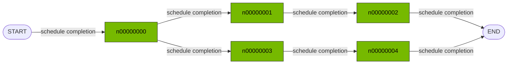

## Graph topology

This is the selected trace's resolved Graph-IR topology.

## Resolved plan

- Source: $REPO/tests/fixtures/dag/small.dag.jsonl
- Format: dag_jsonl
- Trace: root
- Driver: static_graph

## Illustrative readiness waves

| Wave | Nodes ready | Trigger |
|---:|---|---|
| 0 | n00000000 | START |
| 1 | n00000001, n00000003 | completed: n00000000 |
| 2 | n00000002, n00000004 | completed: n00000001, n00000003 |
