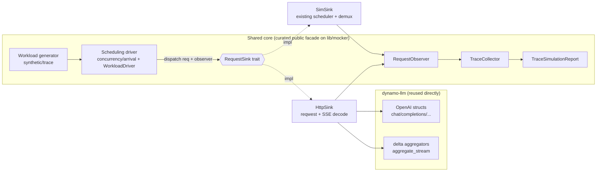

# dynamo-aiperf: a Rust-native AIPerf sharing DynoSim's core — Design

- **Date:** 2026-07-09
- **Status:** Approved design; ready for implementation plan
- **Author:** Anthony Casagrande (with Claude)
- **Working tree:** `/home/anthony/nvidia/projects/dynamo-aiperf-native` (fresh top-of-tree `ai-dynamo/dynamo` clone, commit `f553c46a`, moved out of `/tmp`)
- **Scope of this spec:** Increment 1 only — a walking-skeleton HTTP load generator built *on* DynoSim's production loadgen/collector core and dynamo-llm's OpenAI protocol/aggregators. Later increments (other load modes, endpoints, `loadgen-core` extraction) are named but not specified here.

## 1. Motivation

There are two relevant bodies of code:

- **DynoSim / mocker** (`lib/mocker` in the dynamo repo) — production code. A GPU-free simulator whose `replay` path is, structurally, already a load generator: trace + synthetic workload generation, arrival patterns, concurrency admission, multi-turn sessions, and a metrics collector emitting the exact AIPerf vocabulary (TTFT/ITL/e2e/goodput/throughput/percentiles). It drives an *in-process* simulated engine and never touches a socket.
- **`aiperf-rs`** (in the aiperf repo, worktree `ajc/k8s-rs`) — an AI-generated mechanical 1:1 port of Python AIPerf (~60 crates). Treated as slop: it *re-implements* the workload/timing/metrics that DynoSim already does well. **We do not build on it and do not reuse its reimplementations.**

**Goal:** a Rust-native AIPerf (real HTTP load generation + measurement) that **shares DynoSim's core instead of re-implementing it**, and **reuses dynamo-llm's OpenAI protocol structs and streaming aggregators directly** rather than hand-rolling request formatting / response parsing.

## 2. Locked decisions (from brainstorming)

1. **Option A, in-repo:** the new client is a crate inside the dynamo Cargo workspace, not a separate repo yet.
2. **Composable-later:** boundaries drawn so the shared core can be lifted into a standalone `loadgen-core` crate/repo in the future.
3. **Share DynoSim's core:** reuse `TraceCollector`, the workload generator, and the scheduling/driver loop — do not duplicate them.
4. **Share dynamo-llm classes directly:** reuse the OpenAI request structs + streaming delta **aggregators**.
5. **First increment = walking skeleton, end-to-end** (chosen over core-extraction-first and HTTP-leaf-first).
6. **3b — generalize the real driver now:** the production online scheduling loop is generalized behind a `RequestSink` trait in increment 1, so both the simulated engine and the HTTP client go through the *same* driver. No throwaway driver, no duplication.

## 3. Key findings that ground the design (real code)

### 3.1 The mocker emits random tokens — it models timing/KV, not content
- `lib/llm/src/mocker.rs:188` `generate_random_token()` → `rng.random_range(1000..2000)`; used at `mocker.rs:1042`. The sim never runs inference; it simulates *when* tokens are emitted and KV-cache behavior.

### 3.2 DynoSim's collector is the AIPerf metric vocabulary, and is time-source-agnostic
- `lib/mocker/src/replay/collector.rs` computes TTFT, ITL, e2e, output-tok/s-per-user, request/input/output/total throughput, SLA goodput, percentiles (see `collector.rs:99-104`, `:41-44`).
- It is fed by plain-`f64`-ms events: `on_arrival` (`collector.rs:586`), `on_admit`, `on_token`. **Proof it is source-agnostic:** the "online" replay mode already drives it from wall-clock while "offline" drives it from a discrete-event clock. A real HTTP client is simply a third time source.

### 3.3 The online runtime has TWO sim-coupling points
- **Dispatch:** `lib/mocker/src/replay/online/task.rs:106` — `ctx.senders[worker_idx].send(request)` sends a `DirectRequest` into a scheduler's mpsc.
- **Completion + measurement:** a *shared* `OutputSignal` bus (`output_rx`) is fanned back out per-request by `run_demux`, which owns the single `TraceCollector` and calls:
  - `collector.on_arrival(...)` from arrival events (`demux.rs:88`)
  - `collector.on_admit(...)` from admission events (`demux.rs:100`)
  - `collector.on_token(uuid, batch_time_ms)` per `OutputSignal` token (`demux.rs:28`)
  - first-token via `state.mark_first_token_once()` (`demux.rs:35`)
  - completion via `state.notify_completion()` (`demux.rs:52`), which wakes `state.wait_for_completion()` in the request task (`task.rs:119`)
  - final report: `collector.finish().with_wall_time_ms(...)` (`demux.rs:127`) → `TraceSimulationReport`.
- The scheduling loop (concurrency semaphore / arrival sleep / `WorkloadDriver` feedback) lives in `lib/mocker/src/replay/online/live_runtime.rs` (`LiveRuntime::run`, concurrency branch uses `Semaphore::new(max_in_flight)`), with per-request completion feedback to the driver in `task.rs` (`driver.on_complete(...)`, `InFlightGuard`).

### 3.4 Everything reusable is currently crate-private
- `lib/mocker/src/lib.rs` exposes `pub mod loadgen;` and `pub mod replay;`, but inside them: `loadgen/mod.rs` has `mod driver; mod trace; mod types;` (all private) and `replay/mod.rs` has `mod collector;` (private). `TraceCollector::on_arrival` is `pub(crate)` (`collector.rs:586`).
- **Consequence:** any reuse from a new crate requires adding a deliberate public surface to `lib/mocker`. "Zero edits to DynoSim" is impossible; **"minimal curated public facade" is the objective**, and it is step 1 of building the shared core.

### 3.5 dynamo-llm gives protocol structs + streaming aggregators, but SSE is server-side only
- Protocol + streaming aggregation live in `lib/llm/src/protocols/openai/{chat_completions,completions,embeddings,responses,images,videos,audios}` — each with `delta.rs` + `aggregator.rs`, plus `stream_aggregator.rs` (`aggregate_stream` at `stream_aggregator.rs:21`). These are directly reusable: request formatting + response parsing + delta accumulation.
- SSE in `lib/llm` is an **encoder** (axum `Sse`/`Event`, `[DONE]` in `http/service/disconnect.rs`). There is no client byte-decoder in `lib/llm/src` (only `parse_json_sse` in the test harness).
- **Consequence:** "share dynamo's SSE parser" concretely = a thin `data: …\n\n` line splitter → `serde` into dynamo's stream-response struct → dynamo's `aggregate_stream`. The framing is ~30 lines; the parsing/aggregation is dynamo's.

## 4. Architecture

Three shared cores compose; two thin leaves differ by transport.



- **Shared core** owns: workload model, the scheduling driver loop, `TraceCollector`, the `RequestObserver` hook, and the `RequestSink` trait.
- **`SimSink`** = the existing scheduler + `run_demux`, wrapped behind the trait (behavior-preserving).
- **`HttpSink`** = reqwest + thin SSE decode → dynamo aggregators, in the new crate.

### 4.1 The two new abstractions (land in `lib/mocker`'s public facade)

```rust
/// Collector-facing measurement hook. These are today's TraceCollector
/// pub(crate) methods, promoted to the public core API. All timestamps are
/// f64 ms relative to run start.
pub trait RequestObserver: Send + Sync {
    fn on_arrival(&self, uuid: Uuid, arrival_ms: f64, /* input/session meta */);
    fn on_admit(&self, uuid: Uuid, admit_ms: f64, reused_input_tokens: usize);
    fn on_first_token(&self, uuid: Uuid, at_ms: f64);
    fn on_token(&self, uuid: Uuid, at_ms: f64);
    fn on_complete(&self, uuid: Uuid, at_ms: f64, /* output token count, finish */);
}

/// Dispatch one request, drive it to terminal state, resolve on completion.
/// Emits measurement events through `obs` along the way.
#[async_trait]
pub trait RequestSink: Send + Sync {
    async fn dispatch(&self, req: SinkRequest, obs: &dyn RequestObserver) -> anyhow::Result<()>;
}
```

- `SinkRequest` is the transport-neutral request the driver hands to a sink. For SimSink it carries what today's `DirectRequest` needs (tokens/hashes/max_output_tokens/uuid). For HttpSink it carries the prompt text + generation params. **Exact shape is a planning detail;** the design constraint is that the *schedule/timing* fields are shared and the *payload* fields are sink-specific (the token-vs-text divide from §6).

### 4.2 The 3b refactor of `lib/mocker` (behavior-preserving for SimSink)
1. Add `RequestSink` + `RequestObserver` to a curated public module.
2. Generalize `LiveRuntime::run`'s concurrency/arrival loop + `WorkloadDriver` feedback so the "dispatch → await completion → `driver.on_complete`" step delegates to `RequestSink::dispatch`. The concurrency permit / arrival sleep / `InFlightGuard` stay in the shared loop.
3. Implement `SimSink`: `dispatch` = `router.select_worker` + `senders[idx].send(direct_request)` + await the per-request `RequestState` (i.e. today's `run_request_task` body), while `run_demux` is adapted to feed the `RequestObserver` instead of a private `TraceCollector`.
4. Promote `TraceCollector`, workload types, and the driver loop from `pub(crate)`/private to the curated public facade.
5. **Regression gate:** the existing `lib/mocker` online replay tests must stay green — that is the definition of "did not break DynoSim."

### 4.3 `HttpSink` (in the new crate)
- `reqwest` streaming POST to `/v1/chat/completions` (streaming on).
- Thin SSE line decoder (`data: …\n\n`, `[DONE]` terminal) → `serde` into dynamo's `NvCreateChatCompletionStreamResponse` → dynamo's `aggregate_stream`/delta.
- Emits: `obs.on_arrival` immediately before send; `obs.on_first_token` on first chunk; `obs.on_token` per chunk; `obs.on_complete` at `[DONE]`, with output token count from dynamo's aggregator/usage block.
- `on_admit` is sim-specific; for HTTP it is either omitted or set equal to dispatch time (planning detail).

## 5. Crate layout

- New workspace crate at `lib/aiperf/` — package `dynamo-aiperf`, binary `aiperf`.
- Dependencies: the curated `dynamo-mocker` core facade (workload + driver + collector + traits), `dynamo-llm` (protocol structs + aggregators), `reqwest`, `tokio`, `anyhow`, `uuid`.
- **Composability guardrail:** `dynamo-aiperf` depends only on the curated mocker facade and dynamo-llm public API — never on mocker internals. The facade + `RequestSink`/`RequestObserver` + collector + workload constitute the future `loadgen-core`; a later increment relocates them into their own crate without changing `dynamo-aiperf`.
- Crate home (`lib/aiperf` vs elsewhere) is tentative and confirmed during planning; it is not load-bearing for this design.

## 6. Scope

**In (increment 1):**
- Synthetic workload, concurrency mode, single endpoint (`/v1/chat/completions`, streaming).
- Real reqwest + SSE decode, dynamo aggregators, DynoSim `TraceCollector` + driver.
- The 3b `RequestSink`/`RequestObserver` refactor with `SimSink` behavior preserved.
- A printed TTFT/ITL/throughput summary from `TraceSimulationReport`.

**Out (later increments, named not specified):**
- Request-rate / trace / agentic / disaggregated modes.
- Non-chat endpoints (completions/embeddings/responses/rankings/image/video).
- Exporters, UI, `--extra-inputs`, headers/auth breadth.
- Extraction of the shared core into a standalone `loadgen-core` crate.

**Scoped simplification (accepted):** DynoSim's synthetic workload is token-length-based (no text); HTTP needs real prompt text. The skeleton uses a **trivial synthetic text generator targeting an approximate input length**. **Tokenizer-exact ISL/OSL** (via dynamo's HF tokenizer) is deferred to increment 2. This is the one place the skeleton is not full AIPerf fidelity.

## 7. Verification

- **Regression gate:** existing `lib/mocker` online replay tests pass unchanged after the SimSink refactor.
- **New e2e:** run `dynamo-aiperf` against a tiny in-crate mock OpenAI SSE server; assert TTFT, ITL, and throughput are populated and finite, and request/token counts match the workload.
- **Manual smoke:** point `aiperf` at a `frontend` + `mocker` deployment (real HTTP, random-token content) and confirm a sane summary.

## 8. Risks / open items (resolve during planning)

- **Curated facade shape:** exactly which `TraceCollector`/workload/driver items become public, and whether the observer is a trait object or generic. Aim: smallest surface that both sinks need.
- **`SinkRequest` shape:** how to carry sim fields (tokens/hashes) and HTTP fields (text/params) without a leaky union — likely a small shared "schedule" struct + sink-specific payload.
- **Driver generalization blast radius:** `live_runtime.rs` / `task.rs` / `demux.rs` / `state.rs` all move; the regression gate contains the risk but the diff is nontrivial.
- **SSE decoder ownership:** thin decoder lives in `dynamo-aiperf` for now; if a second endpoint needs it, consider promoting into the facade.

## 9. Future increments (roadmap, not committed)

1. Tokenizer-exact prompts (dynamo HF tokenizer) + request-rate mode.
2. Additional endpoints via dynamo protocol structs (completions, embeddings, responses).
3. Trace/agentic/disagg workload modes through the shared driver.
4. Extract `loadgen-core` crate; `dynamo-aiperf` and `lib/mocker` both depend on it.
5. Exporters / summary parity with Python AIPerf output.
