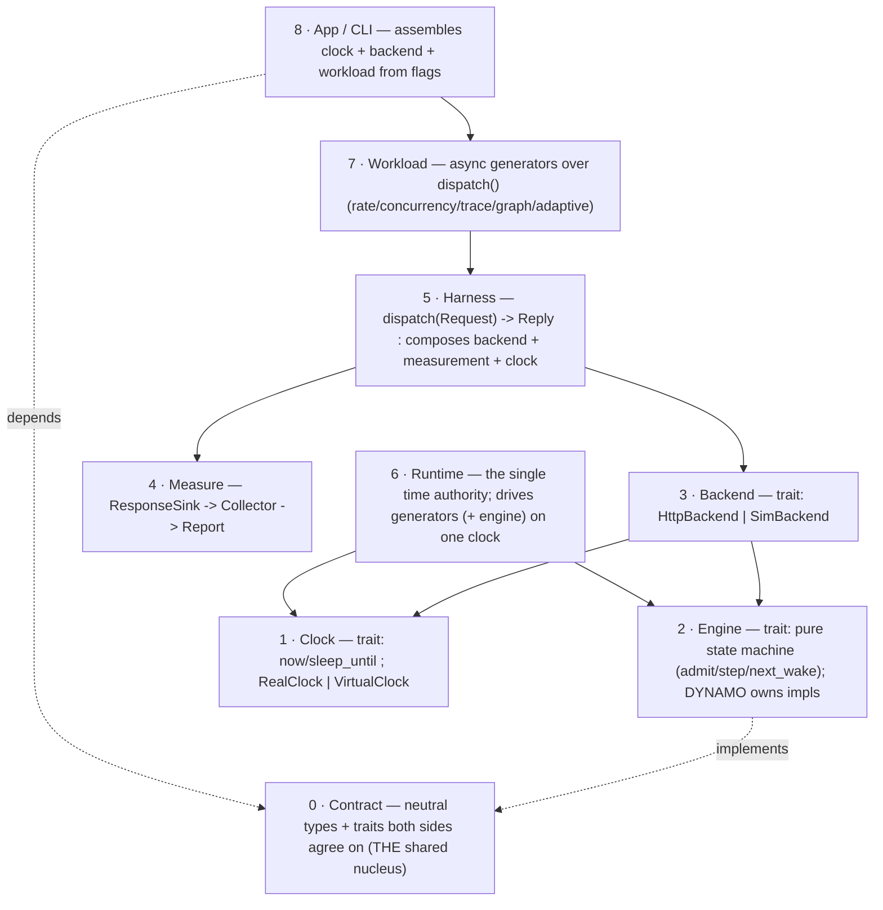
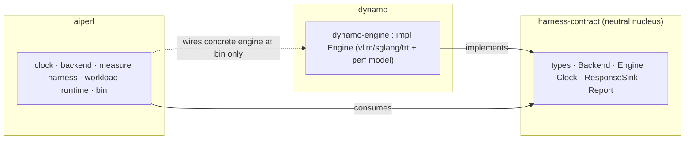

# Shared Dynamo + AIPerf Rust Architecture — North Star (Greenfield)

> **Fresh-eyes design.** This describes the cleanest end-state abstraction, not a
> migration. It deliberately ignores every existing symbol
> (`ReplayWorkerCore`, `execute_pass`, `current_time_ms`, `DirectRequest`,
> `WorkloadDriver`, `drive_sim`, …). Those belong to the *path* spec
> (`2026-07-10-steppable-clock-injected-engine-design.md`); this is the
> *target*. Pure Rust, one workspace, zero Python.

## The one idea

A load-testing/simulation system has exactly **three orthogonal axes**. Every
existing tangle comes from conflating them. Separate them cleanly and the whole
thing collapses to a small trait set:

| Axis | Question | Values |
|---|---|---|
| **Time** | Who decides *when*? | real (reactor) · virtual (DES) |
| **Backend** | Where does a request *go*? | real HTTP · in-process engine |
| **Workload** | What requests, in what *pattern*? | rate · concurrency · trace · dataflow · adaptive |

These are **fully independent**. Any combination is valid and meaningful:

```
              rate   concurrency   trace   graph-dataflow   adaptive
real+http      ✓          ✓          ✓            ✓             ✓
virtual+sim    ✓          ✓          ✓            ✓             ✓
```

The design goal: **a workload never knows which time or backend it runs on**, a
backend never knows which workload drives it, and time lives in exactly one
place. Achieve that and "real vs simulated" and "open- vs closed-loop" stop
being code paths — they become dependency injection.

## Layer stack



## Layer 0 — The Contract (the actual "shared codebase")

The shared surface is **one tiny neutral crate** — types + traits, no logic.
Dynamo depends on it to *implement* an engine; AIPerf depends on it to *consume*
one. Neither depends on the other's crate.

```rust
// crate: harness-contract   (owned jointly; changes need both teams' sign-off)

/// Virtual-or-real time, nanoseconds since run origin. Monotonic newtype.
#[derive(Clone, Copy, PartialEq, Eq, PartialOrd, Ord)]
pub struct Instant(pub i64);
pub struct Duration(pub i64);

pub struct Request {
    pub id: ReqId,
    pub prompt: Prompt,          // tokens are authoritative; text is a convenience
    pub params: GenParams,
    pub label: Label,            // session/turn/node correlation, opaque to backends
}
pub enum Prompt { Tokens(Vec<u32>), Text(String) }
pub struct GenParams { pub max_tokens: u32, pub ignore_eos: bool }

/// The single streamed vocabulary every backend speaks. Timestamps are read
/// from the active clock, so the same events describe a real server or a sim.
pub enum Event {
    Admitted   { at: Instant, reused_prefix_tokens: u32 },
    FirstToken { at: Instant },
    Token      { at: Instant },
    Done       { at: Instant, terminal: Terminal, usage: Usage },
}
pub enum Terminal { Completed, Rejected, Error }
pub struct Usage { pub prompt_tokens: u32, pub completion_tokens: u32 }

/// What a dispatch returns to its caller. Content is real text over HTTP and a
/// token *length* under sim (which is all a dataflow workload needs to size the
/// next prompt) — so downstream splicing works identically on both.
pub struct Reply { pub body: ReplyBody, pub usage: Usage, pub terminal: Terminal }
pub enum ReplyBody { Text(String), Length(u32) }

/// Anything that watches a request's event stream (measurement, gates).
pub trait ResponseSink { fn on_event(&mut self, req: ReqId, ev: Event); }

// ---- the two provider traits ----

/// Where a request goes. The ONLY place real-vs-sim lives (besides Clock).
#[async_trait(?Send)]
pub trait Backend {
    async fn dispatch(&self, req: Request, sink: &mut dyn ResponseSink) -> Reply;
}

/// A pure inference simulator: injected time in, events out. No loop, no IO,
/// no clock ownership. DYNAMO implements this (vLLM/SGLang/TRT-LLM flavors).
pub trait Engine {
    fn admit(&mut self, now: Instant, req: &Request);
    /// Advance internal work as of `now`, draining events produced since the
    /// last step. Pure function of (state, now).
    fn step(&mut self, now: Instant, out: &mut dyn FnMut(ReqId, Event));
    /// Earliest `now` at which `step` would make progress; None if idle.
    fn next_wake(&self) -> Option<Instant>;
    fn is_idle(&self) -> bool;
}

/// Consumer view of time.
pub trait Clock {
    fn now(&self) -> Instant;
    async fn sleep_until(&self, t: Instant);
}
```

That is the whole shared contract. ~120 lines. Everything else is one side's
private business.

## Layer 1 — Clock (AIPerf)

Two impls of `Clock`. The virtual one exposes an extra runtime-only trait so the
Runtime — and *only* the Runtime — can drive it:

```rust
pub struct RealClock;      // now() = monotonic OS; sleep_until = reactor timer
pub struct VirtualClock;   // now() = current virtual ns; sleep_until parks on a DES heap

/// Runtime-facing. Consumers never see this — they only get `Clock`.
pub trait Advance: Clock {
    fn next_parked(&self) -> Option<Instant>;  // earliest sleeper deadline
    fn advance_to(&self, t: Instant);          // jump virtual time, wake due sleepers
}
```

Splitting `Clock` (now/sleep) from `Advance` (peek/advance) is what keeps
workloads unable to cheat time: a generator can *read* and *await* time but can
never *move* it. Only the Runtime moves it.

## Layer 2 — Engine (Dynamo)

Dynamo's home. A pure state machine — trivially unit-testable (admit; step at t;
assert events), deterministic by construction (no wall clock, no IO, no
threads), and swappable (ship `VllmEngine`, `SglangEngine`, `TrtEngine`; AIPerf
consumes any `dyn Engine`). The perf model and scheduler live entirely behind
this trait; the boundary never widens.

## Layer 3 — Backend (AIPerf) — the unification point

```rust
pub struct HttpBackend { client, base_url, clock: Rc<dyn Clock> }
// dispatch: stream SSE, emit Event{at: clock.now()} per chunk, return Reply::Text

pub struct SimBackend { host: Rc<EngineHost> }   // wraps a dyn Engine via the host
// dispatch: host.admit(clock.now(), req); await this request's events (routed by
//           the Runtime as it steps the engine); return Reply::Length
```

`EngineHost` is the shared seam between `SimBackend` and `SimRuntime`: it owns
the `dyn Engine` plus a `ReqId -> sink` routing table. `admit` registers a
request and hands back a per-request event stream; `step` (called by the
runtime) routes engine events to the registered sinks, waking parked dispatch
futures.

Both backends satisfy the same `Backend::dispatch` signature, so **nothing above
Layer 3 can tell them apart.**

## Layer 4 — Measure (AIPerf)

A `ResponseSink` that timestamps and accumulates into a `Collector`, producing a
`Report`. Backend-neutral: it records the same `Event` stream whether it came
from a socket or the engine. TTFT/ITL/TPOT/e2e/throughput all derive from
`Event.at`, so they are correct on both paths without special-casing.

## Layer 5 — Harness (AIPerf) — the one API workloads use

```rust
pub struct Harness { backend: Box<dyn Backend>, clock: Rc<dyn Clock>, collector: Rc<RefCell<Collector>> }

impl Harness {
    /// The single verb. Composes backend + measurement + clock. A workload only
    /// ever calls this; it is identical for real and sim.
    pub async fn dispatch(&self, req: Request) -> Reply {
        let mut sink = Tee(MeasuringSink::new(&self.collector), /* + gates */);
        self.backend.dispatch(req, &mut sink).await
    }
}
```

## Layer 6 — Runtime (AIPerf) — the single time authority

```rust
// real: the tokio reactor is the driver; sleeps and socket IO wake naturally.
pub fn run_real(clock, generators) { LocalSet::block_on(join(generators)) }

// sim: one loop unifies generator sleepers and engine steps on ONE VirtualClock.
pub fn run_sim(clock: VirtualClock, host: EngineHost, generators) {
    let fut = join(generators);                 // generators submit to host, park
    loop {
        match poll(fut) {
            Ready => return,
            Pending => {                         // everyone parked -> advance time
                let t = min(clock.next_parked(), host.next_wake());
                match t {
                    None => return,              // drained
                    Some(t) => { clock.advance_to(t); host.step(t); }  // step routes events -> wakes
                }
            }
        }
    }
}
```

This loop is the *entire* difference between simulated and real execution. It is
also where determinism is guaranteed: virtual time only ever advances to a
scheduled event, engine steps are a pure function of `t`, and generator ordering
is fixed — so a run is bit-reproducible with no wall-clock anywhere in it.

## Layer 7 — Workload (AIPerf) — generators, clock/backend-agnostic

Each pattern is just async code over `harness.dispatch`. None of them mention
time source or backend:

```rust
// open-loop rate
async fn rate(h, work, qps)  { for r in work { h.clock.sleep_until(next_arrival(qps)).await; spawn(h.dispatch(r)); } }
// closed-loop concurrency
async fn concurrency(h, work, n) { join(n lanes of `while let Some(r)=work.next() { h.dispatch(r).await; }`) }
// dataflow DAG
async fn graph(h, dag)       { walk nodes; each node: splice predecessors' Reply -> h.dispatch(node_req).await }
// adaptive outer loop
async fn adaptive(h, planner){ loop { let cfg = planner.next(last_report); run inner workload; if converged break } }
```

The concurrency generator that runs against a real server is byte-identical to
the one that runs against the sim. That is the payoff.

## Layer 8 — App / CLI (AIPerf bin)

The only place concrete types meet:

```rust
let clock   = if offline { VirtualClock::new() } else { RealClock::new() };
let backend = if offline { SimBackend::new(EngineHost::new(dynamo_engine::vllm(profile))) }
              else        { HttpBackend::new(url, clock.clone()) };
let harness = Harness::new(backend, clock.clone());
let workload = select(mode);                 // rate | concurrency | trace | graph | adaptive
if offline { run_sim(clock, host, workload.run(&harness)) }
else       { run_real(clock,       workload.run(&harness)) }
report(harness.collector);
```

## Crate & ownership map



- **`harness-contract`** — jointly owned, tiny, changes rare and reviewed by
  both teams. This is *the* shared codebase; everything else is an
  implementation detail on one side.
- **`dynamo-engine`** — dynamo's, depends only on the contract. Can ship many
  `Engine` impls without touching AIPerf.
- **AIPerf crates** — depend on the contract's `Engine`/`Backend` *traits*, not
  on `dynamo-engine`. Only the final binary names the concrete engine, so the
  coupling is trait-level and either side swaps impls freely.

## Why this is the cleanest possible shape

- **Three orthogonal axes, three injection points.** No mode enums thread
  through the core; real/sim/open/closed are `Clock` + `Backend` choices made
  once at the top.
- **One dispatch verb.** Every workload is `dispatch`-and-await; the hardest
  part of the old world (closed-loop feedback vs. batch replay) is just "await
  the future," because the Runtime unifies engine and generator time.
- **The engine is pure.** No loop, no clock, no IO — the most correctness-
  sensitive code becomes the most testable and the most portable.
- **Time has one owner.** The Runtime. Everything else can read and sleep but
  never move time — structurally impossible to get virtual-time bugs from a
  workload.
- **The shared surface is ~120 lines.** dynamo and AIPerf meet at a trait crate,
  not a merged architecture — the smallest possible thing to agree on, and the
  easiest to keep stable.

## Contract-crate acceptance checklist

A design is "contract-clean" iff:
1. No type in `harness-contract` names HTTP, tokio, a scheduler, or a metric
   formula. (Pure vocabulary.)
2. `Engine` has no `async`, no `&self` IO, and no clock parameter beyond
   `Instant`. (Pure state machine.)
3. A workload file compiles with `HttpBackend` and `SimBackend` swapped and
   `RealClock`/`VirtualClock` swapped, unchanged. (Orthogonality holds.)
4. `dynamo-engine` has zero `aiperf-*` dependencies and `aiperf-workload` has
   zero `dynamo-*` dependencies. (Only the bin bridges.)
