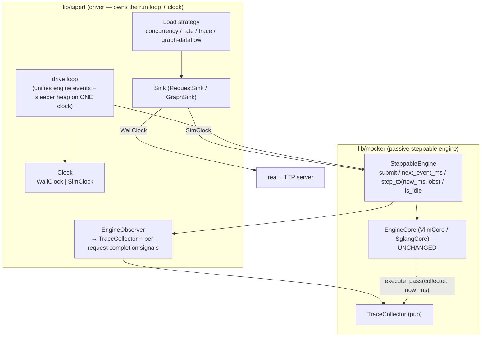

# Steppable Clock-Injected Engine — AIPerf ↔ Mocker Shared Boundary

**Goal:** Define one Rust boundary through which the in-repo Rust AIPerf port
(`lib/aiperf`) drives the dynamo mocker's inference engine (`lib/mocker`) —
real (HTTP) or simulated (in-process DES) — behind a single load-generation
harness, by inverting the mocker's self-driving batch loops into a *passive,
steppable, externally-clocked engine core*.

**Architecture:** AIPerf owns the run loop and the clock; the mocker exposes its
scheduler/perf-model as a steppable engine that takes injected time and emits
measurement events. Inject a `WallClock` → drive a real server. Inject a
`SimClock` → drive the mocker engine in-process, faster-than-real. One driver,
two backends, one report type.

**Tech Stack:** Pure Rust, single workspace. `lib/aiperf` (tokio
`current_thread` + `LocalSet`, `?Send`, `spawn_local`) consumes `lib/mocker`
(scheduler cores `VllmCore`/`SglangCore`, perf model, `TraceCollector`).
Dependency direction is strictly `aiperf → mocker`.

## Global Constraints

- **ZERO Python.** This spec covers only the in-repo Rust AIPerf port. The
  Python `aiperf` package, the `mocker_shm_bridge` subprocess, the SPSC rings,
  and the `SimClockDriver` are **reference blueprints only** — none of their
  code, IPC, or threading model is in scope. No subprocess, no shared memory,
  no cross-language boundary.
- **Dependency is unidirectional:** `lib/mocker` MUST NOT depend on
  `lib/aiperf` or on aiperf's `Clock` trait. The engine takes `now` as a plain
  scalar and an `&mut dyn RequestObserver`; it never sees a clock object.
- **Determinism is a hard invariant.** The steppable path MUST reproduce the
  existing batch path's `perf_ns` sequence bit-for-bit on every handoff
  conformance fixture. This is the acceptance gate, not a nice-to-have.
- **The scheduler math is untouched.** `VllmCore` / `SglangCore` /
  `EngineCore::execute_pass` are not rewritten. Only the *driver loops* around
  them are inverted.
- **No report-schema change.** `TraceSimulationReport` stays the output on both
  the real and simulated paths.

---

## 1. Motivation

The dynamo maintainers want AIPerf and the mocker to share a codebase. The
seam that makes "shared" real is the **clock** — because *who drives time* is
exactly the online/offline/real distinction, and it is currently duplicated.

Three signals already in the mocker tree point at this boundary:

1. **The engine core already takes injected time.**
   `offline/core.rs:74` — `ReplayWorkerCore::execute_pass(collector, now_ms)`
   forwards to `self.core.execute_pass(collector, now_ms)`. Time is a
   *parameter*, not owned by the core.
2. **Two driver wrappers already exist around one scheduler.** Offline:
   `ReplayWorkerCore` (sync, `current_time_ms: f64`, batch `run()`), online:
   `EngineScheduler` (async, real wall-clock, `live_runtime.rs`). Both wrap the
   same `crate::scheduler` cores. The only axis they differ on is time supply.
3. **`planner_handle.rs` already fights the batch model** to get a
   planner-in-the-loop — evidence that feedback-driven consumers are being
   bolted onto a loop that resists them.

What blocks reuse today (verified in `offline/single.rs`):

- The offline "clock" is a bare `current_time_ms: f64` field mutated inline
  (`= next_arrival_ms`, `= pass.end_ms`) — **not an injectable object.**
- `run(mut self) -> Result<TraceCollector>` is a synchronous batch loop that
  **owns time** and drains a **pre-known** arrival queue to completion.
- There is no "submit a request at the current sim-time, notify me on
  completion" entry point — arrivals must be fixed before the loop starts.

A closed-loop consumer (graph dataflow, adaptive/BO outer loop, SLA search,
planner-in-the-loop) cannot use a batch `run()`, because *its next arrival is
the prior request's simulated completion* — which is what the sim is computing.

## 2. Non-Goals

- Porting or modifying anything in the Python `aiperf` package.
- Reusing or reviving the `mocker_shm_bridge` / SPSC-ring / slave-clock design.
  (In-process pure-Rust shares **one** clock; there is nothing to bridge.)
- Rewriting `VllmCore` / `SglangCore` scheduler or the AIConfigurator perf model.
- Changing the `TraceSimulationReport` schema or the metrics contract.
- Disaggregated (`DisaggRuntime`) inversion in the first cut — agg/single first;
  disagg follows the same shape once the boundary is proven.

## 3. Architecture Overview



**The rule:** the mocker never runs a loop and never reads a clock. AIPerf's
driver advances one shared clock, asks the engine when it next needs stepping,
and steps it. Every measurement event the engine produces flows through one
`RequestObserver` that both records into `TraceCollector` and wakes the parked
per-request future in the driver.

## 4. The Engine Boundary (in `lib/mocker`)

A single trait; all input/output types already `pub`.

```rust
// lib/mocker/src/loadgen/engine.rs  (new; sits beside the RequestSink seam)

/// A discrete-event inference engine whose time is supplied by the caller.
/// The caller owns the run loop; the engine is a passive library. Time is a
/// plain millisecond scalar (the mocker's + perf-model's + TraceCollector's
/// native unit); the engine never depends on any Clock abstraction.
pub trait SteppableEngine {
    /// Admit a request at the caller's current sim time (`now_ms`). Returns the
    /// engine-assigned id used to correlate later observer callbacks.
    fn submit(&mut self, now_ms: f64, req: DirectRequest) -> Uuid;

    /// The next sim time (ms) at which the engine wants to be stepped:
    /// `Some(now_ms)` when in-flight work can make progress immediately,
    /// `None` when idle (no progress without a further `submit`).
    fn next_event_ms(&self) -> Option<f64>;

    /// Advance internal work as of `now_ms`, emitting measurement events
    /// (`on_admit` / `on_token` / `on_terminal`) to `obs`. Returns the sim time
    /// after the step (the pass end), which the caller uses as the next clock
    /// target. Mirrors today's `execute_pass(collector, now_ms) -> end_ms`.
    fn step_to(&mut self, now_ms: f64, obs: &mut dyn RequestObserver) -> f64;

    /// True when no pending or in-flight work remains.
    fn is_idle(&self) -> bool;
}
```

Construction reuses `MockEngineArgs` (already `pub`, `derive_builder` with
vLLM-sane defaults, `Deserialize` from a profile file):

```rust
pub fn new_steppable(args: MockEngineArgs) -> impl SteppableEngine; // wraps ReplayWorkerCore
```

**Why `now_ms: f64`, not `ns: i64`:** the perf model, `execute_pass`, and
`TraceCollector::on_arrival(uuid, arrival_time_ms, …)` are all ms-`f64`. Keeping
the boundary in the engine's native unit means zero conversion inside the
mocker; the aiperf driver (whose `SimClock` is ns-`i64`) converts once at the
call site. The engine stays a pure function of injected ms.

**Coupling summary:** `aiperf` depends on `mocker::{SteppableEngine,
new_steppable, DirectRequest, MockEngineArgs, RequestObserver, TraceCollector,
TraceSimulationReport}`. `mocker` depends on nothing of aiperf's. All of these
except `SteppableEngine`/`new_steppable` are already `pub` on the experiment
branch.

## 5. The Clock (owned by `lib/aiperf`)

AIPerf already has the abstraction (`graph/clock.rs`):

```rust
pub trait Clock {
    fn now_ns(&self) -> i64;
    fn sleep(self: Rc<Self>, duration_ns: i64) -> Pin<Box<dyn Future<Output=()>>>;
    fn next_event_time(&self) -> Option<i64>;   // earliest parked deadline
    fn advance_to(&self, ns: i64);
}
```

`SimClock` (DES BinaryHeap) and `WallClock` (reactor) both implement it, and
`drive_sim` / `drive_real` already pump each. **These become the shared clock**
for every strategy, not just graph. The concurrency/rate/trace strategies move
onto the same `Clock`-parameterized pacer so `--offline` is a clock swap, not a
new code path.

## 6. The Observer / Completion Seam

The existing `RequestObserver` (already `pub`) does double duty on the sim path:

1. **Record** into `TraceCollector` (as `CollectorObserver` does today).
2. **Signal** the parked per-request future. When the engine emits
   `on_terminal(uuid, …)`, the observer resolves the request's completion
   (a `oneshot`-like slot keyed by `uuid`); when it emits the first
   `on_token(uuid, …)`, it fires the graph first-token gate
   (`GraphSink::dispatch`'s `on_first_token`).

```rust
// lib/aiperf: wraps CollectorObserver + a uuid->waker registry
struct EngineObserver { collector: CollectorObserver, pending: HashMap<Uuid, CompletionSlot> }
impl RequestObserver for EngineObserver { /* record + wake */ }
```

A sim sink then looks identical in shape to the HTTP sink, differing only in
that `dispatch` calls `engine.submit(now_ms, req)` and awaits the completion
slot instead of streaming HTTP:

```rust
// GraphSink / RequestSink over the in-process engine
async fn dispatch(&self, …, on_first_token: &dyn Fn()) -> Result<Reply> {
    let uuid = self.engine.borrow_mut().submit(self.clock.now_ms(), req);
    let outcome = self.pending.register(uuid, on_first_token).await; // resolved by driver step
    Ok(reply_from(outcome))
}
```

## 7. The Driver Loop (one loop, both event sources)

`drive_sim` is extended from "advance to next *sleeper*" to "advance to next
*sleeper or engine* event" — the externalized form of `SingleRuntime::run`'s
existing `min(next_arrival, pass_end)` selection:

```
loop:
  poll aiperf tasks         # pacers/nodes may submit() to the engine and park
  if all parked:
    t_eng = engine.next_event_ms().map(ms_to_ns)      # Some(now) if work, else None
    t_slp = clock.next_event_time()                   # next pacer arrival / gate delay
    match min(t_eng, t_slp):
      None            => return                         # drained
      Some(t):
        clock.advance_to(t)
        if engine due at t:
          engine.step_to(ns_to_ms(t), &mut obs)         # emits on_terminal -> wakes parked sinks
```

Because both event sources ride one clock and the engine step emits terminals
through the observer that wakes the sinks, the closed loop closes with **no
slave clock and no IDLE fast-forward** — those existed only to bridge two
clocks across a process boundary that does not exist here.

## 8. Online vs Offline Falls Out

| | Inject | Sink dispatch | Time authority |
|---|---|---|---|
| **Real** | `WallClock` | stream HTTP (`HttpSink`) | OS reactor |
| **Offline** | `SimClock` | `engine.submit` + await slot | aiperf driver over the shared clock |

Same strategy code (concurrency / rate / trace / graph). `--offline` selects the
clock + sink pair. `MockEngineArgs` (defaults or `--engine-profile x.json`)
supplies the simulated hardware/model when offline.

## 9. Determinism Contract & Conformance Gate

- The steppable path MUST emit an identical `perf_ns` sequence to the batch
  `run()` on every existing handoff conformance fixture. The mocker already
  ships this harness (`common/handoff.rs`, `run_offline_handoff_conformance`);
  it flips from a *drift tax between two wrappers* to the *acceptance test for
  the inversion*.
- Event ordering rule: at equal sim time, the driver MUST select engine steps
  vs. arrivals in the same order `SingleRuntime::run` does today (arrivals
  enqueued before the pass that observes them). Encode as a total order on
  `(time, kind, seq)` mirroring `offline/events.rs` `SimEvent` tie-breaking.
- Any reordering that changes batch composition changes `perf_ns` and fails the
  gate — so the gate is sufficient to catch the one class of bug that matters.

## 10. Consumers Proven by This Spec

1. **Concurrency/rate/trace offline** — the driven path (`driven.rs`) gains a
   `SimClock` + engine-sink variant; `--offline` produces a predicted report
   with the same table.
2. **Graph offline** — the graph executor (already clock-driven, measures off
   `handle.now_ns()`) runs on `SimClock` with a `SimGraphSink` over the engine.
   This is the faithful, contention-aware offline graph that motivated the
   spec, and it is the *second independent consumer* that proves the boundary.

## 11. Migration Staging (each PR independently shippable)

- **PR1 — Seam (largely done on the experiment branch).** `TraceCollector`,
  `RequestSink`/`RequestObserver`/`DispatchRequest` `pub`; `SimSink` refactor of
  the online path through the seam. ~290 LOC, additive. (Already implemented.)
- **PR2 — Steppable engine, non-breaking.** Add `SteppableEngine` +
  `new_steppable` wrapping `ReplayWorkerCore`; rewrite `SingleRuntime::run` (and
  `AggRuntime`) as a thin synchronous driver `while !engine.is_idle() { step }`
  over it. Gate: handoff bit-identity. No consumer change. This is the
  determinism-sensitive PR — land it behind the conformance harness.
- **PR3 — AIPerf in-process sim sink (== graph-offline).** `EngineObserver`,
  the completion-slot registry, the `SimGraphSink`/`SimRequestSink`, and the
  `drive_sim` unification (§7). Wire `--offline` + `--engine-profile`. Ships the
  feature *and* proves the shared core with a non-mocker consumer.
- **PR4 — Retire duplication.** Move the mocker's own concurrency/trace driver
  loops onto aiperf strategies (or delete in favor of them); mocker keeps only
  the steppable engine + perf model. Disagg inversion lands here.

## 12. Risks & Mitigations

- **Determinism drift (highest).** Mitigation: PR2 is pure inversion behind the
  conformance harness; no behavior change ships until bit-identity holds.
- **Batch-path regression.** The common "simulate a whole trace" case must stay
  a tight sync loop. Mitigation: keep dynamo's synchronous `while !idle{step}`
  driver as a first-class thin wrapper; do not force async on batch callers.
- **Unit friction (ns-i64 vs ms-f64).** Mitigation: boundary is ms-f64 (engine
  native); aiperf converts once at the call site. Document the single
  conversion site.
- **Ownership/politics.** The ask to dynamo is small and concrete: agree the
  engine boundary is `submit`/`step_to`/`next_event_ms`/injected-time. Backed by
  three in-tree signals (§1), it is a narrower yes than "merge our
  architectures."

## 12b. Time Representation (canonical)

- **Canonical time is `i64` nanoseconds** everywhere a timestamp is stored or
  compared. The `SimClock` heap keys on `(at_ns, seq_no)`; ordering is total and
  exact. Never key an event queue on `f64` — float ordering is rounding-
  dependent and forces `to_bits()`/`seq_no` hacks.
- **One source: the `Clock`.** Real mode = `Instant::now()`/`elapsed()` inside
  `WallClock` only; sim mode = the virtual counter. **Nothing else may call
  `Instant::now()` / `elapsed()` / `SystemTime`.** The existing
  `observer.rs`/`http_sink.rs` `now_ms()` helpers (which read `start.elapsed()`
  directly) MUST be re-routed through `Clock::now_ns()` before the sim backend
  lands — otherwise sim events get wall-clock timestamps. Track as **PR2.5**.
- **`f64` ms is a boundary/output unit only, converted once at two edges:**
  perf-model latency (ms `f64`) → quantize to ns at schedule time
  (`now_ns + (latency_ms * 1e6).round() as i64`, the determinism anchor); ns →
  report/`TraceCollector` (`ns as f64 / 1e6`, exact to ~104 days).
- **Granularity = ns**, not µs/ms: perf-model fidelity is ms-scale, so ns has
  ~6 sub-ms digits of headroom and never collapses distinct events; `i64` ns
  overflows at ~292 years.

## 13. Open Questions

1. Where does `SteppableEngine` live — `lib/mocker/src/loadgen/engine.rs`
   (beside the `RequestSink` seam) or `replay/`? Recommend `loadgen` so the
   dispatch + engine contract sit together.
2. Does agg (`AggRuntime`, multi-worker + router) need a per-worker
   `SteppableEngine` with the router as a driver-side component, or one engine
   fronting N workers? Lean: engine fronts the worker pool; router stays inside
   the engine so the boundary stays single-object.
3. First-token semantics on the sim path: does the perf model already emit a
   distinct first-token event, or is TTFT derived at terminal? Confirm before
   wiring `on_first_token` (graph gating depends on a real first-token signal).
4. `max_sim_time_ms` soft-cap: preserve as a driver-side guard or an engine
   `is_idle`-adjacent state? Recommend driver-side so the engine stays pure.

## Addendum — 2026-07-11

The `lib/aiperf` + dynamo `lib/mocker` framing above describes the historical
engine-boundary design lineage, not the current standalone native-Rust workspace.
Current AIPerf lives under `crates/` and has no direct dynamo dependency. The realized
seams are `aiperf-clock::Clock` and `loadgen-core::{RequestSink<R>, RequestObserver,
Dispatchable}`; the OFFLINE-mock steppable engine remains a design target, but it must
be wired through those current seams rather than through the `lib/aiperf` /
`lib/mocker` module names used here.

The PR2.5-era gap about the online path using a separate reqwest/`Instant` stack is
closed in the current workspace: both the CLI online path and graph benchmark use the
Clock-injected `aiperf-transport` hyper client. Any future implementation work from
this spec should translate the concepts to the standalone crate topology before
changing code.
