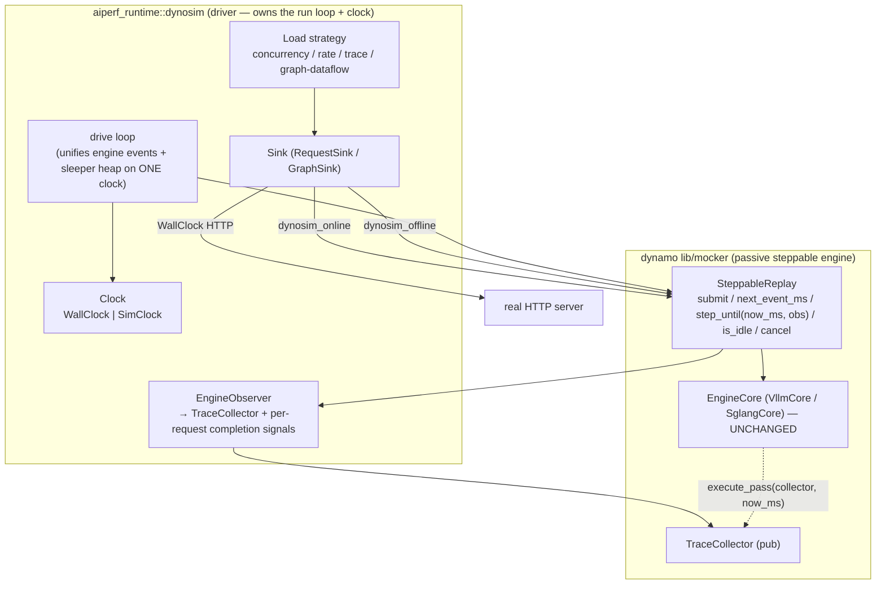

# Steppable Clock-Injected Engine — AIPerf ↔ Mocker Shared Boundary

**Status:** built behind the `dynosim` Cargo feature; runner product-reachable
through Python Config v2 (`transport.type: dynosim_offline | dynosim_online`).
Default runner builds omit the transports.

**Goal:** Define one Rust boundary through which AIPerf (`rust/runtime`, module
`aiperf_runtime::dynosim`) drives the Dynamo mocker's inference engine — real (HTTP) or
simulated (in-process DES) — behind a single load-generation harness, by
inverting the mocker's self-driving batch loops into a *passive, steppable,
externally-clocked engine core*.

**Architecture:** AIPerf owns the run loop and the clock; the mocker exposes its
scheduler/perf-model as a steppable engine that takes injected time and emits
measurement events. Inject a wall clock → drive a real server or drive the
engine in real time. Inject a virtual clock → drive the mocker engine
in-process, faster-than-real. One driver, three modes, one report type.

**Tech Stack:** Pure Rust, single workspace. `rust/runtime` (tokio
`current_thread` + `LocalSet`, `?Send`, `spawn_local`) consumes the sibling
`dynamo-aiperf-native/lib/mocker` checkout (scheduler cores
`VllmCore`/`SglangCore`, perf model, `TraceCollector`) only under the `dynosim`
feature. Dependency direction is strictly `aiperf → mocker`.

## Global Constraints

- **ZERO Python on the co-sim path.** The Python `aiperf` package, the
  `mocker_shm_bridge` subprocess, the SPSC rings, and the `SimClockDriver` are
  **reference blueprints only** — none of their code, IPC, or threading model is
  in scope. No subprocess, no shared memory, no cross-language boundary. Python
  Config v2 selects the transport and projects a strict runner request; it never
  parses the mocker or performs its calculations.
- **Dependency is unidirectional:** the mocker MUST NOT depend on `aiperf` or on
  aiperf's `Clock` trait. The engine takes `now` as a plain scalar and an
  `&mut dyn RequestObserver`; it never sees a clock object.
- **Determinism is a hard invariant.** The steppable path reproduces the batch
  path's `perf_ns` sequence bit-for-bit on every handoff conformance fixture.
  This is the acceptance gate, not a nice-to-have.
- **The scheduler math is untouched.** `VllmCore` / `SglangCore` /
  `EngineCore::execute_pass` are not rewritten. Only the *driver loops* around
  them are inverted.
- **No report-schema change.** `TraceSimulationReport` stays the mocker output;
  AIPerf emits its normal native-v2 report. Every offline return path proves
  byte parity between the two collectors (see §9).

---

## 1. Motivation

The dynamo maintainers want AIPerf and the mocker to share a codebase. The
seam that makes "shared" real is the **clock** — because *who drives time* is
exactly the online/offline/real distinction, and it was previously duplicated.

Three signals in the mocker tree pointed at this boundary:

1. **The engine core already takes injected time.**
   `offline/core.rs:74` — `ReplayWorkerCore::execute_pass(collector, now_ms)`
   forwards to `self.core.execute_pass(collector, now_ms)`. Time is a
   *parameter*, not owned by the core.
2. **Two driver wrappers already exist around one scheduler.** Offline:
   `ReplayWorkerCore` (sync, `current_time_ms: f64`, batch `run()`), online:
   `EngineScheduler` (async, real wall-clock, `live_runtime.rs`). Both wrap the
   same `crate::scheduler` cores. The only axis they differ on is time supply.
3. **`planner_handle.rs` already fights the batch model** to get a
   planner-in-the-loop — evidence that feedback-driven consumers are bolted
   onto a loop that resists them.

What the batch model blocked (verified in `offline/single.rs`):

- The offline "clock" was a bare `current_time_ms: f64` field mutated inline —
  **not an injectable object.**
- `run(mut self) -> Result<TraceCollector>` was a synchronous batch loop that
  **owns time** and drains a **pre-known** arrival queue to completion.
- There was no "submit a request at the current sim-time, notify me on
  completion" entry point — arrivals had to be fixed before the loop started.

A closed-loop consumer (graph dataflow, adaptive/BO outer loop, SLA search,
planner-in-the-loop) cannot use a batch `run()`, because *its next arrival is
the prior request's simulated completion* — which is what the sim is computing.
The passive `SteppableReplay` boundary resolves this.

## 2. Non-Goals

- Porting or modifying anything in the Python `aiperf` package.
- Reusing or reviving the `mocker_shm_bridge` / SPSC-ring / slave-clock design.
  (In-process pure-Rust shares **one** clock; there is nothing to bridge.)
- Rewriting `VllmCore` / `SglangCore` scheduler or the AIConfigurator perf model.
- Changing the mocker's `TraceSimulationReport` schema or the metrics contract.

## 3. Architecture Overview



**The rule:** the mocker never runs a loop and never reads a clock. AIPerf's
driver advances one shared clock, asks the engine when it next needs stepping,
and steps it. Every measurement event the engine produces flows through one
`RequestObserver` that both records into `TraceCollector` and wakes the parked
per-request future in the driver.

## 4. The Engine Boundary (in `lib/mocker`)

A single passive contract; all input/output types `pub`. Dynamo's
`SteppableReplay` exposes deadline-bounded `step_until` for aggregate and
disaggregate runtimes, terminal classification, exact emitted token IDs, dynamic
`cancel`, per-request capture, SLA thresholds, admission facts, authoritative
output length, and native report extraction:

```rust
// A discrete-event inference engine whose time is supplied by the caller.
// The caller owns the run loop; the engine is a passive library. Time is a
// plain millisecond scalar (the mocker's + perf-model's + TraceCollector's
// native unit); the engine never depends on any Clock abstraction.
pub trait SteppableReplay {
    /// Admit a request at the caller's current sim time (`now_ms`). Returns the
    /// engine-assigned id used to correlate later observer callbacks.
    fn submit(&mut self, now_ms: f64, req: DirectRequest) -> Uuid;

    /// The next sim time (ms) at which the engine wants to be stepped:
    /// `Some(now_ms)` when in-flight work can make progress immediately,
    /// `None` when idle (no progress without a further `submit`).
    fn next_event_ms(&self) -> Option<f64>;

    /// Advance internal work up to and including `now_ms`, emitting measurement
    /// events (`on_admit` / `on_token` / `on_terminal`) to `obs`. Deadline-
    /// bounded so external arrivals can interleave without changing batch
    /// composition. Mirrors `execute_pass(collector, now_ms) -> end_ms`.
    fn step_until(&mut self, now_ms: f64, obs: &mut dyn RequestObserver) -> f64;

    /// Post-admission cancellation — a real engine terminal in every topology.
    fn cancel(&mut self, id: Uuid);

    /// True when no pending or in-flight work remains.
    fn is_idle(&self) -> bool;
}
```

Construction reuses `MockEngineArgs` (`pub`, `derive_builder` with vLLM-sane
defaults, `Deserialize` from a profile file). The direct single-worker wrapper
cannot interrupt a pass, so AIPerf's `single` topology deliberately uses the
eventized one-worker **aggregate** runtime; single, aggregate, and disaggregate
modes all ride the eventized runtime so external deadlines interleave without
changing batch composition.

**Why `now_ms: f64`, not `ns: i64`:** the perf model, `execute_pass`, and
`TraceCollector::on_arrival(uuid, arrival_time_ms, …)` are all ms-`f64`. Keeping
the boundary in the engine's native unit means zero conversion inside the
mocker; the aiperf driver (whose `SimClock` is ns-`i64`) converts once at the
call site. The engine stays a pure function of injected ms.

**Coupling summary:** `aiperf` depends on the mocker's `SteppableReplay`,
`DirectRequest`, `MockEngineArgs`, `RequestObserver`, `TraceCollector`, and
`TraceSimulationReport`. The mocker depends on nothing of aiperf's. The external
AIPerf dependency disables Dynamo's default router runtime and ZMQ
event-publisher features so no application runtime services or socket transports
are pulled into the pure co-sim library (the feature-gated
`dynamo-router-runtime` / `dynamo-zmq-events` families re-enable them).

## 5. The Clock (owned by `aiperf`)

The realized seams are `aiperf_runtime::clock::Clock` and
`loadgen_core::{RequestSink<R>, RequestObserver, Dispatchable}`:

```rust
pub trait Clock {
    fn now_ns(&self) -> i64;
    fn sleep(self: Rc<Self>, duration_ns: i64) -> Pin<Box<dyn Future<Output=()>>>;
    fn next_event_time(&self) -> Option<i64>;   // earliest parked deadline
    fn advance_to(&self, ns: i64);
}
```

`SimClock` (DES BinaryHeap) and `WallClock` (reactor) both implement it, and
`drive_sim` / `drive_real` already pump each. These are the shared clock for
every strategy, not just graph: concurrency, continuation-priority request rate,
fixed trace, user-centric, and Graph-IR strategies all run on the same
`Clock`-parameterized pacer, so the co-sim mode is a clock swap, not a new code
path. The earlier PR2.5-era split HTTP clock was removed — the CLI and graph
benchmark both use the Clock-injected `aiperf_runtime::transport_http` hyper client.

## 6. The Observer / Completion Seam

The `RequestObserver` does double duty on the sim path:

1. **Record** into `TraceCollector` (as `CollectorObserver` does).
2. **Signal** the parked per-request future. When the engine emits
   `on_terminal(uuid, …)`, the observer resolves the request's completion (a
   `oneshot`-like slot keyed by `uuid`); when it emits the first
   `on_token(uuid, …)`, it fires the graph first-token gate.

`aiperf_runtime::dynosim` owns the `Rc`/`RefCell` engine host (`EngineHost`), the
completion mailboxes, the OpenAI request encoder/materializer, and the
`RequestSink<HttpRequest>` / `TurnDispatcher` / `GraphSink` adapters
(`DynosimSink`). A sim sink looks identical in shape to the HTTP sink,
differing only in that `dispatch` calls `engine.submit(now_ms, req)` and awaits
the completion slot instead of streaming HTTP.

## 7. The Driver Loop (one loop, both event sources)

`aiperf_runtime::runtime::SimEventSource` plus `drive_sim_with_source` is the
backend-neutral two-queue DES pump — the externalized form of
`SingleRuntime::run`'s `min(next_arrival, pass_end)` selection:

```
loop:
  poll aiperf tasks         # pacers/nodes may submit() to the engine and park
  if all parked:
    t_eng = engine.next_event_ms().map(ms_to_ns)      # Some(now) if work, else None
    t_slp = clock.next_event_time()                   # next pacer arrival / gate delay
    match min(t_eng, t_slp):
      None            => return                         # drained
      Some(t):
        clock.advance_to(t)
        if engine due at t:
          engine.step_until(ns_to_ms(t), &mut obs)      # emits on_terminal -> wakes parked sinks
```

Clock tasks win equal-time ties, so authored arrivals enter the batch before an
engine pass, and a source step that would cross a parked Clock deadline is
rejected (overshoot rejection). Because both event sources ride one clock and
the engine step emits terminals through the observer that wakes the sinks, the
closed loop closes with **no slave clock and no IDLE fast-forward** — those
existed only to bridge two clocks across a process boundary that does not exist
here.

## 8. Three Modes Fall Out (`transport.type` selects clock + sink)

| | Transport | Inject | Sink dispatch | Time authority | Parity |
|---|---|---|---|---|---|
| **Real** | `http` / `grpc` | `WallClock` | stream HTTP/gRPC | OS reactor | — |
| **Offline** | `dynosim_offline` | `SimClock` | `engine.submit` + await slot | aiperf driver over the shared virtual clock | byte-exact |
| **Online** | `dynosim_online` | `WallClock` | `engine.submit` + await slot | aiperf driver, real wall clock | counts exact |

The same strategy code (concurrency / rate / trace / graph) serves all three.
`MockEngineArgs` (defaults or an authored engine profile) supplies the simulated
hardware/model for the two co-sim transports.

**Wall-clock in-process online replay (`dynosim_online`).** The same passive
`SteppableReplay` engine, `EngineHost`, `DynosimSink`, materializer, observer,
native accumulator, and report are driven under the **real wall clock** by
`aiperf_runtime::runtime::drive_real_with_source` — the equivalent of Dynamo's
`--replay-mode online`. The real-time driver steps the engine at each event's
own sim time (`set_time_ns(at_ns); step(at_ns)`) but sleeps to that deadline in
real wall time (interruptible by a submission `Notify`), so the engine's
internal report is clock-invariant while AIPerf's observer measures real latency
that tracks sim time within timer jitter. Online drivers pass
`enforce_byte_parity=false` (real-timer latencies cannot be byte-identical to
the engine's internal completion times); request/token counts remain exact. The
library entrypoints mirror the offline twins — `run_paced_online`,
`run_scheduled_backend_online[_deferred_with_delivery]`,
`run_graph_workload_online[_deferred]`, plus `EngineHost::new_real`. AIPerf
drives the trace through its **own** scheduled/graph flow; the mocker's own trace
driver is never used online (it runs only under `dynosim_offline` replay).

**There is no `replay_mode` field.** The wall-clock/virtual split is carried
entirely by the transport id: `dynosim_online` derives `online = true`,
`dynosim_offline` derives `online = false`. The protocol-v2 envelope carries a
`transport` object (not a `backend` object), capabilities advertise `transports`
(not `backends`), and both co-sim transports use the typed
`DynosimTransportConfig` / `DynosimTransportSpec` shape. Python validates that
typed config and projects only authored fields into the strict runner request;
there is no `replay_mode` key in authored or runner wire configuration.

**Authored raw-token dispatch.** The source-trace handle bypass also accepts the
dataset seam's exact `Turn::raw_token_ids` handle. Offline preparation skips
endpoint JSON formatting and request-body serialization for such a turn:
`DynosimSink` resolves the validated segment and submits those IDs directly
through `dispatch_tokens` before considering trace-hash synthesis or the ordinary
request encoder. It is the same scheduled workload, observer, metrics,
`SimClock`, engine host, and terminal path used by other offline requests — it
adds no offline-only dataset or endpoint model. The runner selects the same
`vllm_generate` descriptor used online and verifies exact prompt/completion usage
in native-v2.

## 9. Determinism Contract & Byte-Parity Gate

- The steppable path emits an identical `perf_ns` sequence to the batch `run()`
  on every handoff conformance fixture. The mocker's `common/handoff.rs` /
  `run_offline_handoff_conformance` harness is the acceptance test for the
  inversion; the sibling `dynamo-mocker` suite continues to pin the
  scheduler/handoff `perf_ns` sequences byte for byte across single, aggregate,
  and disaggregate co-sim, and a dedicated disaggregated steppable test pins
  emitted-token count to the native collector.
- Event ordering rule: at equal sim time, the driver selects engine steps vs.
  arrivals in the same order `SingleRuntime::run` does (arrivals enqueued before
  the pass that observes them), encoded as a total order on `(time, kind, seq)`
  mirroring `offline/events.rs` `SimEvent` tie-breaking. Any reordering that
  changes batch composition changes `perf_ns` and fails the gate.
- **Whole-report byte parity.** Every *offline* return path serializes the
  complete flat metric schema from AIPerf's independent compatibility observer
  and Dynamo's native replay collector and requires the raw compact JSON bytes
  to match: 74 base fields (69 request/event fields accumulated independently
  plus five engine-owned worker/GPU capacity fields imported from the backend
  that owns them), plus three additional backend-owned goodput fields when SLA
  thresholds are configured. No tolerance, rounding, projection, or
  selected-field allowlist. Field-level diagnostics abort the run on any
  mismatch. This gate exposed and fixed timestamp round-tripping, graph
  authored-vs-encoded ISL drift, and a disaggregated hidden-prefill token that
  had been incorrectly surfaced as client output.
- This does **not** claim that real wall-clock HTTP and virtual simulation
  produce identical latency values — only that, for the same offline run,
  AIPerf's observer and Dynamo's collector emit identical values for the entire
  common report. The online (`dynosim_online`) path relaxes to counts-exact
  (no byte bail) because real-timer latencies cannot be byte-identical to the
  engine's internal completion times. An apples-to-apples online gate drives
  byte-identical native-format hash-block tokens
  (`TurnTrace::synthesize_tokens`) through both AIPerf online and Dynamo's
  native `simulate_concurrency_live_requests` real-clock driver and asserts
  counts exact, every latency stat within 3% (measured ttft 1.4% / e2e 1.0% /
  itl 0.7%), and AIPerf throughput ≥ native.

## 10. Product Surface

Feature-bearing runners register strict `dynosim_offline` and `dynosim_online`
transports for **both** the scheduled and graph protocol-v2 pairs (four pairs:
`(dynosim_offline, scheduled)`, `(dynosim_offline, graph)`,
`(dynosim_online, scheduled)`, `(dynosim_online, graph)`). They are reached
through Python Config v2; the default runner omits them and fails closed on the
transport ids. The native `aiperf --offline` executable that briefly hosted this
adapter was deleted with the native CLI; the sole end-user AIPerf entry point is
`aiperf --execute` over protocol v2, with `aiperf_runtime::dynosim` remaining the shared
library.

`aiperf_runtime::metrics_core` accepts `ReportClockKind::Real` for the Dynamo report
block; the runner reports `clock=real` / `mode=online:*` on the wall-clock path
and `clock=virtual` on the offline path. Python requires no schema change beyond
selecting the transport type: the typed `DynosimTransportConfig` forwards the
authored engine/router/topology fields verbatim.

**Accepted co-sim inputs.** All five canonical trace formats (`mooncake`,
`mooncake-delta`, `agentic_mooncake`, `applied_compute_agentic`, `dynamo`), both
routers, every topology, separate prefill/decode profiles, complete engine and
router JSON, replay concurrency/speedup/shared-prefix controls, and an exact
driver-side simulation cutoff. Artifacts: aggregate Dynamo JSON, per-request
JSONL, AIPerf native-v2 JSON, SLA goodput, and timed request/output/KV worker
artifacts with both pass-start and pass-end KV visibility.

**Strategies.** Paced concurrency, continuation-priority request rate, fixed
schedules, user-centric sessions, and Graph-IR share the same injected
dispatcher and clock as their online forms. Post-admission cancellation is a real
engine terminal in every topology. Linear/exponential/Poisson ramps and adaptive
session concurrency, prefill concurrency, request rate, and target users execute
above the backend-neutral runtime rather than in offline-only loops.

**Cargo features** map one-to-one to every Mocker family: `dynosim`,
`dynamo-profile`, `dynamo-aic-forward-pass`, `dynamo-router-runtime`,
`dynamo-zmq-events`, and `dynamo-kvbm-offload`; `dynamo-full` enables all of
them. The consumer workspace carries Dynamo's required `tokio_unstable` compile
contract. Native AIC startup calls the pinned AIConfigurator API directly,
applies canonical backend-version defaults and rank-local capacity semantics,
and avoids a hidden dependency on Dynamo's private Python binding module.
Requested G2/G3/G4 KV offload is feature-gated and initialization errors
propagate to AIPerf — a successful run can no longer mean that offload silently
disabled itself (**fail-closed offload**).

**Canonical accuracy remains an intentional online-only AIPerf capability**
because the mocker models timing/KV behavior and emits token IDs, not semantic
model text. This is an explicit validation error, not a silent fallback, and it
is not a DynoSim/Mocker feature gap.

## 11. Consumers Proven

1. **Concurrency/rate/trace co-sim** — the driven path gains a `SimClock` (or
   `WallClock`) + engine-sink variant and produces a predicted report with the
   normal AIPerf table.
2. **Graph co-sim** — the graph executor (clock-driven, measures off
   `handle.now_ns()`) runs on the shared clock with a `SimGraphSink` over the
   engine. This is the faithful, contention-aware offline graph that motivated
   the spec, and it is the *second independent consumer* that proves the
   boundary.

Executable gates cover equal-time ordering, overshoot rejection, deadline-bounded
measurement identity, every Dynamo topology, all five workload families, engine
profile loading, rejected requests, no-server runner subprocess execution, whole
shared-report cross-tool byte parity, and byte-stable native-v2 output.

## 12. Risks & Mitigations

- **Determinism drift (highest).** Mitigation: the inversion landed behind the
  conformance harness; no behavior change shipped until bit-identity held, and
  the whole-report byte-parity gate (§9) guards every offline return path.
- **Batch-path regression.** The common "simulate a whole trace" case stays a
  tight sync loop: dynamo's synchronous `while !idle { step }` driver is kept as
  a first-class thin wrapper; async is not forced on batch callers.
- **Unit friction (ns-i64 vs ms-f64).** Mitigation: the boundary is ms-f64
  (engine native); aiperf converts once at the call site.
- **Ownership/politics.** The ask to dynamo was small and concrete: agree the
  engine boundary is `submit`/`step_until`/`next_event_ms`/`cancel`/injected-time.
  Backed by three in-tree signals (§1), it was a narrower yes than "merge our
  architectures."

## 12b. Time Representation (canonical)

- **Canonical time is `i64` nanoseconds** everywhere a timestamp is stored or
  compared. The `SimClock` heap keys on `(at_ns, seq_no)`; ordering is total and
  exact. Never key an event queue on `f64` — float ordering is
  rounding-dependent.
- **One source: the `Clock`.** Real mode = `Instant::now()`/`elapsed()` inside
  `WallClock` only; sim mode = the virtual counter. Nothing else calls
  `Instant::now()` / `elapsed()` / `SystemTime`; the observer/HTTP-sink `now_ms()`
  helpers route through `Clock::now_ns()`.
- **`f64` ms is a boundary/output unit only, converted once at two edges:**
  perf-model latency (ms `f64`) → quantize to ns at schedule time
  (`now_ns + (latency_ms * 1e6).round() as i64`, the determinism anchor); ns →
  report/`TraceCollector` (`ns as f64 / 1e6`, exact to ~104 days).
- **Granularity = ns**, not µs/ms: perf-model fidelity is ms-scale, so ns has
  ~6 sub-ms digits of headroom and never collapses distinct events; `i64` ns
  overflows at ~292 years.

## 13. Resolved Design Questions

1. `SteppableReplay` lives beside the mocker's `RequestSink` seam
   (`loadgen`/replay), keeping the dispatch + engine contract together.
2. Agg (`AggRuntime`, multi-worker + router) uses one eventized engine fronting
   the worker pool; the router stays inside the engine so the boundary stays a
   single object. AIPerf's `single` topology is the one-worker aggregate runtime
   so external deadlines interleave without changing batch composition.
3. First-token semantics on the sim path use the engine's real first-token
   signal, wired to the graph `on_first_token` gate.
4. The `max_sim_time_ms` soft-cap / exact simulation cutoff is a driver-side
   guard, keeping the engine pure.

## 14. Canonical Dynamo Facade (Python, separate product)

Distinct from the in-process AIPerf co-sim path, Python `aiperf dynosim
{run,mocker,sweep,capabilities}` forwards the raw argv vector to Dynamo's
canonical owning parsers for surfaces that are application services or
search/planner workflows rather than an in-process request sink
(planner-in-loop replay, offline/online canonical replay, live discovery,
request/event planes, bootstrap/ZMQ behavior). `aiperf dynosim sweep` validates
`ReplayOptimizeSpec` and exposes aggregate search, disaggregate search,
aggregate-vs-disaggregate comparison, and AIC-vs-replay comparison;
`aiperf dynosim capabilities` emits the shipped support manifest. The manifest's
drift tests compare against both complete argparse schemas, every
`MockEngineArgsSerde` / `KvRouterConfigSerde` field, every public replay entry
point, every `SteppableReplay` method, all sweep model fields/operations, every
trace/mode domain, and every Mocker Cargo feature — a new upstream field or
feature fails the AIPerf suite until it has an explicit support mapping. This
facade delegates to Dynamo's canonical Python-owned products; it is never used as
an AIPerf execution fallback and is not a substitute for the `aiperf --execute`
co-sim transports.
