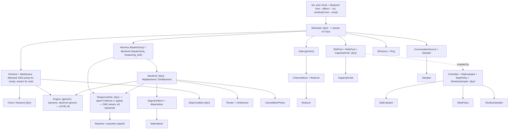

# AIPerf-Rust: One Front-End, Three Backends — every command over {real-http · online-mock · offline-mock}

**Date:** 2026-07-10 (rev 2 — reframed around the explicit product goal + Level-B measurement)
**Author:** Anthony Casagrande (Tech Lead) + Claude
**Status:** design — the realization design: every load mode reduces to one
dispatch verb on the clock-scheduled graph executor, and strategies become
`Workload` schedule generators (supersedes rev 1 "unified graph-runtime" and the
earlier scheduling-policy sketch).
**Grounding:** line-by-line read of `src/aiperf/timing/**` and of dynamo
`lib/mocker/**` (loadgen, replay offline single/agg/disagg, collector, protocols,
perf_model, handoff, scheduler). Companion specs: the north-star,
`2026-07-10-steppable-clock-injected-engine-design.md` (your engine-boundary spec —
this doc *is* its universal realization), the transport crate spec, the coverage-gap
ledger, and the port-exact ledger's three-mode framing.

---

## 0. The goal (stated plainly)

**Every single aiperf-rust command must run unchanged against three backends,
producing aiperf's own report on all three:**

1. **ONLINE-REAL** — real HTTP to a real inference server, wall clock.
2. **ONLINE-MOCK** — HTTP to the dynamo mocker running as an OpenAI server, wall clock.
3. **OFFLINE-MOCK** — in-process co-simulation of the mocker engine on a virtual
   clock — no socket, no GPU, deterministic, faster-than-real.

"Every command" = every workload mode (concurrency, request-rate, user-centric,
fixed-schedule/trace, graph/agentic, adaptive-scale), every endpoint, every
metric/exporter (genai-perf parity), every UI. Build the front-end **once**; the
three modes are dependency injection, not code paths.

---

## 1. The reduction: two paths, one seam

The three modes collapse to **two code paths** behind one `Backend` × `Clock` seam:

| Mode | Backend | Clock | Notes |
|---|---|---|---|
| ONLINE-REAL | `HttpBackend` | `RealClock` | real server |
| ONLINE-MOCK | `HttpBackend` | `RealClock` | **same code**, mocker's URL |
| OFFLINE-MOCK | `SimBackend` | `SimClock` | in-process engine |

So ONLINE-REAL and ONLINE-MOCK are literally the same aiperf code — a URL differs.
The entire engineering problem is: **make the `Backend`/`Clock` seam universal, and
make `SimBackend` (OFFLINE) emit aiperf's own measurement stream so every command
produces aiperf's report offline too.** That last clause is the **Level-B** decision
(§6), and it is exactly what your engine-boundary spec already specified.

**Terminology mapping to today's crates.** `Backend` and `ResponseSink` are the
north-star *explanatory* vocabulary used throughout this doc; the built workspace
exposes the same dispatch seam concretely as `loadgen-core::{RequestSink<R>,
RequestObserver, Dispatchable}`, with time supplied by `aiperf_runtime::clock::Clock`. When
implementing against the current crates, read `Backend::dispatch` as
`RequestSink<R>::dispatch`, `ResponseSink`/`Event`-emission as `RequestObserver`
callbacks (`on_arrival`/`on_admit`/`on_token`/`on_usage`/`on_terminal`), and a
dispatchable request as `Dispatchable`. Virtual-time controls stay on `SimClock`
rather than being added to the `Clock` trait itself.

---

## 2. Three orthogonal axes, three injection points

```
              rate   concurrency   user-centric   trace   graph/agentic   adaptive
http+real      ✓          ✓             ✓           ✓           ✓            ✓
http+mock      ✓          ✓             ✓           ✓           ✓            ✓   (same as http+real)
sim+virtual    ✓          ✓             ✓           ✓           ✓            ✓
```

- **Time** — `Clock`: real (reactor) · virtual (DES). One owner: the Runtime.
- **Backend** — `Backend`: `HttpBackend` · `SimBackend<dyn Engine>`. The only place
  real-vs-sim lives besides Clock.
- **Workload** — async generators over one `dispatch()` verb; never mention time
  source or backend.

A workload never knows which time or backend it runs on; a backend never knows which
workload drives it; time lives in exactly one place. Achieve that and the whole
"three modes" table above is free.

---

## 3. Conventions (apply to every trait)

- **Single thread.** Current-thread tokio + `LocalSet`; per-trace state in
  `Rc<RefCell<…>>`; no `Send`/`Sync`/`Arc`/`Mutex` on the hot path (mirrors Python's
  single asyncio loop; the basis of byte-exact `write_seq`).
- **Async dyn traits** use `#[async_trait(?Send)]`; **generic/hot traits**
  (`Engine`, `Reducer`, `Gate`) use native `fn`/`async fn` and are monomorphized.
  Each trait is tagged **[dyn]** or **[generic]**; every **[dyn]** is object-safe.
- **`WaitQueue` is the determinism anchor** (§10). Every *parkable* seam
  (`SlotPool`, `RatePool`, `ChannelStore::await_inputs`, `Clock::sleep_until`,
  `SimBackend`'s completion slot) parks on `WaitQueue`, so wake order == FIFO
  insertion == asyncio `call_soon`.

---

## 4. The universal unit: `Trace` over a shared `Topology`

Everything the Runtime drives is a **`Trace`** (one conversation/graph instance). A
flat single-turn request is a **1-node trace**; multi-turn is a linear chain;
agentic/DAG is a fan-out graph. One executor, one unit — so a workload's code is the
same whether a "request" is one turn or a whole DAG.

```rust
pub struct TraceId(pub u64); pub struct NodeId(pub u32);
pub struct ReqId(pub u64);   // one wire/sim dispatch, globally monotonic
pub struct CorrId(pub Rc<str>);
pub struct Instant(pub i64); pub struct Duration(pub i64);   // ns

pub struct Topology { pub nodes: Vec<NodeProgram>, pub edges: Vec<Edge>, pub entry: SmallVec<[NodeId;1]> }
pub struct NodeProgram { pub gate: GateSpec, pub inputs: SmallVec<[ChannelRef;1]>,
    pub output: Option<ChannelRef>, pub reducer: ReducerKind, pub request: RequestTemplate, pub slots: SlotSpec }
pub struct Trace { pub id: TraceId, pub corr: CorrId, pub topo: Rc<Topology>,
    pub arrival: Instant, pub channels: ChannelStore }
```

`Request` / `Reply` / `Event` / `Usage` / `Terminal` are the north-star Layer-0
contract types, reused verbatim. Crucially, **`Event` is the one measurement
vocabulary both backends speak:**

```rust
pub enum Event {
    Admitted   { at: Instant, reused_prefix_tokens: u32 },
    FirstToken { at: Instant },
    Token      { at: Instant },
    Done       { at: Instant, terminal: Terminal, usage: Usage },  // terminal: Completed|Rejected|Error
}
pub trait ResponseSink { fn on_event(&mut self, req: ReqId, ev: Event); }   // [dyn]
```

Both `HttpBackend` and `SimBackend` emit this exact `Event` stream into one aiperf
`ResponseSink`. That is what makes the report identical-*schema* on all three modes.

---

## 5. Layer map (every seam named)



---

## 6. Measurement = **Level B** (the committed decision)

**One aiperf `ResponseSink`/`Collector` is fed by one `Event` stream on all three
backends; aiperf owns the report (genai-perf field names, linear-interp percentiles,
aiperf exporters, live/streaming metrics).** This is non-negotiable because the goal
is "every command produces *aiperf's* report in all three modes" — including
adaptive-scale's window sampler and the live dashboard, which need per-token events
*during* the run, not a post-hoc dump.

- **HttpBackend** already emits `Event`s from SSE (the `aiperf_runtime::transport_http` module). ✓
- **SimBackend** must emit the *same* `Event`s from the engine. That requires the
  engine to emit timed measurement events **through an injected observer as it
  steps** — i.e. dynamo's `execute_pass` becomes **observer-generic**
  (`&mut dyn RequestObserver` instead of a concrete `TraceCollector`). This is your
  engine-boundary spec's `step_to(now_ms, obs)`. See §7.

**Level A is explicitly rejected.** Level A (run the mocker's internal
`TraceCollector`, bridge its `per_request` records into aiperf at end-of-run) yields
a static report but has **no live event stream** — it breaks adaptive-scale windows,
streaming metrics, and the live dashboard offline. The graph-offline commits
(`5859b98`, `f018d27`) used the internal collector deliberately (they wanted
*dynosim's* numbers for a graph run); that is the correct choice for that narrow
feature and the wrong one for "every aiperf command." Level B supersedes it for the
universal path.

**Dynosim-native extras stay available, as a second observer.** Prefix-cache-reuse
ratio, worker-seconds, GPU-hours, per-request bypass — things aiperf's collector
doesn't compute — remain reachable by `Tee`-ing the mocker's `TraceCollector`
(itself just a `RequestObserver` impl) alongside aiperf's collector. Aiperf's
collector is primary; the mocker's is an optional co-observer.

---

## 7. The Engine boundary (your steppable spec, restored — observer-generic)

The aiperf-facing engine seam is the north-star pure state machine, in ns:

```rust
pub trait Engine {                                   // [generic] — dynamo implements
    fn admit(&mut self, now: Instant, req: &Request);
    fn step(&mut self, now: Instant, out: &mut dyn FnMut(ReqId, Event));  // caller-clocked; emits timed Events
    fn next_wake(&self) -> Option<Instant>;          // earliest instant progress is possible (DES event source)
    fn is_idle(&self) -> bool;
}
```

`MockerEngine` adapts dynamo's `SteppableEngine`/`SteppableAgg`/`SteppableDisagg` —
**in the shape your design spec specified**, `submit` / `next_event_ms` /
`step_to(now_ms, obs)` / `is_idle`:

```rust
impl Engine for MockerEngine {                       // wraps Box<dyn SteppableReplay-per-your-spec>
    fn admit(&mut self, now: Instant, req: &Request) {
        self.core.set_now_ms(ns_to_ms(now));
        self.map.insert(req.id, self.core.submit(to_direct_request(req)));   // tokens/hashes/max_out
    }
    fn step(&mut self, now: Instant, out: &mut dyn FnMut(ReqId, Event)) {
        let mut obs = ObsAdapter { out, map: &self.map };   // RequestObserver(ms) -> Event(ns)
        self.core.step_to(ns_to_ms(now), &mut obs);         // caller-clocked; clamps to `now`, no overshoot
    }
    fn next_wake(&self) -> Option<Instant> { self.core.next_event_ms().map(ms_to_ns) }
    fn is_idle(&self) -> bool { self.core.is_idle() }
}
```

`ObsAdapter` [dyn] impls dynamo's `RequestObserver`: `on_admit/on_token/on_terminal
(uuid, ms)` → `out(reqid, Event{ at: ms_to_ns(ms) })`. First `on_token` →
`Event::FirstToken` (releases the prefill slot + fires graph first-token gate);
terminal → `Event::Done{terminal}` (`rejected` → `Terminal::Rejected`, excluded from
token/latency stats by aiperf's collector, matching the mocker semantics).

### 7.1 The three dynamo-side changes (minimal, and they restore your own spec)

The primitives already exist in dynamo's runtimes (base commit `f553c46a`,
jthomson04); only surfacing + one signature change is needed:

1. **`execute_pass` observer-generic** — emit through `&mut dyn RequestObserver`
   instead of a concrete `&mut TraceCollector`. `TraceCollector` already implements
   those four methods, so it stays a valid impl; aiperf passes `ObsAdapter`. **This
   is the only real code change** (touches the vllm/sglang core call sites) and it is
   exactly `step_to(now_ms, obs)`.
2. **Expose `next_event_ms()`** — `AggRuntime`/`DisaggRuntime` already compute
   `next_timestamp() = min(arrival, event, offload)` (`agg.rs:444`, `disagg.rs:1320`);
   single-worker derives it. Surface it on the trait. One line each.
3. **Un-gate `step_to(until_ms)`** — `AggRuntime`/`DisaggRuntime` already have
   `advance_to(until_ms)` (`agg.rs:919`, `disagg.rs:2066`), currently `#[cfg(test)]`.
   It clamps to `until_ms` (no overshoot). Promote it to the production trait; the
   shipped engine-clocked `step_dynamic` (drain-then-auto-advance) becomes the
   graph-offline fast path, not the general seam.

Your `SteppableReplay` wrapper lives *inside* `lib/mocker` and already calls these
private methods, so #2/#3 are your edits; #1 touches jthomson04's `execute_pass`.
Net: this is "make the mocker match the engine-boundary spec you wrote" — not a new
architecture.

---

## 8. The Runtime — one loop authority; the DES pump vs the reactor

`Runtime::run` branches on `clock.is_virtual()`:

- **Real** (ONLINE-REAL / ONLINE-MOCK): reactor-driven (`LocalSet::block_on`); socket
  IO and `timerfd` sleeps wake naturally. No engine.
- **Virtual** (OFFLINE-MOCK): the DES pump unifies generator sleepers **and** the
  engine on one clock:

```text
loop:
  drain ready-queue to empty          # workload tasks fire nodes, acquire slots,
                                       # SimBackend.dispatch -> engine.admit -> park.
                                       # all admits at instant t land BEFORE the step that
                                       # observes them (arrivals-before-pass ordering).
  if all parked:
    t = min( clock.next_parked(),      # next pacer/gate/rate-token/sleep deadline
             engine.next_wake() )      # earliest engine progress instant (None if idle)
    match t:
      None    => return                # drained: workload exhausted AND engine idle
      Some(t) => clock.advance_to(t);
                 engine.step(t, &mut route_events)   # step_to(t, obs): emits timed Events into
                                                     # aiperf's ResponseSink, resolves completion
                                                     # slots on Done, fires first-token — WaitQueue
                                                     # wakes parked dispatch futures FIFO.
```

Because `step` is caller-clocked (`step_to(t)`, clamped to `t`), the **workload owns
arrival timing** and the engine never overshoots a pacer arrival that falls inside a
pass — the fidelity property the graph-offline `step()` gave up. `next_wake` (=
`next_event_ms`) makes the engine a true DES event source the pump can `min()`
against sleepers. `max_sim_time_ms` is a driver-side soft cap.

---

## 9. Every command × every backend (nothing but injection)

`SimBackend` is the *general* `Backend` (not graph-only), shaped identically to
`HttpBackend`, so every workload dispatches through it unchanged:

```rust
#[async_trait(?Send)]
impl Backend for SimBackend {
    async fn dispatch(&self, req: Request, sink: &mut dyn ResponseSink) -> Reply {
        let id   = self.host.admit(self.clock.now(), req);   // engine.admit; register slot
        let slot = self.host.register(id, sink);             // Events for `id` route to `sink`
        slot.await                                            // PARKS on WaitQueue; resolved on Done
    }
}
```

| Mode | Workload | RatePool | SlotPool(s) | Gate | Controller | Topology | works on Http+Sim? |
|---|---|---|---|---|---|---|---|
| concurrency | `RateWorkload`(Burst) | Burst(0) | session=N | none | — | 1-node/chain | ✓ |
| request-rate | `RateWorkload` | Poisson/Gamma/Const | ∞ | think-time | — | chain | ✓ |
| user-centric | `UserCentricWorkload` | — | ∞/N | `max(now,·)` | — | chain | ✓ |
| fixed-schedule | `FixedScheduleWorkload` | — | ∞ | absolute-offset | — | chain | ✓ |
| adaptive-scale | base + `Controller` | via knob | knob | base | `RampUntilFail` | chain | ✓ |
| agentic/DAG | `ReplayWorkload` | any | tree-scoped | 5 delay kinds + fan-in | opt | DAG | ✓ |

Every cell is trait selection. Zero `match mode` in the executor / backend / measure
layers. The report is aiperf's on every row and every backend (Level B).

---

## 10. Determinism contract

1. **Time has one owner** (`Runtime` via `dyn Advance`); nothing else advances it.
2. **Every parkable seam parks on `WaitQueue`** (Invariant W) → admission/wake order
   is the single FIFO ready-queue order. This is the one thing to get right when a
   semaphore is threaded through a byte-exact dataflow executor.
3. **`write_seq`** is one monotonic counter; reductions sort `(write_seq, writer)`.
4. **No wall clock** anywhere but `RealClock`. Sim runs are bit-reproducible.
5. **Acceptance gates:**
   - (a) **Conformance (byte-exact):** the `step_to`-driven engine reproduces
     dynamo's batch `SingleRuntime::run` `perf_ns`/report bit-for-bit
     (`run_offline_handoff_conformance`, `test_trace_replay_matches_manual_steps`).
   - (b) **Universal-command:** every aiperf command runs on all three backends and
     emits aiperf's report (same schema) — the product gate.
   - (c) **Code-path parity, NOT numeric:** OFFLINE and ONLINE run the same
     workload/gate/slot code and the same report schema; metric *values* differ by
     construction (simulated vs real). "Offline == online byte-for-byte on values" is
     false and never claimed.

---

## 11. Sim-safety audit — every seam under `SimClock`

Offline works only if **no seam reads wall time** and **every parkable seam parks on
`WaitQueue`**. The Python timing layer calls `time.perf_counter()`/`time_ns()`
directly in nearly every strategy/ramp/window/lifecycle (`request_rate.py:149`,
`user_centric_rate.py:373,404`, `adaptive_scale.py:139,332`, `ramping.py:192`,
`lifecycle.py:87,151`). In Rust **none may read wall time** — `now` is always the
injected `Clock`. Enforced by a CI grep-gate (no `Instant::now`/`SystemTime::now`/
`Instant::elapsed` outside `RealClock`). This is the generalization of your
engine-boundary spec's PR2.5 note (`observer.rs`/`http_sink.rs` `now_ms()` must route
through `Clock`) to the whole timing plane. With that + Invariant W, the DES pump can
always advance: every parked task is on a clock deadline or a completion slot, so
`min(clock.next_parked(), engine.next_wake())` is well-defined.

---

## 12. Bin assembly — the only place concrete types meet

```rust
let (offline, url) = parse(cli);                        // --offline | <url>
let clock: Rc<dyn Clock> = if offline { SimClock::rc() } else { RealClock::rc() };
let collector = Collector::new(clock.clone());          // aiperf's own — ALL modes
let backend: Box<dyn Backend> = if offline {
        let engine = MockerEngine::new(MockEngineArgs::from(cli));   // single|agg|disagg from flags
        Box::new(SimBackend::new(EngineHost::new(engine, collector.clone()), clock.clone()))
    } else {
        Box::new(HttpBackend::new(url, clock.clone()))  // real server OR online-mock URL — same code
    };
let harness  = Harness::new(backend, clock.clone(), collector.clone());
let workload = select_workload(cli.mode, conv_source /*, rate/slots/knob*/);
let rt = if offline { Runtime::new_sim(clock, engine_host) } else { Runtime::new_real(clock) };
rt.run(run_phase(workload, harness, stops, controller /*, …*/));
report(collector);                                      // aiperf's genai-perf report, all three modes
```

Flip `--offline` and the *same* workload/gate/slot/collector/exporter code runs on
the other clock+backend. Point `<url>` at the mocker server and ONLINE-MOCK falls out
of ONLINE-REAL with zero code difference.

---

## 13. The full trait inventory ("every seam")

| # | Trait | dyn/gen | Blessed impl(s) | Parks→WaitQueue |
|--|--|--|--|--|
| 1 | `Runtime` | dyn¹ | DES-pump (virtual) / reactor (real) | drives it |
| 2 | `Clock` / `Advance` | dyn | Real / Virtual | yes (sleep) |
| 3 | `Backend` | dyn | **Http (real+online-mock)** / **Sim (offline)** | Sim: yes (slot) |
| 4 | `ResponseSink` | dyn | **aiperf Collector** / Tee / gates | no |
| 5 | `Engine` | gen | `MockerEngine`→dynamo (observer-generic, Level B) | no |
| 6 | `EngineHost` | dyn | Single / Agg / Disagg | yes (resolves slots) |
| 7 | `SlotPool` | dyn | Dynamic + GlobalPhase (debt-drain, TTFT-release) | **yes** |
| 8 | `RatePool` | dyn | Timed + Burst (continuation-priority) | **yes** |
| 9 | `CapacityKnob` | dyn | Session/Prefill/Rate/Users | no |
| 10 | `Gate` | gen | GateSpec-driven (5 delay kinds + fan-in) | no |
| 11 | `ChannelStore` / `Reducer` | dyn/gen | Versioned / Overwrite·AddMessages | store: **yes** |
| 12 | `SegmentStore` / `Materializer` | dyn | Pool / Splice | no |
| 13 | `Workload` | dyn | Rate/UserCentric/Fixed/Trace/Replay | no |
| 14 | `IntervalGenerator` / `RampStrategy` | dyn | Poisson·Gamma·Const·Burst / Lin·Exp·Poisson | no |
| 15 | `Controller` / `SlaEvaluator` / `StepPolicy` / `WindowSampler` | dyn | RampUntilFail / AdaptiveSla / margin·percent / ReturnedWindow | no |
| 16 | `StopCondition` | dyn | Lifecycle/Count/Session/Duration | no |
| 17 | `Router` / `UrlSelector` | dyn | Sticky / RoundRobin | no |
| 18 | `CancellationPolicy` | dyn | ClientDisconnectSim | no |
| 19 | `Reporter` + exporters | dyn | genai-perf CSV/JSON/console | no |
| 20 | `ConversationSource` / `Sampler` | dyn | Dataset / random·seq·shuffle | no |
| 21 | `IdFactory` / `Rng` | dyn | Counter / BLAKE3-derived order-independent seeds | no |
| 22 | `RequestObserver` (mocker-side) | dyn | `ObsAdapter`→aiperf Events; `TraceCollector` co-observer | no |

¹ one blessed impl; trait for test doubles only. Parkable seams (#2,3,6,7,8,11) build
on `WaitQueue`. #5/#6/#22 are OFFLINE-only (absent in the two ONLINE modes). The
mocker's `TraceCollector` is now just *one* `RequestObserver` impl (#22), optional and
co-observed; aiperf's `Collector` (#4) is primary on all three backends. The `Rng`
(#21) substrate derives seeds with BLAKE3 in an order-independent way and explicitly
does **not** pursue cross-language byte parity with Python's RNG — determinism is a
Rust-side reproducibility contract, not a Python-parity one.

---

## 14. Acceptance checklist

1. A `Workload` file compiles and runs unchanged under `{Real,Virtual}Clock` ×
   `{Http,Sim}Backend`; ONLINE-MOCK is ONLINE-REAL with a different `<url>`.
2. Every `[dyn]` trait object-safe; every parkable impl routes through `WaitQueue`.
3. **Every command × three backends** produces aiperf's report (same schema) — §10(b).
4. Conformance: `step_to`-driven engine == dynamo batch `run()` byte-for-byte — §10(a).
5. Level B live: adaptive-scale windows, streaming metrics, and the live dashboard
   work OFFLINE (per-token Events during the run, not a post-hoc dump).
6. No wall clock outside `RealClock` (CI grep-gate) — §11.
7. Dynamo delta is exactly: observer-generic `execute_pass` + exposed `next_event_ms`
   + un-gated `step_to` + `pub` runtimes — i.e. the mocker conformed to your
   engine-boundary spec (#1 real change; #2–4 surface existing primitives).

---

## 15. One-line summary

The product goal — *every aiperf command over real-http, online-mock, and
offline-mock, with aiperf's own report on all three* — is the north-star made
concrete, and it reduces to two paths behind a `Backend`×`Clock` seam. ONLINE-REAL and
ONLINE-MOCK are already one code path (a URL apart). OFFLINE-MOCK needs the
**Level-B** engine boundary — observer-generic `step_to(now_ms, obs)` + `next_event_ms`
— which is precisely your steppable engine-boundary spec, whose primitives already
exist in dynamo's runtimes. The shipped graph-offline `SteppableReplay` was the right
subset for one feature; Level B is the superset that makes *every* command work
offline with aiperf's report.
